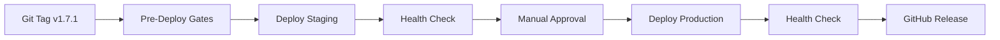

# CLAUDE.md — Evolution Hub Project Guide

> **Quick Reference for Claude Code (Sonnet 4.5)**
> Last Updated: 2025-10-03

---

## 📋 Projekt-Übersicht

**Evolution Hub** ist eine moderne Full-Stack-Webanwendung für Developer-Tools mit KI-gestützten Features.

### Hauptfeatures

- 🖼 **AI Image Enhancer**: KI-Bildverbesserung (Real-ESRGAN, GFPGAN)
- ✨ **Prompt Enhancer**: Text-zu-Prompt-Optimierung
- 🛠 **Tool-Sammlung**: Wachsende Bibliothek von Developer-Tools
- 🔐 **Stytch Auth**: Magic Link Authentifizierung (passwordless)
- 🌍 **i18n**: Mehrsprachig (DE/EN)

### Live URLs

- **Production**: [hub-evolution.com](https://hub-evolution.com)
- **Staging**: staging.hub-evolution.com
- **Testing/CI**: ci.hub-evolution.com

---

## 🛠 Tech Stack

### Frontend

- **Astro 5** (Insel-Architektur, SSR/SSG)
- **React 18** (Interactive Islands)
- **TypeScript 5** (strict mode)
- **Tailwind CSS 3**

### Backend & Infrastructure

- **Cloudflare Workers** (Edge Computing)
- **Cloudflare D1** (SQL Database)
- **Cloudflare R2** (Object Storage)
- **Cloudflare KV** (Key-Value Store)

### Testing & Quality

- **Vitest** (Unit/Integration, Coverage ≥70%)
- **Playwright** (E2E, Chromium/Firefox/WebKit)
- **ESLint** + **Prettier**
- **Husky** (Pre-commit Hooks, aktuell deaktiviert)

---

## 🏗 Architektur

### Astro Islands Architecture

```plain
src/
├── pages/          # Routes (Astro/React)
├── components/     # UI Components
├── layouts/        # Page Layouts
├── lib/            # Shared Logic
├── server/         # Server-only Code
└── types/          # TypeScript Types
```

### API-Layer

- **Location**: `src/pages/api/`
- **Pattern**: Hono-ähnliche Handler-Struktur
- **Response**: Standardisiertes JSON-Format

```typescript
// Success
{ success: true, data: T }

// Error
{
  success: false,
  error: {
    type: string,
    message: string,
    details?: unknown
  }
}
```

### Service-Layer

- **Auth Service**: Stytch Magic Link
- **User Service**: Profil & Settings
- **Security Services**: Rate-Limiting, Logging, Headers

---

## 🔒 Security & Compliance

### Authentifizierung

- **Stytch Magic Link** (kein Passwort)
- **Session Cookie**: `__Host-session` (HttpOnly, Secure, SameSite=Strict)
- **Middleware**: Unverifizierte Nutzer → `/[locale]/verify-email?email=...`

### Rate-Limiting

| Scope | Limit | Verwendung |
|-------|-------|------------|
| `authLimiter` | 10/min | Auth-Endpunkte |
| `standardApiLimiter` | 50/min | Normale APIs |
| `sensitiveActionLimiter` | 5/h | Sensible Aktionen |

### Security Headers

- CSP, HSTS, X-Frame-Options, X-Content-Type-Options
- COOP, COEP, Referrer-Policy

### Audit-Logging

- **Dev (Astro)**: WebSocket Live-Streaming
- **Dev (Wrangler)**: SSE Live-Streaming (`/api/debug/logs-stream`)
- **Production**: Console + Cloudflare Analytics

**Event-Typen**: AUTH_SUCCESS, AUTH_FAILURE, PROFILE_UPDATE, PERMISSION_DENIED, RATE_LIMIT_EXCEEDED, SUSPICIOUS_ACTIVITY, API_ERROR, API_ACCESS

---

## ☁️ Cloudflare Infrastructure

### Environments

| Environment | URL | D1 Database | Purpose |
|-------------|-----|-------------|---------|
| **development** | `http://127.0.0.1:8787` | `evolution-hub-main-dev` | Lokal |
| **testing** | `ci.hub-evolution.com` | `evolution-hub-main-local` | CI/E2E |
| **staging** | `staging.hub-evolution.com` | `evolution-hub-main-local` | Pre-Prod |
| **production** | `hub-evolution.com` | `evolution-hub-main` | Live |

### Bindings (pro Environment explizit)

**D1**: `DB`
**R2**: `R2_AVATARS`, `R2_LEADMAGNETS`, `R2_AI_IMAGES`
**KV**: `SESSION`, `KV_AI_ENHANCER`

**Wichtig**: Keine implizite Vererbung zwischen Environments - alle Bindings müssen explizit in `wrangler.toml` definiert sein.

---

## 🧪 Testing & Quality

### Test-Struktur

```bash
tests/
├── unit/           # Vitest Unit Tests
├── integration/    # Vitest Integration Tests
└── e2e/            # Playwright E2E Tests (test-suite-v2/)
```

### Coverage-Anforderungen

- **Statements**: ≥70%
- **Branches**: ≥70%
- **Functions**: ≥70%
- **Lines**: ≥70%

### CI-Gates (alle müssen grün sein)

1. ✅ **Lint/Format**: ESLint + Prettier
2. ✅ **TypeScript**: `astro check`
3. ✅ **Unit/Integration**: Vitest (Coverage ≥70%)
4. ✅ **E2E Smoke**: Playwright (Enhancer, Pricing, Auth)
5. ✅ **Security**: `npm audit --audit-level=moderate`
6. ✅ **OpenAPI**: Schema-Validierung

### Test-Befehle

```bash
npm test                    # Vitest Watch
npm run test:once          # Single Run
npm run test:coverage      # Mit Coverage-Report
npm run test:e2e           # Playwright E2E
```

---

## 🚀 CI/CD & Deployment

### Deployment-Flow (Git Tags)



### Deployment-Trigger

1. **Git Tags**: `git tag v1.7.1 && git push origin v1.7.1`
2. **Manual**: GitHub Actions UI → "Deploy to Cloudflare"

### Health-Check

```bash
# Endpoint
GET /api/health

# Response (200 OK)
{
  "status": "ok",
  "services": { "d1": true, "kv": true, "r2": true },
  "duration": "45ms",
  "timestamp": "2025-01-15T10:30:00.000Z",
  "version": "production"
}
```

### Rollback-Strategien

```bash
# Option 1: Cloudflare Rollback
npx wrangler rollback --env production

# Option 2: Git Tag Rollback
git checkout v1.7.0
npx wrangler deploy --env production
```

---

## 💻 Development Workflow

### Pre-Commit Hooks

**Status**: Deaktiviert (für schnellere Entwicklung)
**CI/CD**: Bleibt streng (alle Gates aktiv)

### Empfohlener Workflow

**Tägliche Entwicklung:**

```bash
git add .
git commit -m "feat: implement new feature"
npm run lint              # Optional: Grundcheck
```

**Vor PR-Erstellung:**

```bash
npm run format            # Auto-Fix
npm run lint              # Code-Qualität
npx astro check           # TypeScript
npm run test:coverage     # Tests + Coverage
```

**Für Releases:**

```bash
npm run lint
npm run format:check
npx astro check
npm run test:coverage
npm audit --audit-level=moderate
```

### IDE-Integration

- **VS Code**: ESLint + Prettier Extensions
- **Dev-Config**: `eslint.config.dev.js` (entspannte Regeln)
- **Strict-Config**: `eslint.config.js` (für CI/CD)

---

## 📐 Coding Standards

### TypeScript

- **strict mode**: Aktiviert
- **kein `any`**: Immer explizite Typen
- **Interface > Type**: Für Objekt-Definitionen
- **Path Aliases**: `@/*`, `@components/*`, `@lib/*`, etc.

### Code-Style

```typescript
// Einrückung: 2 Leerzeichen
// Zeilenlänge: max 100 Zeichen
// Quotes: Single Quotes
// Semicolons: Ja

// Benennung
camelCase     // Variablen, Funktionen
PascalCase    // Klassen, Komponenten
UPPER_CASE    // Konstanten
```

### Funktionen

- **Max. Länge**: 50 Zeilen
- **Max. Verschachtelung**: 3 Ebenen
- **Single Responsibility**: Eine Funktion = Ein Zweck

### Imports

```typescript
// Imports immer oben, gruppiert
import { something } from '@/lib/module';  // ✅
import something from '~/lib/module';      // ❌ Nicht erlaubt
```

---

## 🤖 AI Agent Guidelines

### Allgemeine Regeln

- **Autonomie**: Assistiert-autonom (kleine bis mittlere Änderungen)
- **Bestätigung erforderlich bei**:
  - API-/Schema-Änderungen
  - Security-relevanten Stellen
  - DB-Migrations
  - Neue Dependencies
  - CI/Build-Änderungen
  - Diffs > 300 Zeilen oder > 5 Dateien

### Dateizugriff

- **Read**: Große Dateien segmentiert (`limit`/`offset`)
- **Write**: Kleine, fokussierte Patches
- **No Binary**: Keine Binär-/Bilddateien öffnen
- **Parallelisierung**: Nur Reads parallel, Writes sequentiell

### Terminal-Nutzung

```bash
# ✅ Erlaubt (automatisch)
ls, tree, curl, git status, git diff, git log
npm test, npm run lint, npm run format
npx prettier, npx astro check

# ⚠️  Bestätigung erforderlich
npm install, npm audit fix
git push, wrangler deploy
npm run build, npm run db:migrate
```

### Code-Edits

- **Imports**: Immer oben
- **Typen**: Strikte Typisierung, kein `any`
- **Diffs**: Kleine, fokussierte Änderungen
- **Tests**: Bei Logik-Änderungen mitaktualisieren

### Commit-Konventionen

```bash
# Conventional Commits
feat:      # Neue Features
fix:       # Bug-Fixes
chore:     # Wartung, Dependencies
refactor:  # Code-Verbesserungen
test:      # Tests
docs:      # Dokumentation
```

### Feature Flags

- **Client-exponiert**: `PUBLIC_*` Prefix erforderlich
- **Default**: Aus (pro Environment aktivieren)
- **Rollout**: Canary 5-10% → 50% → 100%

---

## 🔍 Wichtige Hinweise

### Navigation

- **Niemals `cd` verwenden**
- **CWD**: Immer im Repo-Root bleiben
- **Pfade**: Absolute Pfade bevorzugen

### Excludes (nicht durchsuchen)

- `dist/`, `node_modules/`, `.wrangler/`
- `coverage/`, `.backups/`, `reports/`
- `favicon_package/`

### Suchpfade (bevorzugt)

- `src/`, `tests/`, `docs/`

### Context-Quellen (immer prüfen)

- `package.json`, `tsconfig.json`
- `eslint.config.js`, `.prettierrc.json`
- `astro.config.mjs`, `wrangler.toml`
- `README.md`, `docs/`

---

## 📚 Weitere Ressourcen

- **Setup**: [README.md](README.md)
- **CI/CD**: [docs/development/ci-cd.md](docs/development/ci-cd.md)
- **Security**: [docs/SECURITY.md](docs/SECURITY.md)
- **Architecture**: [docs/architecture/system-overview.md](docs/architecture/system-overview.md)
- **API Docs**: [docs/api/](docs/api/)

---
