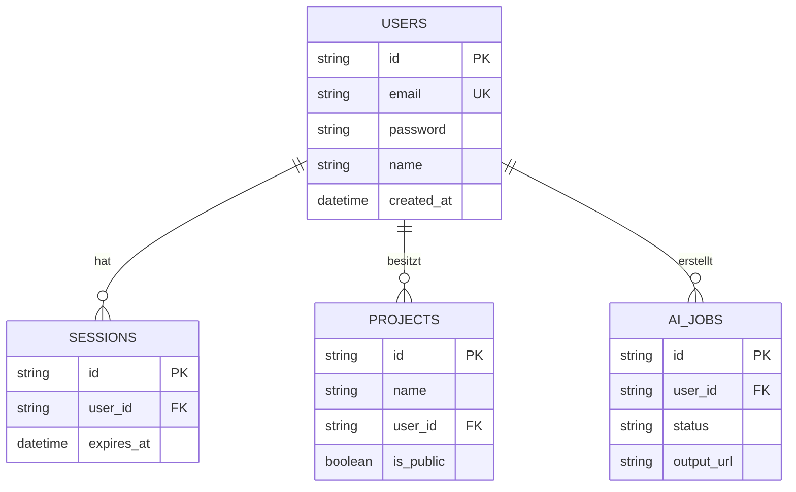

# Architektur von EvolutionHub

Diese Dokumentation bietet einen umfassenden Überblick über die Systemarchitektur von EvolutionHub. Sie beschreibt die Kernkomponenten, Schichten, Design-Entscheidungen und den Datenfluss. Die Architektur basiert auf modernen Prinzipien wie Modularität, Skalierbarkeit und Sicherheit, und folgt den globalen Regeln (z. B. Trennung der Zuständigkeiten, Islands-Architektur).

## Überblick

EvolutionHub ist eine Web-Anwendung für Produktivitäts-Tools, Authentifizierung, KI-Bildbearbeitung und Blog-Management. Sie nutzt eine hybride Architektur mit statischem Frontend (Astro) und serverless Backend (Cloudflare Workers). Schlüssel-Features:
- **Lokalisierung**: Unterstützt DE (neutral) und EN (/en/).
- **Sicherheit**: CSRF-Schutz, Rate-Limiting, anonymisiertes Logging.
- **Performance**: Edge-Computing, Caching, partielle Hydration.
- **Deployment**: Separate Envs (dev, testing, staging, prod) mit vollständigen Bindings (D1, KV, R2).

Die Architektur folgt ADRs (Architecture Decision Records) in [docs/architecture/adrs/](docs/architecture/adrs/), z. B. ADR-0001 (Astro-Cloudflare-Stack), ADR-0002 (Cloudflare-Architektur), ADR-0004 (DB-Schema).

## Schichten

### Frontend-Schicht (Astro + React)
- **Rendering**: Hybrid-SSG/SSR mit Islands-Architektur für optimale Performance (ADR-0003).
- **Komponenten**: Astro für statische UI, React für interaktive Inseln (z. B. Dashboard, Image-Enhancer).
- **Routing**: Dateibasiertes Routing mit Locale-Prefixen (/de/, /en/).
- **Styling**: Tailwind CSS für konsistentes Design.
- **Lokalisierung**: Cookie-basierte Persistenz (`pref_locale`), URL-Prefixe für SEO, Middleware für Normalisierung (ADR-0005).

Beispiel-Komponente:
```astro
---
// src/components/Dashboard.astro
import { ProjectsPanel } from '@/components/dashboard/ProjectsPanel.jsx';
---
<html>
  <body>
    <ProjectsPanel client:load />
  </body>
</html>
```

### Backend-Schicht (Cloudflare Workers + Hono)
- **Routing**: Hono für API-Endpunkte mit typsicherem Typing (APIContext).
- **Services**: Zentrale Logik (z. B. AuthService, AIImageService) mit Dependency Injection.
- **Middleware**: Globale Pipeline in `src/middleware.ts` für Locale, Session-Validierung, Security-Headers (CSP, HSTS).
- **Error-Handling**: Konsistente Responses `{ success: boolean, data?: T, error?: string }`.

API-Beispiel:
```typescript
// src/pages/api/auth/login.ts
import { createAuthService } from '@/lib/services/auth-service-impl';
export async function POST({ request, locals, runtime }) {
  const formData = await request.formData();
  const service = createAuthService(runtime.env.DB);
  const result = await service.login(formData, locals.clientAddress);
  return redirect('/dashboard');
}
```

### Data-Schicht (D1, R2, KV)
- **D1**: Serverless SQL-DB mit Drizzle ORM für typsichere Queries (ADR-0004).
- **R2**: Object-Storage für Bilder (z. B. AI-Enhancer, Avatare).
- **KV**: Key-Value-Store für Sessions (TTL-basiert).
- **Schema**: Relational mit Users, Sessions, Projects, Comments, AI-Jobs (siehe [database-schema.md](docs/architecture/database-schema.md)).

ER-Diagramm (vereinfacht):


### Cloudflare-Integration
- **Bindings**: D1 (DB), KV (Sessions), R2 (Storage) pro Env (ADR-0002).
- **Workers**: Edge-Execution für APIs, Graceful-Degradation für Offline.
- **Deployment**: Wrangler für Builds/Deploy, separate Targets für Envs.

## Schlüssel-Entscheidungen (ADRs)
- **ADR-0001**: Astro + Cloudflare für Performance und Skalierbarkeit.
- **ADR-0002**: Cloudflare-Stack (Pages, Workers, D1) für Edge-Computing.
- **ADR-0003**: Astro-Frontend mit React-Inseln für hybrides Rendering.
- **ADR-0004**: Relationales DB-Schema mit D1 für Integrität und Effizienz.
- **ADR-0005**: Locale-Normalisierung für Auth-Routen, um UX-Konsistenz zu gewährleisten.

Weitere Details: [auth-migration-stytch.md](docs/architecture/auth-migration-stytch.md), [ai-image-enhancer.md](docs/architecture/ai-image-enhancer.md).

## Datenfluss
```mermaid
graph TD
    Client[Browser] -->|Request| Middleware[Middleware (Locale/Session/Security)]
    Middleware -->|Validiert| API[API-Routen (Hono)]
    API -->|Logik| Services[Services (Auth/AI/Project)]
    Services -->|Queries| D1[D1 DB]
    Services -->|Storage| R2[R2 Bucket]
    Services -->|Sessions| KV[KV Namespace]
    D1 -->|Daten| Services
    R2 -->|Files| Services
    KV -->|Sessions| Services
    Services -->|Response| API
    API -->|JSON/HTML| Client
```

## Erweiterbarkeit
- **Modularität**: Lose Kopplung durch Services und Interfaces.
- **Skalierbarkeit**: Serverless-Design, automatische Edge-Replikation.
- **Erweiterung**: Neue ADRs für Features (z. B. Multi-Tenancy).

## Referenzen
- [System-Overview](docs/architecture/system-overview.md)
- [Data-Flow](docs/architecture/data-flow.md)
- [API-Middleware-Inventar](docs/architecture/api-middleware-inventory.md)
- [OpenAPI-Spec](openapi.yaml)
- [Wrangler.toml](wrangler.toml)

---

*Letzte Aktualisierung: 2025-09-07*