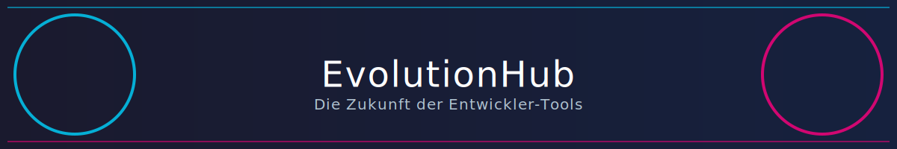

[](https://opensource.org/licenses/MIT)

[](https://astro.build/)
[](https://tailwindcss.com/)
[](https://pages.cloudflare.com/)
[](https://www.cloudflarestatus.com/)

Eine Full-Stack-Webanwendung, die eine Sammlung von Entwickler-Tools bereitstellt. Gebaut mit den neuesten Web-Technologien, um eine schnelle, moderne und skalierbare Plattform zu schaffen.

---

##  Features

-  **Tool-Sammlung:** Zugriff auf eine wachsende Bibliothek von Online-Tools für Entwickler.
-  **Modernes Frontend:** Gebaut mit [Astro](https://astro.build/) für maximale Performance.
-  **Styling:** [Tailwind CSS](https://tailwindcss.com/) für ein schnelles und konsistentes Design.
-  **Serverless-Backend:** Läuft auf [Cloudflare Pages](https://pages.cloudflare.com/) mit Cloudflare D1 als Datenbank.
-  **Authentifizierung:** Sichere Authentifizierung mit E-Mail und Passwort, einschließlich Registrierung, Login und einer "Passwort vergessen"-Funktion. Social-Media-Logins sind für die Zukunft geplant.

---

##  Tech Stack

- **Framework:** [Astro](https://astro.build/)
- **Styling:** [Tailwind CSS](https://tailwindcss.com/)
- **UI-Komponenten:** [React](https://react.dev/) (innerhalb von Astro)
- **Hosting & Deployment:** [Cloudflare Pages](https://pages.cloudflare.com/)
- **Datenbank:** [Cloudflare D1](https://developers.cloudflare.com/d1/)
- **Testing:** [Playwright](https://playwright.dev/) für E2E-Tests, [Vitest](https://vitest.dev/) für Unit-Tests

---

##  Getting Started

Folge diesen Schritten, um das Projekt lokal zu installieren und auszuführen.

### Voraussetzungen

- [Node.js](https://nodejs.org/) (Version 20.x oder höher)
- [npm](https://www.npmjs.com/) (wird mit Node.js installiert)

### Installation

1. Klone das Repository:
   ```bash
   git clone <repository-url>
   ```
2. Installiere die Abhängigkeiten:
   ```bash
   npm install
   ```
3. Erstelle eine `.env`-Datei aus dem Beispiel und fülle die notwendigen Umgebungsvariablen aus:
   ```bash
   cp .env.example .env
   ```

### Projekt starten

Führe den folgenden Befehl aus, um den lokalen Entwicklungsserver zu starten:

```bash
npm run dev
```

Das Projekt ist nun unter `http://localhost:4321` erreichbar.

---

##  Deployment

Das Deployment erfolgt automatisch bei jedem `git push` auf den `main`-Branch über **Cloudflare Pages**. Der Build-Prozess und die Bereitstellung werden vollständig von Cloudflare verwaltet.

---

##  Live-Demo

Eine Live-Version der Anwendung findest du hier: **[evolution-hub.pages.dev](https://hub-evolution.pages.dev)**

---

##  Social Media

- **GitHub:** [LucasBonnerue](https://github.com/LucasBonnerue)
- **X (ehemals Twitter):** [@LucasBonnerue](https://twitter.com/LucasBonnerue)

---

##  3D-Illustrationen

- [Storyset](https://storyset.com/) für 3D-Illustrationen.
- [Lottiefiles](https://lottiefiles.com/) für animierte SVG-Icons.

---

##  Dark-Mode-Unterstützung

Diese README-Datei unterstützt dynamische SVG-Grafiken, die sich an den Dark Mode anpassen.

---

##  Futuristische Schriftarten und Stile

- **Schriftarten:** [Google Fonts](https://fonts.google.com/) für moderne Typografie.
- **SVG-Banner:** Dynamische, futuristische Banner.

---

##  Mitwirken

Beiträge sind willkommen! Bitte erstelle einen Pull Request oder öffne ein Issue, um Ideen einzubringen.
