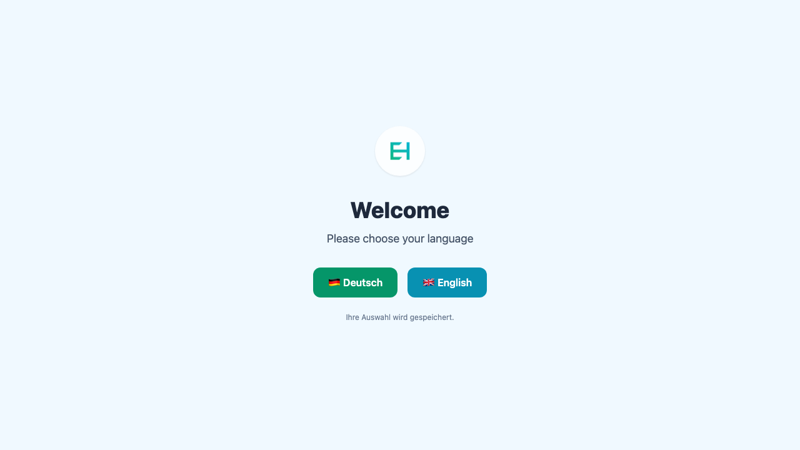

# Evolution Hub

> Das modulare AI-Produktivitäts-Toolkit, das deine SaaS-Workflows automatisiert und für Teams skalierbar macht.

[](https://github.com/HubEvolution/EvolutionHub/actions/workflows/enhancer-e2e-smoke.yml)
[](https://github.com/HubEvolution/EvolutionHub/actions/workflows/pricing-smoke.yml)

[](LICENSE)

## Kernfeatures

- **Geführte AI-Flows** – Kombiniere Prompt-Optimierung, Bildverbesserung und Automationen ohne komplexes Setup.
- **Cloudflare-native Plattform** – Workers, D1 und R2 sorgen für globale Verfügbarkeit und niedrige Latenzen.
- **Self-Serve Abrechnung** – Integrierte Stripe-Workflows für Trial, Billing und Upgrades.
- **Team Collaboration** – Rollenbasierte Zugriffe mit passwortloser Stytch-Authentifizierung.
- **Observability & Governance** – Rate-Limiting, Audit-Logging und konfigurierbare Webhooks.

## Quickstart

> Ausführliche Schritt-für-Schritt-Anleitungen findest du im [Setup-Guide](./docs/SETUP.md).

### Voraussetzungen

- Node.js >= 20
- npm >= 10
- Cloudflare Wrangler CLI (für Worker-/D1-Workflows)

### Installation

```bash
git clone https://github.com/HubEvolution/EvolutionHub.git
cd EvolutionHub
npm install
cp .env.example .env
```

### Lokale Entwicklung

```bash
npm run dev
```

Der lokale Worker läuft standardmäßig unter `http://127.0.0.1:8787`. Alternative Dev-Workflows (Astro-UI, Remote Dev, Datenbank-Reset) sind im [Setup-Guide](./docs/SETUP.md#lokale-entwicklung) dokumentiert.

### Tests

```bash
npm test
```

Weitere Test-Strategien, Coverage-Ziele und bekannte Stolperfallen sind im [Testing-Guide](./docs/testing/README.md) zusammengefasst.

### Build & Preview Deploy

```bash
npm run build
wrangler deploy
```

Hinweise zu Secrets, Preview Deployments und Rollbacks findest du im Abschnitt [Bereitstellung](./docs/SETUP.md#bereitstellung).

## Environment-Variablen

| Variable              | Beschreibung                                 | Erforderlich |
| --------------------- | -------------------------------------------- | ------------ |
| STYTCH_PROJECT_ID     | Projekt-ID für die Stytch Magic-Link-Auth    | Ja           |
| STYTCH_SECRET         | Secret-Key für Stytch                        | Ja           |
| CLOUDFLARE_ACCOUNT_ID | Cloudflare-Account für Workers/D1/R2         | Ja           |
| CLOUDFLARE_API_TOKEN  | API-Token mit Workers- und D1-Rechten        | Ja           |
| DB_URL                | Verbindung zur Cloudflare D1 Datenbank       | Ja           |
| R2_BUCKET_NAME        | Optionaler Bucket für Medien-Assets          | Nein         |

Nutze `.env.example` als Vorlage und ergänze lokale oder Produktionswerte. Eine vollständige Liste samt Generierungsbefehlen ist im [Setup-Guide](./docs/SETUP.md#umgebungsvariablen) dokumentiert.

## API & Routing

- [Routenübersicht](./routes.md) – beschreibt zentrale Seiten- und API-Routen.
- [OpenAPI-Spezifikation](./openapi.yaml) – maschinenlesbare Definition der öffentlichen Schnittstellen.
- [API-Handbuch](./docs/api/README.md) – Hintergrundwissen zu Response-Formaten, Auth und Beispielaufrufen.

## Cloudflare Deployment

1. **Secrets setzen** – Für jede Umgebung:
   ```bash
   wrangler secret put STYTCH_PROJECT_ID --env production
   wrangler secret put STYTCH_SECRET --env production
   wrangler secret put CLOUDFLARE_API_TOKEN --env production
   ```
2. **Deploy ausführen** – Nach erfolgreichem Build:
   ```bash
   wrangler publish
   ```
3. **Rollback** – Bei Bedarf eine vorherige Version aktivieren:
   ```bash
   wrangler versions list
   wrangler versions rollback <version-id>
   ```

Weitere Cloudflare-spezifische Hinweise findest du im [Ops-Bereich](./docs/ops/README.md).

## Screenshots



## Weitere Ressourcen

- [Architekturübersicht](./docs/architecture/README.md)
- [Frontend Guidelines](./docs/frontend/README.md)
- [Security-Hinweise](./docs/security/README.md)
- [Lead-Magnet Assets](./docs/lead-magnets/README.md)
- [Archiv & Verlauf](./docs/archive/README.md)

## Mitwirken

Wir freuen uns über Beiträge! Lies bitte die [Contribution Guidelines](./CONTRIBUTING.md) und beachte die Hinweise in [CLAUDE.md](./CLAUDE.md), bevor du einen PR erstellst.
