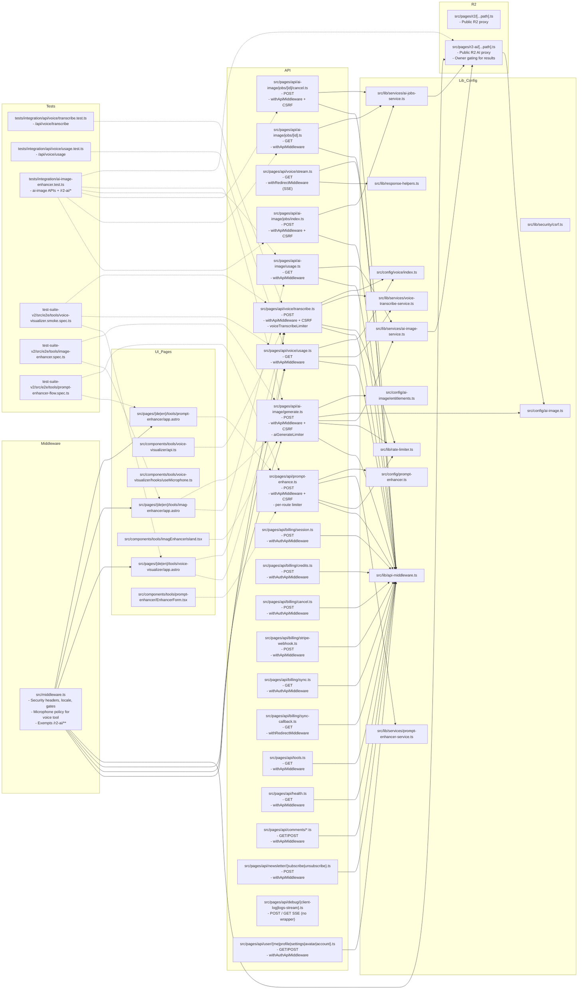
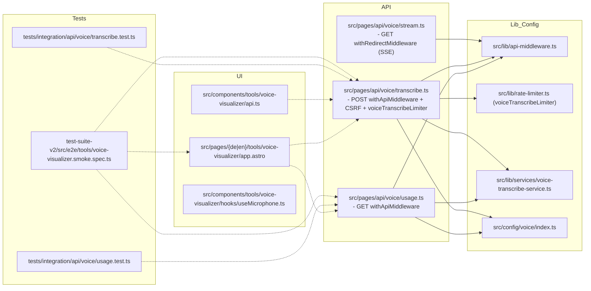
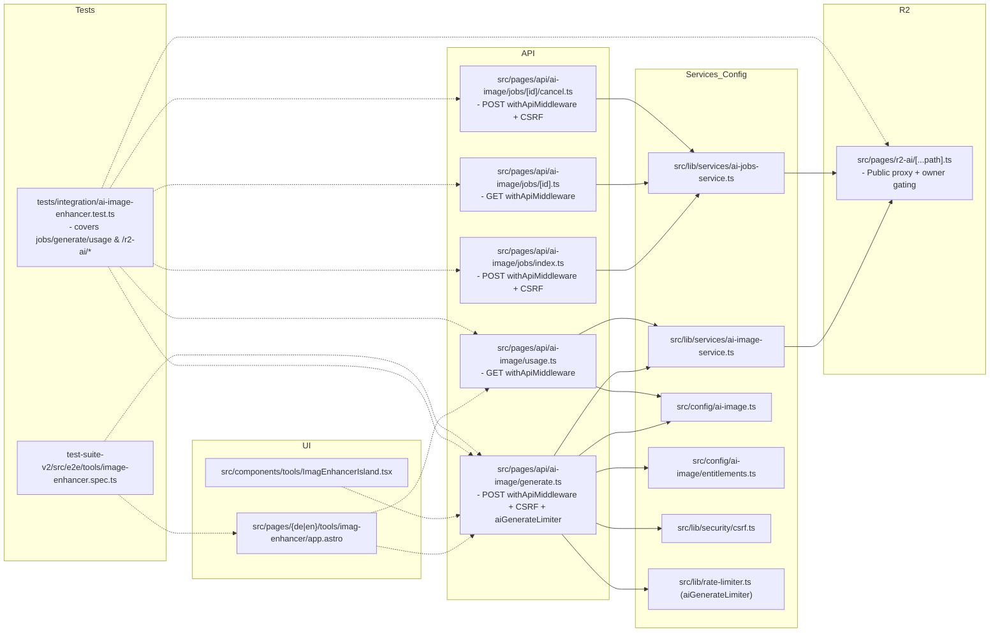
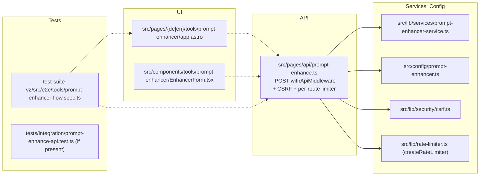

# Evolution Hub Codemap (Deep Import Graph)

Generated: 2025-10-14

This document provides a deep import graph with TypeScript alias edges and per-feature subgraphs. Groups follow your requested globs.

- API: `src/pages/api/**`, `openapi.yaml`
- R2: `src/pages/r2/**`, `src/pages/r2-ai/**`
- Middleware: `src/middleware.ts`
- UI/Pages: `src/components/**`, `src/pages/**`, `src/layouts/**`
- Lib/Config: `src/lib/**`, `src/config/**`, `src/utils/**`
- Tests: `tests/integration/**`, `tests/e2e/**`, `test-suite-v2/src/e2e/**`, `src/**/*.{test,spec}.*`, `playwright.config.ts`, `test-suite-v2/playwright*.config.ts`, `vitest.config.ts`

Ignored: `node_modules`, `dist`, `reports/`, `.backups/**`

---

## All-Edges Graph (Condensed)

---

## Per-Feature Subgraphs

### Voice Visualizer + Transcriptor

- **Middleware note**: `src/middleware.ts` applies global headers; overrides microphone Permissions-Policy for `/{locale}/tools/voice-visualizer[/app]` and does not gate `/r2-ai/**`.

### AI Image Enhancer

### Prompt Enhancer

---

## Alias Import Edges (Selected)

- **Voice**
  - `src/pages/api/voice/transcribe.ts` → `@/lib/api-middleware`, `@/lib/rate-limiter`, `@/lib/services/voice-transcribe-service`, `@/config/voice`
  - `src/pages/api/voice/usage.ts` → `@/lib/api-middleware`, `@/lib/services/voice-transcribe-service`, `@/config/voice`
  - `src/components/tools/voice-visualizer/api.ts` → `@/lib/security/csrf`
- **AI Image**
  - `src/pages/api/ai-image/generate.ts` → `@/lib/api-middleware`, `@/lib/services/ai-image-service`, `@/config/ai-image`, `@/config/ai-image/entitlements`, `@/lib/rate-limiter`
  - `src/pages/api/ai-image/usage.ts` → `@/lib/api-middleware`, `@/lib/services/ai-image-service`
  - `src/pages/r2-ai/[...path].ts` → `@/config/ai-image`
  - `src/components/tools/ImagEnhancerIsland.tsx` → `@/config/ai-image`, `@/lib/security/csrf`, `@/lib/client-logger`
- **Prompt Enhancer**
  - `src/pages/api/prompt-enhance.ts` → `@/lib/api-middleware`, `@/config/ai-image` (limits), `@/lib/services/prompt-enhancer-service`, `@/lib/rate-limiter`, `@/lib/services/prompt-attachments`
  - `src/components/tools/prompt-enhancer/EnhancerForm.tsx` → `@/utils/i18n`, `@/lib/i18n`, `@/config/prompt-enhancer`, `@/lib/client/telemetry`, `@/lib/client-logger`

---

## API Annotations and Middleware

- **withApiMiddleware**: security headers, rate limiting, origin/CSRF (optional), unified JSON shapes via `createApiSuccess`/`createApiError`, `405` via `createMethodNotAllowed`.
- **withAuthApiMiddleware**: as above plus session/user requirement.
- **withRedirectMiddleware**: redirect endpoints and SSE, applies rate limiting, security headers; no forced JSON envelope.
- **Public R2 routes**: `src/pages/r2/**`, `src/pages/r2-ai/**` are public per `src/middleware.ts`; `/r2-ai/**` additionally owner-gates `results/` access.

---

## Test Coverage Links

- `tests/integration/api/voice/transcribe.test.ts` → `/api/voice/transcribe`
- `tests/integration/api/voice/usage.test.ts` → `/api/voice/usage`
- `tests/integration/ai-image-enhancer.test.ts` → `/api/ai-image/*`, `/r2-ai/*`
- `test-suite-v2/src/e2e/tools/voice-visualizer.smoke.spec.ts` → voice tool pages and APIs
- `test-suite-v2/src/e2e/tools/image-enhancer.spec.ts` → enhancer pages and APIs
- `test-suite-v2/src/e2e/tools/prompt-enhancer-flow.spec.ts` → prompt enhancer page and API

---

## Notes

- This codemap focuses on concrete edges validated in the codebase for core features. Additional pages/components import `@/*` utilities (i18n, SEO, client logging) not expanded here to keep the graph readable.
- If you need a raw CSV/JSON of all edges across `src/**`, I can generate and attach it separately.
