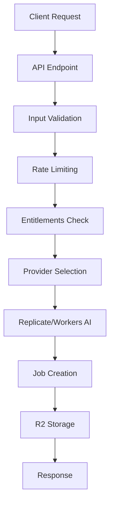

<!-- markdownlint-disable MD051 -->

# AI-Image Enhancement API

**Status:** ✅ Vollständig implementiert (Production-Ready)
**Dokumentationsstatus:** 🔄 Wird aktualisiert

Die AI-Image Enhancement API bietet umfassende Bildverbesserungsfunktionen mit Hybrid-Provider-Unterstützung (Replicate + Cloudflare Workers AI). Das System unterstützt verschiedene Modelle für Upscaling, Gesichtsverbesserung und kreative Bildtransformationen.

## Übersicht

- **Basis-URL:** `/api/ai-image`

- **Authentifizierung:** Optional (User + Guest-Modus)

- **Rate-Limiting:** 15/min (aiGenerateLimiter)

- **Provider:** Hybrid (Replicate + Cloudflare Workers AI)

- **Modelle:** Real-ESRGAN (2x/4x), GFPGAN/CodeFormer (Gesichts-Restore), SD 1.5/SDXL (img2img)

## Endpunkte

### POST `/api/ai-image/generate`

Startet eine neue Bildverbesserung mit umfassenden Konfigurationsoptionen.

#### Request Format

**Content-Type:** `multipart/form-data`

**Erforderliche Felder:**

- `image` - Bilddatei (JPEG, PNG, WebP, max. 10MB)

- `model` - Modell-Slug (z.B. `real-esrgan`, `gfpgan`, `sdxl-img2img`)

**Optionale Felder:**

- `scale` - Upscaling-Faktor: `2` | `4` (nur für ESRGAN-Modelle)

- `face_enhance` - Gesichtsverbesserung: `true` | `false` (GFPGAN/CodeFormer)

- `prompt` - Prompt-Text für img2img-Modelle

- `negative_prompt` - Negativer Prompt für img2img-Modelle

- `strength` - Stärke der Transformation (0.0-1.0)

- `guidance` - Guidance-Scale für SD-Modelle (1.0-20.0)

- `steps` - Anzahl der Inferenz-Schritte (10-50)

#### Beispiel-Requests

**Einfaches 4x Upscaling:**

```bash
curl -X POST \
  -H "X-CSRF-Token: 123" \
  -H "Cookie: csrf_token=123" \
  -H "Origin: http://127.0.0.1:8787" \
  -F "model=real-esrgan" \
  -F "scale=4" \
  -F "image=@mein-bild.jpg;type=image/jpeg" \
  http://127.0.0.1:8787/api/ai-image/generate

```bash

**Gesichtsverbesserung mit Prompt:**

```bash
curl -X POST \
  -H "X-CSRF-Token: 123" \
  -H "Cookie: csrf_token=123" \
  -H "Origin: http://127.0.0.1:8787" \
  -F "model=codeformer" \
  -F "face_enhance=true" \
  -F "prompt=schönes porträt, professionelle beleuchtung" \
  -F "strength=0.8" \
  -F "image=@portrait.jpg;type=image/jpeg" \
  http://127.0.0.1:8787/api/ai-image/generate
```

#### Success Response (200)

```json
{
  "success": true,
  "data": {
    "jobId": "job_abc123def456",
    "model": "real-esrgan",
    "imageUrl": "https://r2-hub-evolution.com/ai-images/job_abc123def456/output.webp",
    "originalUrl": "https://r2-hub-evolution.com/ai-images/job_abc123def456/original.jpg",
    "usage": {
      "used": 1,
      "limit": 10,
      "resetAt": null
    },
    "limits": {
      "user": 20,
      "guest": 3
    },
    "entitlements": {
      "dailyBurstCap": 10,
      "monthlyImages": 100,
      "maxUpscale": 4,
      "faceEnhance": true
    },
    "charge": {
      "type": "free",
      "amount": 0
    }
  }
}

```text

#### Error Responses

**Validierungsfehler (400):**

```json
{
  "success": false,
  "error": {
    "type": "validation_error",
    "message": "Bilddatei (field 'image') ist erforderlich"
  }
}
```

**Quota überschritten (403):**

```json
{
  "success": false,
  "error": {
    "type": "forbidden",
    "message": "Kostenloses Nutzungslimit erreicht",
    "details": {
      "used": 3,
      "limit": 3,
      "resetAt": "2025-01-16T00:00:00.000Z"
    }
  }
}

```bash

### GET `/api/ai-image/usage`

Liefert den aktuellen Nutzungsstand und Limits für den authentifizierten Benutzer oder Gast.

#### Request Headers

**Erforderlich:**

- `X-Usage-OwnerType: user|guest` (wird automatisch gesetzt)

#### Beispiel-Request

```bash
curl "http://127.0.0.1:8787/api/ai-image/usage" \
  -H "Cookie: guest_id=abc123"
```

#### Success Response (200) (2)

```json
{
  "success": true,
  "data": {
    "ownerType": "guest",
    "usage": {
      "used": 1,
      "limit": 3,
      "resetAt": null
    },
    "limits": {
      "user": 20,
      "guest": 3
    }
  }
}

```bash

### GET `/api/ai-image/jobs`

Listet alle AI-Jobs des aktuellen Benutzers/Gasts auf.

#### Query-Parameter

- `status` - Filter nach Status: `queued` | `processing` | `succeeded` | `failed` | `canceled`

- `limit` - Anzahl der Ergebnisse (Standard: 20, Max: 100)

- `offset` - Offset für Pagination (Standard: 0)

#### Beispiel-Request (2)

```bash
curl "http://127.0.0.1:8787/api/ai-image/jobs?status=succeeded&limit=10" \
  -H "Cookie: guest_id=abc123"
```

#### Success Response (200) (3)

```json
{
  "success": true,
  "data": {
    "jobs": [
      {
        "id": "job_abc123def456",
        "status": "succeeded",
        "model": "real-esrgan",
        "createdAt": "2025-01-15T10:30:00.000Z",
        "completedAt": "2025-01-15T10:30:15.000Z",
        "imageUrl": "https://r2-hub-evolution.com/ai-images/job_abc123def456/output.webp",
        "originalUrl": "https://r2-hub-evolution.com/ai-images/job_abc123def456/original.jpg"
      }
    ],
    "total": 1,
    "hasMore": false
  }
}

```bash

### GET `/api/ai-image/jobs/{id}`

Ruft den Status und Details eines spezifischen Jobs ab.

#### Pfad-Parameter

- `id` - Job-ID (z.B. `job_abc123def456`)

#### Beispiel-Request (3)

```bash
curl "http://127.0.0.1:8787/api/ai-image/jobs/job_abc123def456" \
  -H "Cookie: guest_id=abc123"
```

#### Success Response (200) (4)

```json
{
  "success": true,
  "data": {
    "id": "job_abc123def456",
    "status": "succeeded",
    "model": "real-esrgan",
    "scale": 4,
    "faceEnhance": false,
    "prompt": null,
    "createdAt": "2025-01-15T10:30:00.000Z",
    "startedAt": "2025-01-15T10:30:02.000Z",
    "completedAt": "2025-01-15T10:30:15.000Z",
    "imageUrl": "https://r2-hub-evolution.com/ai-images/job_abc123def456/output.webp",
    "originalUrl": "https://r2-hub-evolution.com/ai-images/job_abc123def456/original.jpg",
    "errorMessage": null,
    "provider": "replicate",
    "providerJobId": "abc123def456",
    "inputSize": 2048576,
    "outputSize": 8192004
  }
}

```bash

### POST `/api/ai-image/jobs/{id}/cancel`

Bricht einen laufenden oder wartenden Job ab.

#### Pfad-Parameter (2)

- `id` - Job-ID

#### Beispiel-Request (4)

```bash
curl -X POST "http://127.0.0.1:8787/api/ai-image/jobs/job_abc123def456/cancel" \
  -H "X-CSRF-Token: 123" \
  -H "Cookie: csrf_token=123" \
  -H "Origin: http://127.0.0.1:8787"
```

#### Success Response (200) (5)

```json
{
  "success": true,
  "data": {
    "id": "job_abc123def456",
    "status": "canceled",
    "canceledAt": "2025-01-15T10:35:00.000Z"
  }
}

```text

## Modelle und Konfigurationen

### Real-ESRGAN

**Zweck:** Bild-Upscaling mit hoher Qualität
**Scale-Optionen:** 2x, 4x
**Besonderheiten:**

- Bewahrt Details und Texturen

- Reduziert Artefakte

- Optimiert für Fotos und digitale Kunst

### GFPGAN/CodeFormer

**Zweck:** Gesichtsverbesserung und -wiederherstellung
**Besonderheiten:**

- Augen- und Gesichtsverbesserung

- Faltenreduktion

- Verbesserte Hauttextur

- Erhaltung der Identität

### Stable Diffusion (SDXL)

**Zweck:** Kreative Bild-zu-Bild-Transformation
**Besonderheiten:**

- Prompt-basierte Transformation

- Negative Prompts

- Stärke- und Guidance-Kontrolle

- Inpainting-ähnliche Effekte

## Sicherheitsfeatures

### Rate-Limiting

- **aiGenerateLimiter:** 15 Anfragen/Minute

- **Retry-After:** Header bei Überschreitung

- **Owner-spezifisch:** Separate Limits für User/Guest

### Input-Validierung

- **Dateigröße:** Max. 10MB

- **Dateiformat:** JPEG, PNG, WebP

- **Parameter-Validierung:** Typ- und Wertebereichs-Checks

- **Model-Existenz:** Verifikation gegen Provider-Mapping

### Error-Handling

- **Strukturierte Fehler:** Konsistente Error-Response-Formate

- **Sensible Daten:** Keine Weitergabe interner Fehlerdetails

- **Quota-Erkennung:** Automatische Erkennung und Mapping von Limit-Fehlern

## Kosten und Limits

### Kostenlose Limits

| Owner-Typ | Täglich | Monatlich | Max. Upscale | Gesichtsverbesserung |
|-----------|---------|-----------|--------------|-------------------|
| **User** | 20 | 100 | 4x | ✅ |
| **Guest** | 3 | - | 4x | ❌ |

### Premium-Features

- **Erhöhte Limits:** Bis zu 1000 Bilder/Monat

- **Priority Processing:** Schnellere Verarbeitung

- **Erweiterte Modelle:** Zusätzliche AI-Modelle

- **Batch-Processing:** Mehrere Bilder gleichzeitig

## Architektur

### Provider-Integration



### Job-Lifecycle

```mermaid
stateDiagram-v2
    [*] --> queued
    queued --> processing
    processing --> succeeded
    processing --> failed
    queued --> canceled
    processing --> canceled
    succeeded --> [*]
    failed --> [*]
    canceled --> [*]

```text

## Fehlerbehebung

### Häufige Probleme

**"Quota exceeded":**

- Tägliches Limit erreicht

- Warte bis zum Reset (24h) oder upgrade

- Prüfe `usage` und `limits` in der Response

**"Unsupported model":**

- Model-Slug ist ungültig

- Prüfe verfügbare Modelle bei Providern

- Kontaktiere Support falls Modell fehlt

**"File too large":**

- Bilddatei > 10MB

- Komprimiere Bild vor Upload

- Prüfe Dateigröße vor Versand

### Debug-Informationen

Bei aktiviertem Debug-Panel (`PUBLIC_ENABLE_DEBUG_PANEL = 'true'`) werden alle AI-Image-Anfragen automatisch geloggt mit:

- Request-Details (Model, Parameter, Dateigröße)

- Provider-Response (Job-ID, Status, Dauer)

- Error-Informationen (Stack-Traces, Provider-Fehler)

- Performance-Metriken (Verarbeitungsdauer, Dateigrößen)

## Migration von Legacy-Versionen

### Änderungen v1.7.x

- **Neue Modelle:** SDXL-Unterstützung hinzugefügt

- **Erweiterte Parameter:** `guidance`, `steps`, `strength`

- **Verbesserte Error-Messages:** Strukturierte Fehler mit Details

- **Entitlements-System:** Plan-basierte Limits und Features

### Breaking Changes

- **Response-Format:** `entitlements` und `charge` Felder hinzugefügt

- **Error-Types:** Neue standardisierte Error-Codes

- **Limits:** Monatliche Limits für User hinzugefügt

## Tests

### Unit-Tests

- **Provider-Mapping:** `tests/unit/ai-jobs-provider-mapping.test.ts`

- **Service-Logik:** AI-Image Service Unit-Tests

- **Validation:** Input-Parameter-Tests

### E2E-Tests

- **Image Enhancement Workflows:** `test-suite-v2/src/e2e/tools/image-enhancer.gating.spec.ts`

- **Job-Management:** Vollständige Job-Lifecycle-Tests

- **Error-Handling:** Rate-Limiting und Error-Response-Tests

### Test-Daten

- **Test-Bilder:** `tests/fixtures/tiny.png` (kleines Testbild)

- **Mock-Responses:** Provider-Mock für deterministische Tests

- **Usage-Mock:** Limit- und Quota-Mocking

## Performance

### Optimierungen

- **Async Processing:** Lange AI-Inferenzen blockieren nicht die Response

- **R2-Storage:** Optimierte Bildspeicherung und -bereitstellung

- **Caching:** Wiederholte Anfragen werden gecacht

- **Provider-Failover:** Automatisches Wechseln zwischen Providern

### Metriken

- **Response-Time:** < 2s für Request-Validation und Job-Erstellung

- **Processing-Time:** 10-60s je nach Modell und Bildgröße

- **Success-Rate:** > 95% für Standard-Modelle

- **Storage-Effizienz:** Komprimierte Bildformate (WebP)

## Compliance

### Datenschutz (GDPR)

- **Keine Speicherung:** Originalbilder werden nach Verarbeitung gelöscht

- **Anonymisierung:** Keine Verknüpfung mit personenbezogenen Daten

- **Aufbewahrung:** Ergebnisse 30 Tage, dann automatische Löschung

- **Audit-Log:** Alle Zugriffe werden protokolliert

### Sicherheit

- **Input-Sanitization:** XSS- und Injection-Schutz

- **Rate-Limiting:** DoS-Schutz

- **Origin-Checks:** CSRF-Schutz

- **Secure-Headers:** Vollständiger Security-Header-Satz

## Roadmap

### Geplante Features

- **Batch-Processing:** Mehrere Bilder gleichzeitig verarbeiten

- **Custom-Modelle:** User-definierte AI-Modelle

- **Video-Support:** AI-Videoverbesserung

- **Real-time-Preview:** Live-Vorschau während der Bearbeitung

- **Advanced-Editor:** In-Browser-Bildeditor-Integration

### Performance-Verbesserungen

- **CDN-Integration:** Globale Bildbereitstellung

- **Edge-Processing:** Cloudflare Workers AI für schnellere Verarbeitung

- **Caching-Strategie:** Intelligente Cache-Verwaltung

- **Background-Processing:** Parallele Job-Verarbeitung

```text
