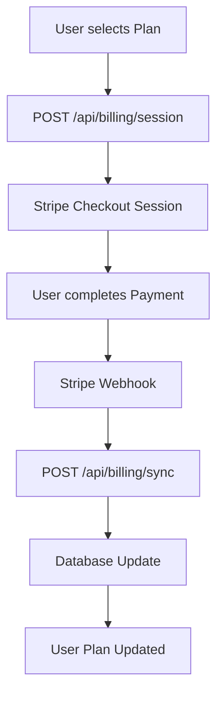
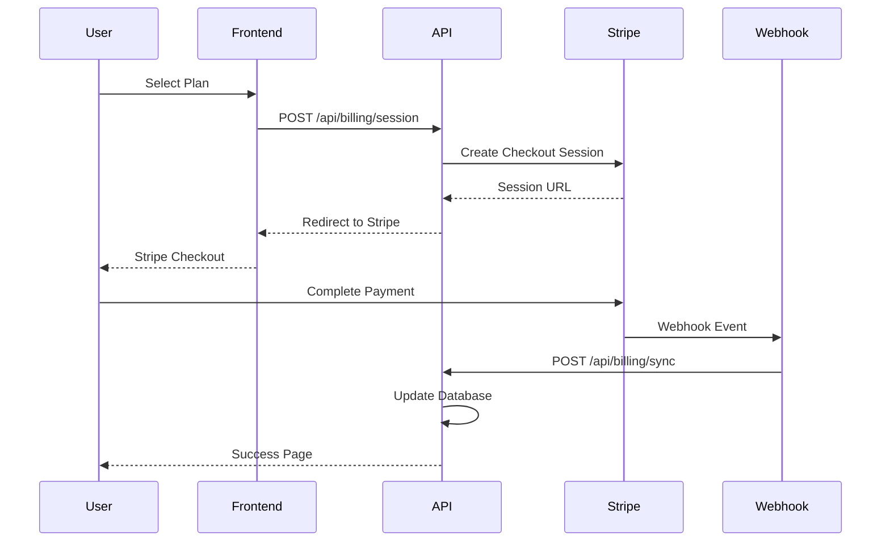

# Billing & Subscription API

**Status:** ✅ Vollständig implementiert (Production-Ready)
**Dokumentationsstatus:** 🔄 Wird aktualisiert

Die Billing API bietet vollständige Stripe-Integration für Subscription-Management, Checkout-Sessions und Zahlungsabwicklung. Unterstützt mehrere Plan-Typen (Pro, Premium, Enterprise) mit monatlichen und jährlichen Abrechnungsintervallen.

## Übersicht

- **Basis-URL:** `/api/billing`
- **Authentifizierung:** Erforderlich (Auth-only Endpunkte)
- **Payment-Provider:** Stripe (Checkout Sessions + Webhooks)
- **Pläne:** Pro, Premium, Enterprise
- **Intervalle:** Monatlich, Jährlich
- **Währung:** EUR (Standard)
- **Compliance:** PCI DSS konform über Stripe

## Architektur

### Subscription-Flow



### Datenmodell

```typescript
interface Subscription {
  id: string;
  userId: string;
  workspaceId: string;
  stripeSubscriptionId: string;
  stripeCustomerId: string;
  plan: 'pro' | 'premium' | 'enterprise';
  interval: 'monthly' | 'annual';
  status: 'active' | 'canceled' | 'past_due' | 'incomplete';
  currentPeriodStart: string;
  currentPeriodEnd: string;
  cancelAtPeriodEnd: boolean;
  createdAt: string;
  updatedAt: string;
}

interface CheckoutSession {
  id: string;
  url: string;
  stripeSessionId: string;
  plan: string;
  interval: string;
  amount: number;
  currency: string;
}
```

## Endpunkte

### POST `/api/billing/session`

Erstellt eine neue Stripe Checkout-Session für Subscription-Upgrade.

#### Security-Features

- **Authentifizierung:** Erforderlich (User-Session)
- **Rate-Limiting:** Standard-API-Limits (30/min)
- **Audit-Logging:** Checkout-Events werden protokolliert
- **Input-Validierung:** Plan- und Workspace-Validierung
- **CSRF-Schutz:** Double-Submit Pattern

#### Request-Body

```json
{
  "plan": "pro" | "premium" | "enterprise",
  "workspaceId": "string",
  "interval": "monthly" | "annual",
  "returnTo": "string (optional)"
}
```

**Erforderliche Felder:**
- `plan`: Abonnement-Plan (pro, premium, enterprise)
- `workspaceId`: Workspace/Organization-ID

**Optionale Felder:**
- `interval`: Abrechnungsintervall (monthly, annual) - Standard: monthly
- `returnTo`: Return-URL nach erfolgreichem Checkout

#### Beispiel-Request

```bash
curl -X POST "http://127.0.0.1:8787/api/billing/session" \
  -H "Content-Type: application/json" \
  -H "Authorization: Bearer <session-cookie>" \
  -H "X-CSRF-Token: abc123" \
  -H "Cookie: csrf_token=abc123" \
  -d '{
    "plan": "premium",
    "workspaceId": "ws_abc123def456",
    "interval": "annual",
    "returnTo": "/dashboard/billing"
  }'
```

#### Success Response (200)

```json
{
  "success": true,
  "data": {
    "url": "https://checkout.stripe.com/pay/cs_test_abc123...",
    "sessionId": "cs_test_abc123def456",
    "plan": "premium",
    "interval": "annual",
    "amount": 9900,
    "currency": "eur"
  }
}
```

#### Error Responses

**Nicht authentifiziert (401):**
```json
{
  "success": false,
  "error": {
    "type": "auth_error",
    "message": "Unauthorized"
  }
}
```

**Ungültiger Plan (400):**
```json
{
  "success": false,
  "error": {
    "type": "validation_error",
    "message": "Unknown plan"
  }
}
```

**Stripe-Konfiguration fehlt (500):**
```json
{
  "success": false,
  "error": {
    "type": "server_error",
    "message": "Stripe not configured"
  }
}
```

### GET `/api/billing/session`

Ruft die aktuelle Subscription-Information für den authentifizierten Benutzer ab.

#### Security-Features

- **Authentifizierung:** Erforderlich
- **Workspace-Filter:** Zeigt nur Subscriptions des aktuellen Workspaces

#### Beispiel-Request

```bash
curl "http://127.0.0.1:8787/api/billing/session" \
  -H "Authorization: Bearer <session-cookie>" \
  -H "Cookie: session=<session-id>"
```

#### Success Response (200)

```json
{
  "success": true,
  "data": {
    "subscription": {
      "id": "sub_abc123def456",
      "plan": "premium",
      "interval": "annual",
      "status": "active",
      "currentPeriodStart": "2025-01-01T00:00:00.000Z",
      "currentPeriodEnd": "2026-01-01T00:00:00.000Z",
      "cancelAtPeriodEnd": false,
      "amount": 9900,
      "currency": "eur"
    },
    "upcomingInvoice": {
      "amount": 9900,
      "currency": "eur",
      "date": "2026-01-01T00:00:00.000Z"
    }
  }
}
```

### POST `/api/billing/cancel`

Kündigt die aktuelle Subscription (Cancel at Period End).

#### Request-Body

```json
{
  "workspaceId": "string",
  "cancelAtPeriodEnd": true,
  "reason": "string (optional)"
}
```

#### Beispiel-Request

```bash
curl -X POST "http://127.0.0.1:8787/api/billing/cancel" \
  -H "Content-Type: application/json" \
  -H "Authorization: Bearer <session-cookie>" \
  -H "X-CSRF-Token: abc123" \
  -H "Cookie: csrf_token=abc123" \
  -d '{
    "workspaceId": "ws_abc123def456",
    "cancelAtPeriodEnd": true,
    "reason": "Nicht mehr benötigt"
  }'
```

#### Success Response (200)

```json
{
  "success": true,
  "data": {
    "subscription": {
      "id": "sub_abc123def456",
      "status": "active",
      "cancelAtPeriodEnd": true,
      "canceledAt": "2025-01-15T10:30:00.000Z"
    }
  }
}
```

### GET `/api/billing/credits`

Ruft die aktuellen Credits und Nutzungsstatistiken ab.

#### Query-Parameter

- `workspaceId` (erforderlich): Workspace-ID
- `period`: Zeitraum (`day`, `week`, `month`) - Standard: `month`

#### Beispiel-Request

```bash
curl "http://127.0.0.1:8787/api/billing/credits?workspaceId=ws_abc123def456&period=month" \
  -H "Authorization: Bearer <session-cookie>"
```

#### Success Response (200)

```json
{
  "success": true,
  "data": {
    "workspaceId": "ws_abc123def456",
    "period": "month",
    "credits": {
      "aiImages": {
        "used": 45,
        "limit": 1000,
        "resetAt": "2025-02-01T00:00:00.000Z"
      },
      "promptEnhancements": {
        "used": 12,
        "limit": 500,
        "resetAt": "2025-02-01T00:00:00.000Z"
      },
      "webScraping": {
        "used": 8,
        "limit": 100,
        "resetAt": "2025-02-01T00:00:00.000Z"
      }
    },
    "plan": "premium",
    "subscriptionStatus": "active"
  }
}
```

### POST `/api/billing/sync`

Synchronisiert Subscription-Daten mit Stripe (nach erfolgreichem Checkout).

#### Security-Features

- **Authentifizierung:** Erforderlich
- **Session-Validierung:** Stripe-Session-ID Validierung
- **Idempotency:** Verhindert doppelte Synchronisation

#### Request-Body

```json
{
  "sessionId": "cs_test_abc123...",
  "workspaceId": "ws_abc123def456"
}
```

#### Beispiel-Request

```bash
curl -X POST "http://127.0.0.1:8787/api/billing/sync" \
  -H "Content-Type: application/json" \
  -H "Authorization: Bearer <session-cookie>" \
  -H "X-CSRF-Token: abc123" \
  -H "Cookie: csrf_token=abc123" \
  -d '{
    "sessionId": "cs_test_abc123def456",
    "workspaceId": "ws_abc123def456"
  }'
```

#### Success Response (200)

```json
{
  "success": true,
  "data": {
    "subscription": {
      "id": "sub_abc123def456",
      "plan": "premium",
      "status": "active",
      "currentPeriodStart": "2025-01-15T10:30:00.000Z",
      "currentPeriodEnd": "2025-02-15T10:30:00.000Z"
    },
    "message": "Subscription activated successfully"
  }
}
```

### POST `/api/billing/stripe-webhook` (Server-only)

Verarbeitet Stripe-Webhooks für Subscription-Events.

#### Security-Features

- **Stripe-Signatur:** Webhook-Signatur-Validierung
- **Raw-Body:** Unveränderte Request-Verarbeitung
- **Idempotency:** Event-Deduplikation
- **Error-Handling:** Umfassende Fehlerprotokollierung

#### Webhook-Events

**Unterstützte Events:**
- `customer.subscription.created`
- `customer.subscription.updated`
- `customer.subscription.deleted`
- `customer.subscription.trial_will_end`
- `invoice.payment_succeeded`
- `invoice.payment_failed`

#### Beispiel-Webhook-Payload

```json
{
  "id": "evt_abc123def456",
  "type": "customer.subscription.updated",
  "data": {
    "object": {
      "id": "sub_abc123def456",
      "status": "active",
      "current_period_start": 1705312200,
      "current_period_end": 1707990600
    }
  }
}
```

## Pläne und Preise

### Preisstruktur

| Plan | Monatlich | Jährlich | Features |
|------|-----------|----------|----------|
| **Pro** | €29 | €290 | 1000 AI-Bilder, 500 Prompts, 100 Scraping |
| **Premium** | €99 | €990 | 5000 AI-Bilder, 2000 Prompts, 500 Scraping |
| **Enterprise** | €299 | €2990 | Unbegrenzt, Priority Support, Custom Features |

### Feature-Matrix

**AI Image Enhancement:**
- **Free:** 20/Tag, 100/Monat
- **Pro:** 1000/Tag, 10000/Monat
- **Premium:** 5000/Tag, 50000/Monat
- **Enterprise:** Unbegrenzt

**Prompt Enhancement:**
- **Free:** 5/Tag
- **Pro:** 500/Tag
- **Premium:** 2000/Tag
- **Enterprise:** Unbegrenzt

**Web Scraping:**
- **Free:** 5/Tag
- **Pro:** 100/Tag
- **Premium:** 500/Tag
- **Enterprise:** Unbegrenzt

## Stripe-Integration

### Checkout-Flow



### Webhook-Verarbeitung

**Event-Types:**
- **Subscription Created:** Neue Subscription anlegen
- **Subscription Updated:** Status/Plan-Änderungen
- **Subscription Canceled:** Kündigung verarbeiten
- **Payment Succeeded:** Zahlung bestätigen
- **Payment Failed:** Zahlungsfehler behandeln

**Retry-Logik:**
- Exponential Backoff für fehlgeschlagene Webhooks
- Dead-Letter-Queue für kritische Fehler
- Manual Retry über Admin-Panel

## Sicherheit

### Payment-Sicherheit

**PCI DSS Compliance:**
- Keine Kreditkarten-Daten im System
- Stripe hosted Checkout
- Sichere Token-Verarbeitung
- Audit-Logs für alle Payment-Events

**Fraud-Schutz:**
- Stripe Radar Integration
- Velocity Checks
- Geolocation-basierte Limits
- Manual Review für verdächtige Transaktionen

### API-Sicherheit

**Authentifizierung:**
- Session-basierte Authentifizierung
- Workspace-basierte Berechtigung
- User-Role-Validierung

**Rate-Limiting:**
- Checkout-Session: 5/min pro User
- Sync-Operationen: 10/min pro User
- Webhook-Verarbeitung: 100/min global

## Tests

### Unit-Tests

**Billing-Service-Tests:**
- Plan-Validierung und Preisberechnung
- Subscription-Status-Management
- Stripe-Mock-Integration
- Error-Handling-Szenarien

**API-Endpoint-Tests:**
- Session-Erstellung
- Webhook-Verarbeitung
- Sync-Operationen
- Authentifizierung und Berechtigung

### Integration-Tests

**Stripe-Flow-Tests:**
- Kompletter Checkout-Flow
- Webhook-Event-Verarbeitung
- Subscription-Status-Übergänge
- Error-Recovery-Szenarien

**E2E-Tests:**
- User-Registrierung → Plan-Upgrade → Cancellation
- Payment-Flow mit Test-Karten
- Webhook-Delivery und Retry-Logik

### Test-Daten

**Stripe-Mock:**
- Test-Subscriptions in verschiedenen Stati
- Webhook-Event-Simulation
- Payment-Method-Mocking
- Error-Condition-Testing

## Fehlerbehebung

### Häufige Probleme

**"Stripe not configured":**
- Stripe-Secrets fehlen in Environment
- Prüfe `STRIPE_SECRET` und `STRIPE_WEBHOOK_SECRET`
- Kontaktiere Administrator

**"Subscription sync failed":**
- Webhook-Delivery-Problem
- Manual Sync über Admin-Panel
- Prüfe Stripe-Dashboard für Event-Status

**"Payment failed":**
- Kreditkarte abgelehnt
- Unzureichendes Limit
- Währungsprobleme
- Kontaktiere Support

### Debug-Informationen

**Bei aktiviertem Debug-Panel:**
- Stripe-Session-Erstellung
- Webhook-Event-Verarbeitung
- Subscription-Status-Änderungen
- Payment-Fehler und Recovery
- Performance-Metriken

## Compliance

### PCI DSS

**Sicherheitsmaßnahmen:**
- Keine Speicherung sensibler Karten-Daten
- Stripe hosted Checkout-Forms
- Sichere Token-Verarbeitung
- Audit-Logs für alle Payment-Events

**Zertifizierung:**
- Stripe ist PCI DSS Level 1 zertifiziert
- Evolution Hub verarbeitet keine Karten-Daten
- Sichere API-Kommunikation (TLS 1.2+)

### GDPR

**Datenschutz-Features:**
- **Transparenz:** Klare Angaben über Datenverarbeitung
- **Einwilligung:** Explizite Zustimmung für Marketing
- **Löschung:** Recht auf Datenlöschung
- **Portabilität:** Datenexport-Funktionen

**Payment-Daten:**
- Stripe speichert und verarbeitet alle Payment-Daten
- Evolution Hub speichert nur Subscription-Metadaten
- Keine Kreditkarten-Informationen in der Datenbank

## Monitoring

### Metriken

**Business-Metriken:**
- **Conversion-Rate:** Free → Paid Subscriptions
- **Churn-Rate:** Kündigungsrate
- **MRR:** Monthly Recurring Revenue
- **ARPU:** Average Revenue Per User

**Technische Metriken:**
- **Checkout-Success-Rate:** > 95%
- **Webhook-Delivery-Rate:** > 99.9%
- **Payment-Failure-Rate:** < 5%
- **Sync-Error-Rate:** < 1%

### Alerting

**Kritische Alerts:**
- Webhook-Delivery-Fehler
- Payment-Failures > 10%
- Subscription-Sync-Fehler
- Stripe-API-Ausfälle

**Monitoring-Tools:**
- Stripe-Dashboard
- Custom Metrics in Cloudflare
- Error-Tracking (Sentry)
- Performance-Monitoring

## Roadmap

### Geplante Features

**Erweiterte Billing-Features:**
- **Prorated Upgrades:** Automatische Berechnung bei Plan-Änderungen
- **Add-ons:** Zusätzliche Features als separate Produkte
- **Team-Management:** Team-basierte Subscriptions
- **Usage-based Billing:** Nutzungsabhängige Abrechnung

**Payment-Methoden:**
- **SEPA Direct Debit:** Europäische Banküberweisung
- **PayPal:** Alternative Payment-Methode
- **Crypto:** Kryptowährungen
- **Invoice:** Rechnungszahlung für Enterprise

**Admin-Features:**
- **Manual Subscription Management:** Admin-Interface für Subscription-Änderungen
- **Dunning Management:** Automatisiertes Mahnwesen
- **Revenue Analytics:** Umsatz-Analyse und -Berichte
- **Customer Support Tools:** Support-Tool-Integration

### Compliance-Verbesserungen

**Erweiterte Sicherheit:**
- **3D Secure:** Starke Kundenauthentifizierung
- **SCA Compliance:** PSD2-konforme Zahlungen
- **Fraud Detection:** Erweiterte Betrugserkennung
- **Audit Logs:** Detaillierte Compliance-Logs

**Internationale Expansion:**
- **Multi-Currency:** Mehrere Währungen
- **Tax Compliance:** Automatische Steuerberechnung
- **Localized Pricing:** Länder-spezifische Preise
- **Legal Compliance:** Länder-spezifische Gesetze