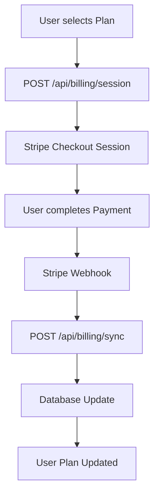
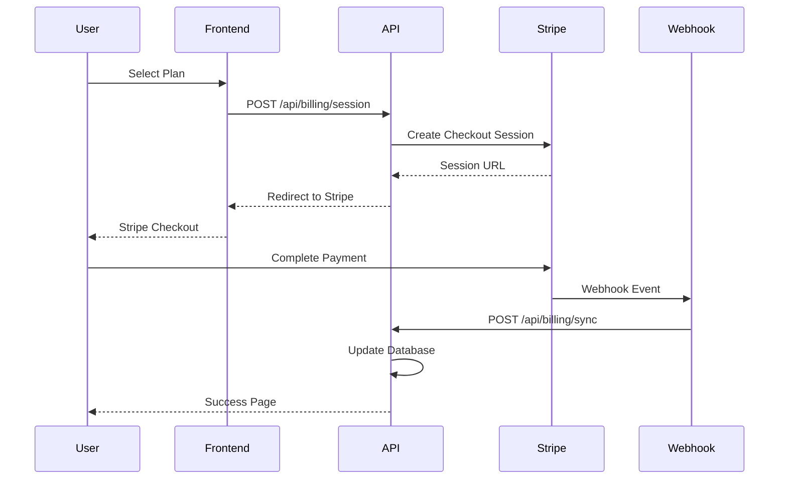

# Billing & Subscription API

**Status:** ✅ Vollständig implementiert (Production-Ready)
**Dokumentationsstatus:** 🔄 Aktualisiert für Worker-Runtime (Oktober 2025)

Die Billing API bietet vollständige Stripe-Integration für Subscription-Management, Checkout-Sessions und Zahlungsabwicklung. Unterstützt mehrere Plan-Typen (Pro, Premium, Enterprise) mit monatlichen und jährlichen Abrechnungsintervallen.

## Übersicht

- **Basis-URL:** `/api/billing`
- **Authentifizierung:** Erforderlich (Auth-only Endpunkte)
- **Payment-Provider:** Stripe (Checkout Sessions + Webhooks)
- **Pläne:** Pro, Premium, Enterprise
- **Intervalle:** Monatlich, Jährlich
- **Währung:** EUR (Standard)
- **Compliance:** PCI DSS konform über Stripe

## Architektur

### Subscription-Flow



### Datenmodell

```typescript
interface SubscriptionRow {
  id: string;
  userId: string;
  customerId: string;
  plan: 'free' | 'pro' | 'premium' | 'enterprise';
  status: 'active' | 'trialing' | 'past_due' | 'canceled' | 'unpaid' | 'incomplete_expired';
  currentPeriodEnd: number | null; // Unix timestamp (seconds)
  cancelAtPeriodEnd: 0 | 1;
  createdAt: string;
  updatedAt: string;
}
```

> ⚠️ Hinweis: Die Worker-Implementierung speichert keine Checkout-Sessions. Checkout-URLs werden direkt an den Client zurückgegeben.

## Endpunkte

### POST `/api/billing/session`

Erstellt eine Stripe Checkout Session für Pro/Premium/Enterprise-Pläne (monatlich/jährlich).

#### Security & Compliance

- **withAuthApiMiddleware** → Authentifizierung, Same-Origin & Double-Submit-CSRF (`X-CSRF-Token` ↔ `csrf_token`).
- **Rate Limit:** `apiRateLimiter` (30/min pro Benutzer).
- **Audit:** `logUserEvent('checkout_session_created', …)` mit IP.
- **Return-To-Schutz:** `sanitizeReturnTo()` erlaubt nur gleiche Origin; alternativ wird `Referer` geprüft.

#### Request

```json
{
  "plan": "pro" | "premium" | "enterprise",
  "workspaceId": "ws_...",
  "interval": "monthly" | "annual" ,
  "returnTo": "/dashboard?tab=billing" (optional)
}
```

- `interval` standardmäßig `monthly`; gültige Preis-IDs kommen aus `PRICING_TABLE[_ANNUAL]`.
- `returnTo` und `Referer` werden sanitisiert und als Query-Parameter an `/api/billing/sync` weitergegeben.

#### Response (200)

```json
{
  "success": true,
  "data": {
    "url": "https://checkout.stripe.com/pay/cs_test_..."
  }
}
```

> Die Implementierung liefert ausschließlich die Weiterleitungs-URL. Es werden keine Beträge oder Session-IDs im JSON gespiegelt.

#### Error Responses

**Nicht authentifiziert (401):**

```json
{
  "success": false,
  "error": {
    "type": "auth_error",
    "message": "Unauthorized"
  }
}
```

**Ungültiger Plan (400):**

```json
{
  "success": false,
  "error": {
    "type": "validation_error",
    "message": "Unknown plan"
  }
}
```

**Stripe-Konfiguration fehlt (500):**

```json
{
  "success": false,
  "error": {
    "type": "server_error",
    "message": "Stripe not configured"
  }
}
```

### GET `/api/billing/sync`

Synchronisiert nach erfolgreichem Stripe-Checkout und führt einen sicheren Redirect durch.

#### Anfrage

`/api/billing/sync?session_id=cs_test_...&ws=workspace_id&return_to=%2Fdashboard`

- **session_id** (Pflicht): Checkout Session ID.
- **ws** (optional): Workspace-ID.
- **return_to** (optional): Sanitized Pfad relative zur App.

#### Ablauf

1. Session Validierung bei Stripe (`expand: ['subscription']`).
2. D1 Upsert (`stripe_customers`, `subscriptions`) + `users.plan` Update.
3. Redirect:
   - `return_to` → `${BASE_URL}${return_to}`
   - sonst `${BASE_URL}/dashboard?ws=...`

> Wird `session_id` oder Stripe-Secret nicht gefunden, erfolgt Redirect mit Query-Flag (`billing=missing_session|stripe_not_configured`).

### POST `/api/billing/cancel`

Kündigt eine Stripe-Subscription zum Periodenende.

#### Request

```json
{
  "subscriptionId": "sub_..."
}
```

#### Verhalten

- **Validierung:** Subscription muss dem aktuellen Benutzer gehören (`subscriptions` D1).
- **Stripe:** `cancel_at_period_end` = true.
- **Datenbank:** `cancel_at_period_end` Flag setzen.
- **Response:**

```json
{
  "success": true,
  "data": {
    "message": "Subscription will cancel at period end",
    "subscriptionId": "sub_..."
  }
}
```

#### Beispiel-Request

```bash
curl -X POST "http://127.0.0.1:8787/api/billing/cancel" \
  -H "Content-Type: application/json" \
  -H "Authorization: Bearer <session-cookie>" \
  -H "X-CSRF-Token: abc123" \
  -H "Cookie: csrf_token=abc123" \
  -d '{
    "subscriptionId": "sub_abc123def456"
  }'
```

#### Success Response (200)

```json
{
  "success": true,
  "data": {
    "subscription": {
      "id": "sub_abc123def456",
      "status": "active",
      "cancelAtPeriodEnd": true,
      "canceledAt": "2025-01-15T10:30:00.000Z"
    }
  }
}
```

### POST `/api/billing/credits`

Erstellt eine Stripe Checkout Session für Credits-Pakete (100 / 500 / 1500 Images).

#### Request

```json
{
  "pack": 100,
  "workspaceId": "ws_...",
  "returnTo": "/dashboard"
}
```

- Preise kommen aus `CREDITS_PRICING_TABLE` (JSON Mapping als Env).
- Optionales `returnTo` wird sanitisiert und mit `credits=1` zurückgegeben.

#### Response (200)

```json
{
  "url": "https://checkout.stripe.com/pay/cs_test_..."
}
```

> Dieser Endpoint verwendet keinen `success`-Wrapper. Fehlerantworten nutzen `error`-Codes wie `invalid_pack`, `pack_not_configured` oder `stripe_not_configured`.

### POST `/api/billing/stripe-webhook`

Unverändert: siehe OpenAPI. Nutzt `STRIPE_WEBHOOK_SECRET` und `withRedirectMiddleware`. (Details bleiben bestehen.)

### POST `/api/billing/stripe-webhook` (Server-only)

Verarbeitet Stripe-Webhooks für Subscription-Events.

#### Security-Features

- **Stripe-Signatur:** Webhook-Signatur-Validierung
- **Raw-Body:** Unveränderte Request-Verarbeitung
- **Idempotency:** Event-Deduplikation
- **Error-Handling:** Umfassende Fehlerprotokollierung

#### Webhook-Events

**Unterstützte Events:**

- `customer.subscription.created`
- `customer.subscription.updated`
- `customer.subscription.deleted`
- `customer.subscription.trial_will_end`
- `invoice.payment_succeeded`
- `invoice.payment_failed`

#### Beispiel-Webhook-Payload

```json
{
  "id": "evt_abc123def456",
  "type": "customer.subscription.updated",
  "data": {
    "object": {
      "id": "sub_abc123def456",
      "status": "active",
      "current_period_start": 1705312200,
      "current_period_end": 1707990600
    }
  }
}
```

## Pläne und Preise

### Preisstruktur

| Plan           | Monatlich | Jährlich | Features                                      |
| -------------- | --------- | -------- | --------------------------------------------- |
| **Pro**        | €29       | €290     | 1000 AI-Bilder, 500 Prompts, 100 Scraping     |
| **Premium**    | €99       | €990     | 5000 AI-Bilder, 2000 Prompts, 500 Scraping    |
| **Enterprise** | €299      | €2990    | Unbegrenzt, Priority Support, Custom Features |

### Feature-Matrix

**AI Image Enhancement:**

- **Free:** 20/Tag, 100/Monat
- **Pro:** 1000/Tag, 10000/Monat
- **Premium:** 5000/Tag, 50000/Monat
- **Enterprise:** Unbegrenzt

**Prompt Enhancement:**

- **Free:** 5/Tag
- **Pro:** 500/Tag
- **Premium:** 2000/Tag
- **Enterprise:** Unbegrenzt

**Web Scraping:**

- **Free:** 5/Tag
- **Pro:** 100/Tag
- **Premium:** 500/Tag
- **Enterprise:** Unbegrenzt

## Stripe-Integration

### Checkout-Flow



### Webhook-Verarbeitung

**Event-Types:**

- **Subscription Created:** Neue Subscription anlegen
- **Subscription Updated:** Status/Plan-Änderungen
- **Subscription Canceled:** Kündigung verarbeiten
- **Payment Succeeded:** Zahlung bestätigen
- **Payment Failed:** Zahlungsfehler behandeln

**Retry-Logik:**

- Exponential Backoff für fehlgeschlagene Webhooks
- Dead-Letter-Queue für kritische Fehler
- Manual Retry über Admin-Panel

## Sicherheit

### Payment-Sicherheit

**PCI DSS Compliance:**

- Keine Kreditkarten-Daten im System
- Stripe hosted Checkout
- Sichere Token-Verarbeitung
- Audit-Logs für alle Payment-Events

**Fraud-Schutz:**

- Stripe Radar Integration
- Velocity Checks
- Geolocation-basierte Limits
- Manual Review für verdächtige Transaktionen

### API-Sicherheit

**Authentifizierung:**

- Session-basierte Authentifizierung
- Workspace-basierte Berechtigung
- User-Role-Validierung

**Rate-Limiting:**

- Checkout-Session: 5/min pro User
- Sync-Operationen: 10/min pro User
- Webhook-Verarbeitung: 100/min global

## Tests

### Unit-Tests

**Billing-Service-Tests:**

- Plan-Validierung und Preisberechnung
- Subscription-Status-Management
- Stripe-Mock-Integration
- Error-Handling-Szenarien

**API-Endpoint-Tests:**

- Session-Erstellung
- Webhook-Verarbeitung
- Sync-Operationen
- Authentifizierung und Berechtigung

### Integration-Tests

> ⚠️ Legacy-Hinweis: `tests/integration/billing-api.test.ts` enthält noch Mock-basierte Endpunkte (GET `/api/billing/credits`, POST `/api/billing/sync`). Diese Tests markieren alte REST-Varianten und sollten bei Gelegenheit modernisiert werden. Für reale Flows nutzen wir Playwright-E2E (`pricing-smoke`) und Stripe CLI.

### Test-Daten

**Stripe-Mock:**

- Test-Subscriptions in verschiedenen Stati
- Webhook-Event-Simulation
- Payment-Method-Mocking
- Error-Condition-Testing

## Fehlerbehebung

### Häufige Probleme

**"Stripe not configured":**

- Stripe-Secrets fehlen in Environment
- Prüfe `STRIPE_SECRET` und `STRIPE_WEBHOOK_SECRET`
- Kontaktiere Administrator

**"Subscription sync failed":**

- Webhook-Delivery-Problem
- Manual Sync über Admin-Panel
- Prüfe Stripe-Dashboard für Event-Status

**"Payment failed":**

- Kreditkarte abgelehnt
- Unzureichendes Limit
- Währungsprobleme
- Kontaktiere Support

### Debug-Informationen

**Bei aktiviertem Debug-Panel:**

- Stripe-Session-Erstellung
- Webhook-Event-Verarbeitung
- Subscription-Status-Änderungen
- Payment-Fehler und Recovery
- Performance-Metriken

## Compliance

### PCI DSS

**Sicherheitsmaßnahmen:**

- Keine Speicherung sensibler Karten-Daten
- Stripe hosted Checkout-Forms
- Sichere Token-Verarbeitung
- Audit-Logs für alle Payment-Events

**Zertifizierung:**

- Stripe ist PCI DSS Level 1 zertifiziert
- Evolution Hub verarbeitet keine Karten-Daten
- Sichere API-Kommunikation (TLS 1.2+)

### GDPR

**Datenschutz-Features:**

- **Transparenz:** Klare Angaben über Datenverarbeitung
- **Einwilligung:** Explizite Zustimmung für Marketing
- **Löschung:** Recht auf Datenlöschung
- **Portabilität:** Datenexport-Funktionen

**Payment-Daten:**

- Stripe speichert und verarbeitet alle Payment-Daten
- Evolution Hub speichert nur Subscription-Metadaten
- Keine Kreditkarten-Informationen in der Datenbank

## Monitoring

### Metriken

**Business-Metriken:**

- **Conversion-Rate:** Free → Paid Subscriptions
- **Churn-Rate:** Kündigungsrate
- **MRR:** Monthly Recurring Revenue
- **ARPU:** Average Revenue Per User

**Technische Metriken:**

- **Checkout-Success-Rate:** > 95%
- **Webhook-Delivery-Rate:** > 99.9%
- **Payment-Failure-Rate:** < 5%
- **Sync-Error-Rate:** < 1%

### Alerting

**Kritische Alerts:**

- Webhook-Delivery-Fehler
- Payment-Failures > 10%
- Subscription-Sync-Fehler
- Stripe-API-Ausfälle

**Monitoring-Tools:**

- Stripe-Dashboard
- Cloudflare Analytics (KV + Logs)
- Error-Tracking (Sentry)
- Internal audit logs (`logUserEvent`)

## Roadmap

### Geplante Features

**Erweiterte Billing-Features:**

- **Prorated Upgrades:** Automatische Berechnung bei Plan-Änderungen
- **Add-ons:** Zusätzliche Features als separate Produkte
- **Team-Management:** Team-basierte Subscriptions
- **Usage-based Billing:** Nutzungsabhängige Abrechnung

**Payment-Methoden:**

- **SEPA Direct Debit:** Europäische Banküberweisung
- **PayPal:** Alternative Payment-Methode
- **Crypto:** Kryptowährungen
- **Invoice:** Rechnungszahlung für Enterprise

**Admin-Features:**

- **Manual Subscription Management:** Admin-Interface für Subscription-Änderungen
- **Dunning Management:** Automatisiertes Mahnwesen
- **Revenue Analytics:** Umsatz-Analyse und -Berichte
- **Customer Support Tools:** Support-Tool-Integration

### Compliance-Verbesserungen

**Erweiterte Sicherheit:**

- **3D Secure:** Starke Kundenauthentifizierung
- **SCA Compliance:** PSD2-konforme Zahlungen
- **Fraud Detection:** Erweiterte Betrugserkennung
- **Audit Logs:** Detaillierte Compliance-Logs

**Internationale Expansion:**

- **Multi-Currency:** Mehrere Währungen
- **Tax Compliance:** Automatische Steuerberechnung
- **Localized Pricing:** Länder-spezifische Preise
- **Legal Compliance:** Länder-spezifische Gesetze
