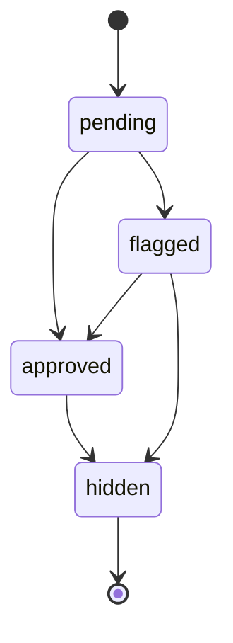

<!-- markdownlint-disable MD051 -->

# Comments API

**Status:** ✅ Vollständig implementiert (Production-Ready 80%)
**Dokumentationsstatus:** 🔄 Wird aktualisiert

Die Comments API bietet ein vollständiges Kommentarsystem mit CRUD-Operationen, Moderation, Spam-Detection und XSS-Protection. Unterstützt sowohl authentifizierte Benutzer als auch anonyme Gäste.

## Übersicht

- **Basis-URL:** `/api/comments`

- **Authentifizierung:** Optional (User + Guest-Modus)

- **Rate-Limiting:** 5/min (strenge Begrenzung für Spam-Schutz)

- **Sicherheit:** CSRF, XSS-Schutz, Spam-Detection, Input-Sanitization

- **Threading:** Hierarchische Kommentar-Struktur (Parent-Child)

- **Moderation:** Mehrstufiges Status-System

## Datenmodell

### Kommentar-Struktur

```typescript
interface Comment {
  id: string;
  content: string;
  status: 'pending' | 'approved' | 'flagged' | 'hidden';
  entityType: 'blog_post' | 'project' | 'general';
  entityId: string;
  parentId?: string; // Für Replies
  authorName?: string; // Guest-Modus
  authorEmail?: string; // Guest-Modus
  userId?: string; // Auth-Modus
  createdAt: string;
  updatedAt: string;
  children?: Comment[];
}

```text

### Status-Workflow



## Endpunkte

### POST `/api/comments/create`

Erstellt einen neuen Kommentar oder Reply.

#### Security-Features

- **CSRF-Schutz:** Double-Submit Cookie + Header Validierung

- **Rate-Limiting:** 5/min (strenge Begrenzung)

- **Spam-Detection:** Automatische Erkennung verdächtiger Inhalte

- **XSS-Schutz:** HTML-Sanitization und Escaping

- **Input-Validierung:** Umfassende Schema-Validierung

#### Request-Body (Authentifizierte Benutzer)

```json
{
  "content": "Dies ist ein Kommentar mit **Markdown** Formatierung.",
  "entityType": "blog_post",
  "entityId": "mein-blog-post-slug",
  "parentId": "optional-parent-comment-id"
}

```text

#### Request-Body (Gast-Benutzer)

```json
{
  "content": "Anonymer Kommentar",
  "entityType": "blog_post",
  "entityId": "mein-blog-post-slug",
  "authorName": "Max Mustermann",
  "authorEmail": "max@example.com",
  "parentId": "optional-parent-comment-id"
}
```

#### Request-Headers

**Erforderlich:**

- `X-CSRF-Token`: CSRF-Token (Header oder Body)

- `Cookie`: `csrf_token=<token>` (Double-Submit Validierung)

#### Beispiel-Request

```bash
curl -X POST "http://127.0.0.1:8787/api/comments/create" \
  -H "Content-Type: application/json" \
  -H "X-CSRF-Token: abc123" \
  -H "Cookie: csrf_token=abc123" \
  -H "Origin: http://127.0.0.1:8787" \
  -d '{
    "content": "Toller Artikel!",
    "entityType": "blog_post",
    "entityId": "mein-artikel",
    "authorName": "Gast Benutzer",
    "authorEmail": "gast@example.com"
  }'

```text

#### Success Response (201 Created)

```json
{
  "success": true,
  "data": {
    "id": "comment_abc123def456",
    "content": "Toller Artikel!",
    "status": "pending",
    "entityType": "blog_post",
    "entityId": "mein-artikel",
    "authorName": "Gast Benutzer",
    "authorEmail": "gast@example.com",
    "userId": null,
    "parentId": null,
    "createdAt": "2025-01-15T10:30:00.000Z",
    "updatedAt": "2025-01-15T10:30:00.000Z",
    "children": []
  }
}
```

#### Error Responses

**CSRF-Fehler (403):**

```json
{
  "success": false,
  "error": {
    "type": "csrf_error",
    "message": "Invalid CSRF token"
  }
}

```text

**Spam erkannt (400):**

```json
{
  "success": false,
  "error": {
    "type": "validation_error",
    "message": "Kommentar wurde als Spam markiert"
  }
}
```

**Rate-Limit erreicht (429):**

```json
{
  "success": false,
  "error": {
    "type": "rate_limit",
    "message": "Too many comments"
  }
}

```text

### GET `/api/comments`

Ruft Kommentare für eine Entität ab mit Filterung und Pagination.

#### Query-Parameter

- `entityType` (erforderlich): `blog_post` | `project` | `general`

- `entityId` (erforderlich): ID/Slug der Entität

- `status` (optional): `approved` | `pending` | `flagged` | `hidden` (Standard: `approved`)

- `limit` (optional): Anzahl der Ergebnisse (1-100, Standard: 20)

- `offset` (optional): Offset für Pagination (Standard: 0)

- `includeReplies` (optional): `true` | `false` (Standard: `true`)

#### Beispiel-Request (2)

```bash
curl "http://127.0.0.1:8787/api/comments?entityType=blog_post&entityId=mein-artikel&status=approved&limit=10" \
  -H "Cookie: guest_id=abc123"
```

#### Success Response (200)

```json
{
  "success": true,
  "data": {
    "comments": [
      {
        "id": "comment_abc123def456",
        "content": "Toller Artikel!",
        "status": "approved",
        "entityType": "blog_post",
        "entityId": "mein-artikel",
        "authorName": "Gast Benutzer",
        "authorEmail": "gast@example.com",
        "userId": null,
        "parentId": null,
        "createdAt": "2025-01-15T10:30:00.000Z",
        "updatedAt": "2025-01-15T10:30:00.000Z",
        "children": [
          {
            "id": "comment_def789ghi012",
            "content": "Danke für das Feedback!",
            "status": "approved",
            "parentId": "comment_abc123def456",
            "authorName": "Autor",
            "createdAt": "2025-01-15T10:35:00.000Z"
          }
        ]
      }
    ],
    "total": 1,
    "hasMore": false,
    "filters": {
      "entityType": "blog_post",
      "entityId": "mein-artikel",
      "status": "approved"
    }
  }
}

```bash

### GET `/api/comments/count`

Liefert die Anzahl von Kommentaren für eine Entität.

#### Query-Parameter (2)

- `entityType` (erforderlich): `blog_post` | `project` | `general`

- `entityId` (erforderlich): ID/Slug der Entität

- `status` (optional): Status-Filter (Standard: `approved`)

#### Beispiel-Request (3)

```bash
curl "http://127.0.0.1:8787/api/comments/count?entityType=blog_post&entityId=mein-artikel"
```

#### Success Response (200) (2)

```json
{
  "success": true,
  "data": {
    "count": 15,
    "entityType": "blog_post",
    "entityId": "mein-artikel"
  }
}

```bash

### GET `/api/comments/recent`

Ruft die neuesten Kommentare über alle Entitäten hinweg ab.

#### Query-Parameter (3)

- `limit` (optional): Anzahl der Ergebnisse (1-50, Standard: 10)

- `status` (optional): Status-Filter (Standard: `approved`)

#### Beispiel-Request (4)

```bash
curl "http://127.0.0.1:8787/api/comments/recent?limit=5&status=approved"
```

### PUT `/api/comments/[id]`

Aktualisiert einen Kommentar (nur durch den Autor).

#### Pfad-Parameter

- `id`: Kommentar-ID

#### Request-Body

```json
{
  "content": "Aktualisierter Kommentar-Text",
  "csrfToken": "abc123"
}

```bash

#### Beispiel-Request (5)

```bash
curl -X PUT "http://127.0.0.1:8787/api/comments/comment_abc123def456" \
  -H "Content-Type: application/json" \
  -H "X-CSRF-Token: abc123" \
  -H "Cookie: csrf_token=abc123" \
  -d '{
    "content": "Das ist der aktualisierte Text.",
    "csrfToken": "abc123"
  }'
```

#### Success Response (200) (3)

```json
{
  "success": true,
  "data": {
    "id": "comment_abc123def456",
    "content": "Das ist der aktualisierte Text.",
    "status": "pending",
    "updatedAt": "2025-01-15T11:00:00.000Z"
  }
}

```json

### DELETE `/api/comments/[id]`

Löscht einen Kommentar (Soft-Delete → Status: `hidden`).

#### Pfad-Parameter (2)

- `id`: Kommentar-ID

#### Request-Body (2)

```json
{
  "csrfToken": "abc123"
}
```

#### Beispiel-Request (2) (2)

```bash
curl -X DELETE "http://127.0.0.1:8787/api/comments/comment_abc123def456" \
  -H "Content-Type: application/json" \
  -H "X-CSRF-Token: abc123" \
  -H "Cookie: csrf_token=abc123" \
  -d '{"csrfToken": "abc123"}'

```text

#### Success Response (200) (2) (2)

```json
{
  "success": true,
  "data": {
    "id": "comment_abc123def456",
    "status": "hidden",
    "deletedAt": "2025-01-15T11:15:00.000Z"
  }
}
```

### POST `/api/comments/[id]/moderate`

Moderiert einen Kommentar (nur für Administratoren).

#### Pfad-Parameter (2) (2)

- `id`: Kommentar-ID

#### Request-Body (2) (2)

```json
{
  "action": "approve" | "flag" | "hide",
  "reason": "Optional: Begründung für die Moderation",
  "csrfToken": "abc123"
}

```bash

#### Beispiel-Request (6)

```bash
curl -X POST "http://127.0.0.1:8787/api/comments/comment_abc123def456/moderate" \
  -H "Content-Type: application/json" \
  -H "X-CSRF-Token: abc123" \
  -H "Cookie: csrf_token=abc123" \
  -d '{
    "action": "approve",
    "reason": "Inhalt ist angemessen",
    "csrfToken": "abc123"
  }'
```

### GET `/api/comments/performance`

Liefert Performance-Metriken für das Kommentarsystem.

#### Query-Parameter (4)

- `period`: Zeitraum: `day` | `week` | `month` (Standard: `day`)

#### Beispiel-Request (3) (2)

```bash
curl "http://127.0.0.1:8787/api/comments/performance?period=week"

```text

#### Success Response (200) (3) (2)

```json
{
  "success": true,
  "data": {
    "period": "week",
    "metrics": {
      "totalComments": 156,
      "approvedComments": 142,
      "pendingComments": 8,
      "flaggedComments": 4,
      "hiddenComments": 2,
      "spamDetected": 3,
      "avgResponseTime": "45ms",
      "cacheHitRate": 0.87
    },
    "trends": {
      "commentsPerDay": [12, 15, 18, 22, 19, 25, 23],
      "spamRate": [0.02, 0.01, 0.03, 0.01, 0.02, 0.01, 0.02]
    }
  }
}
```

## Sicherheitsfeatures

### CSRF-Schutz

**Double-Submit Pattern:**

- Cookie: `csrf_token=<token>` (HttpOnly, Lax)

- Header: `X-CSRF-Token: <token>`

- Validierung: Beide müssen übereinstimmen

**Beispiel-Client-Integration:**

```javascript
// CSRF-Token aus Cookie lesen
const csrfToken = document.cookie
  .split('; ')
  .find(row => row.startsWith('csrf_token='))
  ?.split('=')[1];

// Request mit CSRF-Schutz
await fetch('/api/comments/create', {
  method: 'POST',
  headers: {
    'Content-Type': 'application/json',
    'X-CSRF-Token': csrfToken,
  },
  credentials: 'same-origin',
  body: JSON.stringify({
    content: 'Mein Kommentar',
    entityType: 'blog_post',
    entityId: 'mein-artikel',
    csrfToken: csrfToken
  })
});

```text

### Spam-Detection

**Automatische Erkennung:**

- **Keyword-Filtering:** Verdächtige Wörter und Phrasen

- **Pattern-Matching:** Spam-typische Muster

- **Rate-Limiting:** Ungewöhnlich hohe Aktivität

- **Link-Detection:** Verdächtige URL-Patterns

- **Content-Analysis:** Textlänge und -qualität

**Konfiguration:**

- Anpassbare Spam-Score-Schwellen

- Whitelist für vertrauenswürdige Domains

- Blacklist für bekannte Spam-Patterns

### XSS-Schutz

**HTML-Sanitization:**

- Erlaubt: **Bold**, *Italic*, `Code`, [Links](url)

- Verboten: `<script>`, `<iframe>`, Event-Handler

- Escaping: Sonderzeichen werden escaped

**Input-Cleaning:**

```javascript
// Beispiel-Transformation
input:  "<script>alert('xss')</script>Hello **World**!"
output: "<script>alert(&#x27;xss&#x27;)</script>Hello <strong>World</strong>!"
```

### Rate-Limiting

**Kommentar-spezifische Limits:**

- **Standard:** 5 Kommentare/Minute

- **Strenge Validierung:** Ungewöhnliche Muster werden stärker limitiert

- **IP-basierte Limits:** Schutz vor verteilten Angriffen

- **User-basierte Limits:** Separate Limits pro Benutzer/Gast

## Moderation

### Status-Management

| Status | Beschreibung | Sichtbar | Bearbeitbar |
|--------|-------------|----------|-------------|
| `pending` | Wartet auf Freigabe | ❌ | ✅ |
| `approved` | Freigegeben | ✅ | ✅ |
| `flagged` | Markiert für Review | ❌ | ✅ |
| `hidden` | Versteckt/Gelöscht | ❌ | ❌ |

### Moderations-API

**Admin-spezifische Endpunkte:**

- Kommentar-Status ändern

- Spam-Marken verwalten

- Moderationshistorie einsehen

- Bulk-Operationen für mehrere Kommentare

## Performance

### Optimierungen

**Datenbank:**

- **Indizes:** Optimierte Indizes für häufige Queries

- **Caching:** KV-Namespace für häufig abgerufene Kommentare

- **Pagination:** Effiziente Limit/Offset-Implementierung

**Cache-Strategie:**

- **Heiße Daten:** Kommentar-Listen werden 5 Minuten gecacht

- **Zähler:** Kommentar-Anzahlen werden 1 Minute gecacht

- **Invalidierung:** Automatische Cache-Invalidierung bei Änderungen

### Metriken

**Durchschnittliche Response-Zeiten:**

- **Create:** < 100ms

- **Read:** < 50ms (gecached)

- **Update/Delete:** < 80ms

- **Count:** < 20ms

**Cache-Effektivität:**

- **Hit-Rate:** > 85% für Leseoperationen

- **Speicherverbrauch:** < 10MB für aktive Kommentare

- **TTL:** 5 Minuten für Listen, 1 Minute für Zähler

## Content-Types

### Unterstützte Entitäten

| Entity-Type | Beschreibung | Beispiel-IDs |
|-------------|-------------|--------------|
| `blog_post` | Blog-Artikel | `mein-artikel-slug` |
| `project` | Projekt-Seiten | `mein-projekt-id` |
| `general` | Allgemeine Seiten | `about`, `contact` |

### Threading

**Hierarchische Struktur:**

- **Max. Tiefe:** 3 Ebenen (Kommentar → Reply → Reply)

- **Sortierung:** Chronologisch (neueste zuerst)

- **Darstellung:** Verschachtelte Anzeige mit Einrückung

## Client-Integration

### React-Komponenten

**Verfügbare UI-Komponenten:**

- `CommentSection` - Vollständige Kommentar-Sektion

- `CommentForm` - Kommentar-Eingabeformular

- `CommentList` - Kommentar-Liste mit Threading

- `CommentModerationPanel` - Admin-Moderationsoberfläche

### JavaScript-Client

```javascript
// Kommentar erstellen
const response = await fetch('/api/comments/create', {
  method: 'POST',
  headers: {
    'Content-Type': 'application/json',
    'X-CSRF-Token': csrfToken,
  },
  credentials: 'same-origin',
  body: JSON.stringify({
    content: 'Mein Kommentar',
    entityType: 'blog_post',
    entityId: 'artikel-slug',
    authorName: 'Gast',
    authorEmail: 'gast@example.com',
    csrfToken: csrfToken
  })
});

const result = await response.json();
if (result.success) {
  console.log('Kommentar erstellt:', result.data);
} else {
  console.error('Fehler:', result.error);
}

```text

## Tests

### Unit-Tests

**Abgedeckte Bereiche:**

- **CommentService:** CRUD-Operationen und Business-Logik

- **Spam-Detection:** Pattern-Matching und Scoring

- **XSS-Schutz:** HTML-Sanitization und Escaping

- **Rate-Limiting:** Limit-Validierung und Enforcement

### E2E-Tests

**Test-Szenarien:**

- **Gast-Kommentare:** Anonyme Kommentar-Erstellung

- **Auth-Kommentare:** Registrierte Benutzer-Kommentare

- **Threading:** Reply-Funktionalität

- **Moderation:** Admin-Workflows

- **Spam-Schutz:** Erkennung und Behandlung

- **Performance:** Ladezeiten und Cache-Effektivität

### Test-Daten

**Fixtures:**

- **Test-Kommentare:** Verschiedene Längen und Inhalte

- **Spam-Beispiele:** Bekannte Spam-Patterns

- **User-Daten:** Authentifizierte und Gast-Benutzer

- **Entity-Daten:** Verschiedene Entity-Types

## Fehlerbehebung

### Häufige Probleme

**"Invalid CSRF token":**

- CSRF-Token ist abgelaufen oder ungültig

- Stelle sicher, dass Cookie und Header übereinstimmen

- Prüfe Same-Origin-Policy

**"Spam detected":**

- Kommentar wurde als Spam markiert

- Überprüfe Inhalt auf verdächtige Muster

- Warte 1 Stunde und versuche es erneut

**"Too many comments":**

- Rate-Limit erreicht (5/min)

- Warte 1 Minute oder authentifiziere dich

- Authentifizierte Benutzer haben höhere Limits

**"Missing required fields":**

- Erforderliche Felder fehlen: `content`, `entityType`, `entityId`

- Prüfe Request-Body auf Vollständigkeit

- Stelle sicher, dass Entity-Type gültig ist

### Debug-Informationen

**Bei aktiviertem Debug-Panel:**

- CSRF-Token-Validierungsschritte

- Spam-Score-Berechnung

- Cache-Treffer/Fehlschläge

- SQL-Query-Performance

- Moderationshistorie

## Compliance

### GDPR

**Datenschutz-Features:**

- **Anonymisierung:** Gast-Kommentare ohne personenbezogene Daten

- **Löschung:** Soft-Delete mit Aufbewahrungsfrist

- **Export:** Kommentar-Export für Benutzer

- **Einwilligung:** Cookie-Consent für Tracking

**Aufbewahrungsfristen:**

- **Aktive Kommentare:** Unbegrenzt (bis zur Löschung)

- **Gelöschte Kommentare:** 30 Tage

- **Audit-Logs:** 90 Tage

- **Cache-Daten:** 5 Minuten

### Barrierefreiheit

**WCAG-Compliance:**

- **Keyboard-Navigation:** Vollständige Tastatur-Unterstützung

- **Screen-Reader:** ARIA-Labels und semantische Struktur

- **Kontrast:** WCAG AA konforme Farbkontraste

- **Focus-Management:** Sichtbare Focus-Indikatoren

## Roadmap

### Geplante Features

- **Rich-Text-Editor:** Erweiterte Formatierungsoptionen

- **@Mentions:** Benutzer-Erwähnungen in Kommentaren

- **Reactions:** Like/Dislike-System

- **Email-Benachrichtigungen:** Bei Replies und Mentions

- **Mobile-Optimierung:** Verbesserte Mobile-Erfahrung

- **Dark-Mode:** Theme-Unterstützung

### Performance-Verbesserungen

- **Real-time Updates:** WebSocket-basierte Live-Kommentare

- **Infinite Scroll:** Pagination-freies Laden

- **Image-Upload:** Kommentar-Bilder

- **Video-Support:** Video-Kommentare

- **Voice-Kommentare:** Audio-Kommentare

### Moderations-Features

- **Auto-Moderation:** KI-basierte Inhaltsanalyse

- **Bulk-Moderation:** Mehrere Kommentare gleichzeitig moderieren

- **Moderations-Queue:** Übersicht wartender Kommentare

- **Appeal-System:** Kommentar-Appeal-Prozess

- **User-Reporting:** Meldesystem für unangemessene Inhalte

```text
