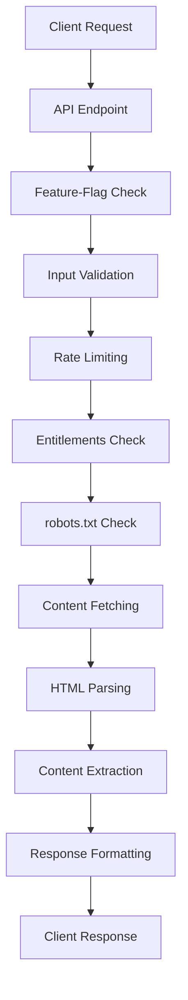
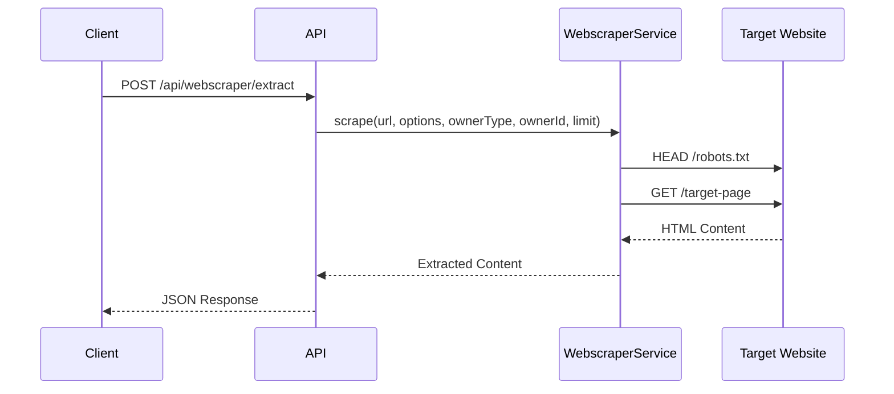

# Webscraper API

**Status:** ✅ Vollständig implementiert (Feature-Flag basiert)
**Dokumentationsstatus:** 🔄 Wird aktualisiert

Die Webscraper API ermöglicht die Extraktion strukturierter Inhalte aus Webseiten. Das System respektiert robots.txt, implementiert Rate-Limiting und unterstützt sowohl authentifizierte Benutzer als auch Gäste mit unterschiedlichen Limits.

## Übersicht

- **Basis-URL:** `/api/webscraper`
- **Authentifizierung:** Optional (User + Guest-Modus)
- **Rate-Limiting:** 10/min (webscraperLimiter)
- **Feature-Flag:** `PUBLIC_WEBSCRAPER_V1` (Standard: aktiviert)
- **Compliance:** robots.txt Respektierung, User-Agent, Rate-Limiting
- **Entitlements:** Plan-basierte Limits und Features

## Architektur

### Content-Extraction Pipeline



### Datenfluss



## Endpunkte

### POST `/api/webscraper/extract`

Extrahiert strukturierte Inhalte aus einer Webseite.

#### Request Format

**Content-Type:** `application/json`

**Request-Body:**

```json
{
  "url": "https://example.com/article",
  "options": {
    "extractImages": true,
    "extractLinks": true,
    "extractMetadata": true,
    "maxContentLength": 50000,
    "followRedirects": true,
    "timeout": 10000
  }
}
```

Hinweis: Der kanonische Request ist in der OpenAPI‑Spezifikation als Komponente definiert:
`#/components/schemas/WebscraperRequest`. Der Server führt zusätzlich SSRF‑Sicherheitsprüfungen
(http/https only; localhost/private Netze blockiert) zur Laufzeit durch.

#### Request-Parameter

**Erforderlich:**

- `url` (string): Die zu scrapende URL (muss mit http:// oder https:// beginnen)

**Optional:**

- `options` (object): Extraktionsoptionen
  - `extractImages` (boolean): Bilder extrahieren (Standard: true)
  - `extractLinks` (boolean): Links extrahieren (Standard: true)
  - `extractMetadata` (boolean): Metadaten extrahieren (Standard: true)
  - `maxContentLength` (number): Maximale Inhaltslänge (Standard: 50000)
  - `followRedirects` (boolean): Redirects folgen (Standard: true)
  - `timeout` (number): Request-Timeout in ms (Standard: 10000)

#### Beispiel-Request

```bash
curl -X POST "http://127.0.0.1:8787/api/webscraper/extract" \
  -H "Content-Type: application/json" \
  -H "X-CSRF-Token: abc123" \
  -H "Cookie: csrf_token=abc123" \
  -H "Origin: http://127.0.0.1:8787" \
  -d '{
    "url": "https://example.com/blog/article",
    "options": {
      "extractImages": true,
      "extractLinks": true,
      "extractMetadata": true,
      "maxContentLength": 30000
    }
  }'
```

#### Success Response (200)

```json
{
  "success": true,
  "data": {
    "result": {
      "url": "https://example.com/blog/article",
      "title": "Artikel-Titel aus Meta oder H1",
      "description": "Beschreibung aus Meta Description",
      "content": "Vollständiger Artikel-Text...",
      "images": [
        {
          "url": "https://example.com/image1.jpg",
          "alt": "Bild-Beschreibung",
          "width": 800,
          "height": 600
        }
      ],
      "links": [
        {
          "url": "https://example.com/other-article",
          "text": "Verwandter Artikel",
          "type": "internal"
        }
      ],
      "metadata": {
        "author": "Autor Name",
        "publishedDate": "2025-01-15T10:00:00.000Z",
        "modifiedDate": "2025-01-15T12:00:00.000Z",
        "language": "de",
        "siteName": "Example.com"
      },
      "extractedAt": "2025-01-15T13:30:00.000Z",
      "contentLength": 15420,
      "processingTime": 1250
    },
    "usage": {
      "used": 1,
      "limit": 10,
      "resetAt": null
    }
  }
}
```

#### Error Responses

**Feature deaktiviert (403):**

```json
{
  "success": false,
  "error": {
    "type": "forbidden",
    "message": "Feature not enabled"
  }
}
```

**robots.txt blockiert (403):**

```json
{
  "success": false,
  "error": {
    "type": "forbidden",
    "message": "Scraping blocked by robots.txt"
  }
}
```

**Quota überschritten (403):**

```json
{
  "success": false,
  "error": {
    "type": "forbidden",
    "message": "Tägliches Scraping-Limit erreicht",
    "details": {
      "used": 10,
      "limit": 10,
      "resetAt": "2025-01-16T00:00:00.000Z"
    }
  }
}
```

**URL ungültig (400):**

```json
{
  "success": false,
  "error": {
    "type": "validation_error",
    "message": "Ungültige URL"
  }
}
```

## Konfiguration

### Umgebungsvariablen

| Variable | Beschreibung | Standard |
|----------|-------------|----------|
| `PUBLIC_WEBSCRAPER_V1` | Feature-Flag für Webscraper | `true` |
| `WEBSCRAPER_GUEST_LIMIT` | Tägliches Limit für Gäste | `5` |
| `WEBSCRAPER_USER_LIMIT` | Tägliches Limit für User | `50` |

### Entitlements

**Gast-Benutzer:**

- Täglich: 5 Scraping-Operationen
- Max. Content-Length: 30.000 Zeichen
- Timeout: 10 Sekunden

**Registrierte Benutzer:**

- Täglich: 50 Scraping-Operationen
- Max. Content-Length: 100.000 Zeichen
- Timeout: 15 Sekunden
- Erweiterte Features: robots.txt Override für eigene Domains

**Premium-Benutzer:**

- Täglich: 500 Scraping-Operationen
- Max. Content-Length: 500.000 Zeichen
- Timeout: 30 Sekunden
- Priority Processing: Schnellere Verarbeitung

## Content-Extraction

### Unterstützte Elemente

**Text-Content:**

- Überschriften (H1-H6)
- Paragraphen (P)
- Listen (UL, OL, LI)
- Tabellen (TABLE, TR, TD, TH)
- Artikel-Content (ARTICLE, SECTION)

**Metadaten:**

- Title (TITLE)
- Meta Description
- Meta Author
- OpenGraph-Daten
- JSON-LD Schema

**Medien:**

- Bilder (IMG) mit Alt-Text und Dimensionen
- Links (A) mit Text und Typ-Klassifizierung
- Videos (VIDEO) mit Quellen
- Audio (AUDIO) mit Quellen

### Filter und Bereinigung

**Automatische Bereinigung:**

- Script-Tags werden entfernt
- Style-Tags werden entfernt
- Kommentare werden entfernt
- Leere Elemente werden gefiltert
- Whitespace wird normalisiert

**Content-Filter:**

- Boilerplate-Content (Navigation, Footer, etc.)
- Werbung und Tracking-Elemente
- Social-Media-Widgets
- Kommentar-Sektionen

## Rate-Limiting

### Standard-Limits

**Webscraper-spezifisch:**

- **10 Requests/Minute** für alle Benutzer
- **Separate Limits** für User vs. Guest
- **Domain-basierte Limits** (pro Domain zusätzliche Begrenzung)
- **Burst-Cap** für intensive Nutzung

### Domain-spezifische Limits

**Pro Domain:**

- Max. 3 Requests/Minute
- Min. 2 Sekunden zwischen Requests
- Max. 10 Requests/Stunde

**Beispiel:**

```javascript
// Domain: example.com
const limits = {
  perMinute: 3,
  perHour: 10,
  minInterval: 2000, // 2 Sekunden
  burstCap: 5
};
```

## Compliance und Ethik

### robots.txt Respektierung

**Automatische Prüfung:**

- HEAD-Request zu `/robots.txt` vor jedem Scraping
- User-Agent: `EvolutionHub-Webscraper/1.0`
- Cache: 1 Stunde für robots.txt Ergebnisse
- Override: Premium-Benutzer können eigene Domains scrapen

**Beispiel robots.txt:**

```txt
User-agent: *
Disallow: /admin
Disallow: /private

User-agent: EvolutionHub-Webscraper
Disallow: /api
Allow: /
```

### User-Agent String

**Standard:**

```
EvolutionHub-Webscraper/1.0 (https://hub-evolution.com)
```

**Erweiterte Informationen:**

```
EvolutionHub-Webscraper/1.0 (https://hub-evolution.com; Contact: support@hub-evolution.com)
```

### Rate-Limiting Compliance

**Respectvolle Delays:**

- Min. 1 Sekunde zwischen Requests zur gleichen Domain
- Max. 100 Requests/Stunde pro Domain
- Exponential Backoff bei Fehlern
- Höfliche Header (Accept, Accept-Language, etc.)

## Error-Handling

### Fehler-Kategorien

**Netzwerk-Fehler:**

- `fetch_error`: HTTP-Request fehlgeschlagen
- `timeout_error`: Request-Timeout
- `ssl_error`: SSL/TLS-Probleme
- `dns_error`: DNS-Auflösung fehlgeschlagen

**Content-Fehler:**

- `parse_error`: HTML-Parsing fehlgeschlagen
- `encoding_error`: Unbekannte Zeichenkodierung
- `content_too_large`: Content überschreitet maxContentLength

**Compliance-Fehler:**

- `robots_txt_blocked`: robots.txt verbietet Scraping
- `domain_blacklisted`: Domain ist blockiert
- `rate_limit_exceeded`: Rate-Limit erreicht

### Retry-Strategie

**Automatische Wiederholungen:**

- Max. 3 Versuche pro Request
- Exponential Backoff: 1s, 2s, 4s
- Fehler nach 3 Versuchen → endgültiger Fehler

**Wiederholbare Fehler:**

- Netzwerk-Timeouts
- Temporäre Server-Fehler (5xx)
- Rate-Limiting (429)

**Nicht wiederholbare Fehler:**

- robots.txt Blocks
- 4xx Client-Fehler
- Content-Parsing-Fehler

## Performance

### Optimierungen

**Request-Optimierung:**

- HEAD-Requests für robots.txt
- Connection Reuse
- Compression (gzip, deflate)
- Keep-Alive Header

**Content-Processing:**

- Streaming-Parsing für große Dokumente
- Parallele Verarbeitung (Images, Links, Text)
- Intelligente Content-Filter
- Cache für wiederholte Requests

### Metriken

**Durchschnittliche Performance:**

- **Request-Time:** 500ms - 3s (je nach Website)
- **Processing-Time:** 100ms - 1s (je nach Content-Größe)
- **Success-Rate:** > 90% für öffentliche Websites
- **Cache-Hit-Rate:** > 70% für wiederholte Requests

**Ressourcenverbrauch:**

- **Memory:** < 50MB pro Request
- **CPU:** < 500ms pro Request
- **Network:** Komprimiert, Connection Reuse

## Sicherheit

### Input-Validierung

**URL-Validierung:**

- Muss mit http:// oder https:// beginnen
- Max. Länge: 2048 Zeichen
- Erlaubte Zeichen: Alphanumerisch, Bindestriche, Punkte, Schrägstriche
- Blockierte Schemas: javascript:, data:, file:

**Options-Validierung:**

- Bekannte Optionen nur erlaubt
- Numerische Werte in gültigen Bereichen
- Boolean-Werte korrekt formatiert

### CSRF-Schutz

**Double-Submit Pattern:**

- Cookie: `csrf_token=<token>`
- Header: `X-CSRF-Token: <token>`
- Validierung: Beide müssen übereinstimmen

### Rate-Limiting

**Mehrstufige Limits:**

- Global: 10/min für alle Benutzer
- Per-User: Separate Limits für User/Guest
- Per-Domain: Domain-spezifische Limits
- Burst-Cap: Kurzzeitige höhere Limits

## Tests

### Unit-Tests

**Service-Tests:**

- Content-Extraction-Logik
- robots.txt Parsing
- Rate-Limiting-Validierung
- Error-Handling

**Integration-Tests:**

- Vollständige Request-Pipeline
- robots.txt Compliance
- Rate-Limiting Enforcement
- Cache-Funktionalität

### E2E-Tests

**Scraping-Workflows:**

- Öffentliche Websites (Wikipedia, Blogs)
- robots.txt Compliance
- Rate-Limiting Tests
- Error-Handling Szenarien

**Test-Daten:**

- Mock-HTML-Responses
- robots.txt Beispiele
- Verschiedene Content-Types
- Fehlerfälle

## Troubleshooting

### Häufige Probleme

**"Feature not enabled":**

- Feature-Flag `PUBLIC_WEBSCRAPER_V1` ist `false`
- Kontaktiere Administrator oder aktiviere Feature-Flag

**"Scraping blocked by robots.txt":**

- Website verbietet Scraping
- Prüfe robots.txt der Zielwebsite
- Verwende alternative Quellen oder kontaktiere Website-Besitzer

**"Tägliches Scraping-Limit erreicht":**

- Tägliches Limit überschritten
- Warte bis zum Reset (24h) oder upgrade auf höheren Plan
- Prüfe `usage` und `limits` in der Response

**"robots.txt Check failed":**

- robots.txt Request fehlgeschlagen
- Website möglicherweise nicht erreichbar
- Versuche es später erneut

### Debug-Informationen

**Bei aktiviertem Debug-Panel:**

- robots.txt Request/Response
- HTML Fetching Details
- Content-Extraction Steps
- Performance-Metriken
- Cache-Treffer/Fehlschläge
- Rate-Limiting Status

## Roadmap

### Geplante Features

**Erweiterte Extraction:**

- **PDF-Scraping:** PDF-Dokumente extrahieren
- **API-Detection:** Automatische API-Endpoint-Erkennung
- **Schema.org:** Strukturierte Daten extrahieren
- **Social-Media:** Social-Media-Content extrahieren

**Intelligente Features:**

- **Content-Summarization:** KI-basierte Zusammenfassungen
- **Language-Detection:** Automatische Spracherkennung
- **Content-Categorization:** Automatische Kategorisierung
- **Duplicate-Detection:** Duplikat-Erkennung

**Performance-Verbesserungen:**

- **Parallel-Processing:** Mehrere URLs gleichzeitig
- **Smart-Caching:** Intelligente Cache-Strategien
- **CDN-Integration:** Globale Content-Delivery
- **Batch-Processing:** Batch-Scraping für mehrere URLs

### Compliance-Verbesserungen

**Erweiterte robots.txt Unterstützung:**

- Wildcard-Patterns
- Crawl-Delay Respektierung
- Sitemap-Integration
- User-Agent-Spezifische Regeln

**Privacy-Features:**

- Cookie-Consent Respektierung
- GDPR-konforme Datenverarbeitung
- Privacy-Policy Detection
- Data-Minimization

## Compliance

### Datenschutz (GDPR)

**Privacy-by-Design:**

- **Keine Speicherung:** Content wird nicht persistent gespeichert
- **Anonymisierung:** Keine Verknüpfung mit personenbezogenen Daten
- **Transparenz:** Klare Angaben über Scraping-Aktivitäten
- **Löschung:** Temporäre Daten werden sofort gelöscht

**User-Agent Transparenz:**

```
EvolutionHub-Webscraper/1.0
Contact: support@hub-evolution.com
Website: https://hub-evolution.com
```

### Ethik und Best Practices

**Respectvolle Scraping-Praktiken:**

- Rate-Limiting auf Domain-Ebene
- robots.txt Compliance
- Keine aggressiven Scraping-Patterns
- Höfliche HTTP-Header
- Fehlerhafte Wiederholungen vermeiden

**Website-Besitzer Rechte:**

- robots.txt wird immer respektiert
- Keine Umgehung von Anti-Scraping-Maßnahmen
- Kontakt-Informationen in User-Agent
- Opt-out Mechanismen werden beachtet
