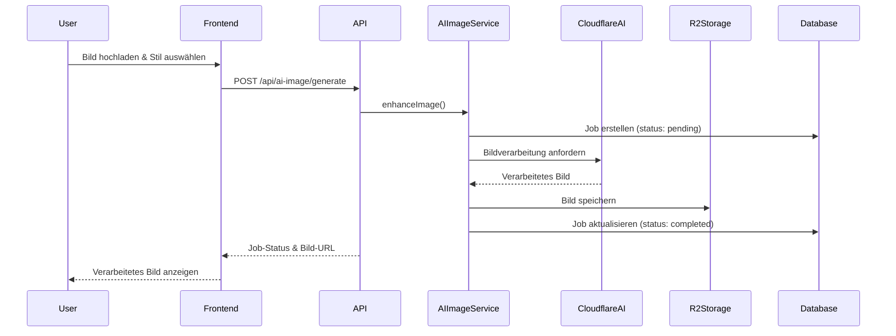

# AI-Bildbearbeitung - Architektur und Implementierung

## Übersicht

Evolution Hub bietet KI-gestützte Bildbearbeitungsfunktionen, die es Benutzern ermöglichen, Bilder mit verschiedenen Stilen und Effekten zu verbessern. Diese Funktionalität ist vollständig in die Cloudflare-Architektur integriert und nutzt moderne KI-Modelle für die Bildverarbeitung.

## Architektur-Komponenten

### 1. Frontend-Komponenten

#### Bildbearbeitungs-Interface
- **Tool-Seite**: `/tools/imag-enhancer/` - Hauptinterface für Bildbearbeitung
- **App-Komponente**: Interaktive React-Komponente für Echtzeit-Vorschau
- **Upload-Modal**: Sichere Datei-Upload-Funktionalität mit Validierung

#### Technische Implementierung
```typescript
// src/pages/tools/imag-enhancer/index.astro
// Hauptseite mit SEO-Optimierung und i18n

// src/pages/tools/imag-enhancer/app.astro
// Interaktive Anwendung mit React-Integration
```

### 2. API-Schicht

#### AI-Image-APIs
Die API-Endpunkte sind in `/src/pages/api/ai-image/` organisiert:

- **`/api/ai-image/generate`**: Bildgenerierung und -bearbeitung
- **`/api/ai-image/usage`**: Nutzungsstatistiken und Limits
- **`/api/ai-image/jobs/[id]`**: Job-Management (Status, Abbruch)
- **`/api/ai-image/jobs/index`**: Job-Liste und Historie
- **`/api/ai-image/jobs/[id]/cancel`**: Job-Abbruch

#### Sicherheitsfeatures
- Rate-Limiting: 10 Anfragen/Minute für AI-Operationen
- Input-Validierung: Dateigröße, Format, Inhaltsprüfung
- Authentifizierung: Erforderlich für alle AI-Operationen
- Audit-Logging: Vollständige Nachverfolgung aller AI-Anfragen

### 3. Service-Schicht

#### AI-Image-Service
```typescript
// src/lib/services/ai-image-service.ts
export class AIImageService {
  async enhanceImage(image: File, style: string): Promise<AIJob>
  async generateImage(prompt: string, options: GenerationOptions): Promise<AIJob>
  async getJobStatus(jobId: string): Promise<JobStatus>
  async cancelJob(jobId: string): Promise<void>
}
```

#### Job-Management
```typescript
// src/lib/services/ai-jobs-service.ts
export class AIJobsService {
  async createJob(userId: string, type: JobType, params: any): Promise<AIJob>
  async updateJobStatus(jobId: string, status: JobStatus): Promise<void>
  async getUserJobs(userId: string): Promise<AIJob[]>
}
```

### 4. Datenmodell

#### AI-Jobs-Tabelle
```sql
CREATE TABLE ai_jobs (
  id TEXT PRIMARY KEY,
  user_id TEXT NOT NULL,
  type TEXT NOT NULL, -- 'enhance', 'generate', 'variation'
  status TEXT NOT NULL, -- 'pending', 'processing', 'completed', 'failed', 'cancelled'
  input_params TEXT, -- JSON mit Eingabeparametern
  output_url TEXT, -- URL zum verarbeiteten Bild in R2
  created_at INTEGER NOT NULL,
  updated_at INTEGER NOT NULL,
  completed_at INTEGER,
  error_message TEXT
);
```

#### Migration
- **0008_create_ai_jobs_table.sql**: Erstellt die ai_jobs-Tabelle
- **0009_update_ai_jobs_guest_ownership.sql**: Fügt Gastbenutzer-Unterstützung hinzu

### 5. Cloudflare-Integration

#### AI-Modelle
- Nutzt Cloudflare AI für verschiedene Bildbearbeitungs-Modelle
- Unterstützt verschiedene Stile: Realistic, Artistic, Vintage, etc.
- Automatische Modellauswahl basierend auf Eingabe

#### R2-Speicher
- **Bucket**: `evolution-hub-avatars` (erweitert für AI-Bilder)
- **Pfad-Struktur**: `/ai-jobs/{jobId}/{filename}`
- **Zugriffssteuerung**: Private Objekte mit signierten URLs

#### Worker-Integration
```toml
# wrangler.toml
[[ai]]
binding = "AI"

[[r2_buckets]]
binding = "R2_AI"
bucket_name = "evolution-hub-ai-images"
```

## Datenfluss



## Sicherheitsarchitektur

### Input-Validierung
- **Dateigröße**: Max. 10MB pro Bild
- **Formate**: JPEG, PNG, WebP
- **Inhaltsprüfung**: Automatische Filter für unangemessenen Content
- **Rate-Limiting**: Pro-Benutzer und globale Limits

### Datenschutz
- **Lokale Verarbeitung**: Bilder werden nicht an externe Dienste gesendet
- **Temporäre Speicherung**: Verarbeitete Bilder werden nach 30 Tagen automatisch gelöscht
- **Zugriffssteuerung**: Nur der Eigentümer kann auf seine Bilder zugreifen

### Monitoring
- **Audit-Logs**: Alle AI-Operationen werden protokolliert
- **Nutzungsstatistiken**: Tracking von API-Nutzung pro Benutzer
- **Fehlerbehandlung**: Umfassende Fehlerprotokollierung und -behandlung

## Performance-Optimierungen

### Asynchrone Verarbeitung
- Jobs werden asynchron verarbeitet, um UI-Blockierung zu vermeiden
- WebSocket/SSE für Echtzeit-Status-Updates
- Queue-basierte Verarbeitung für Lastverteilung

### Caching-Strategien
- **CDN-Caching**: Verarbeitete Bilder werden über Cloudflare CDN ausgeliefert
- **Browser-Caching**: Optimierte Cache-Header für statische Assets
- **API-Response-Caching**: Kurzfristiges Caching für häufige Anfragen

### Optimierungen
- **Bildkomprimierung**: Automatische Optimierung der Ausgabebilder
- **Lazy-Loading**: Bilder werden nur bei Bedarf geladen
- **Progressive Enhancement**: Funktionalität auch ohne JavaScript

## Testing-Strategie

### Unit-Tests
```typescript
// src/lib/services/ai-image-service.test.ts
describe('AIImageService', () => {
  test('should enhance image successfully', async () => {
    // Test für Bildverbesserung
  })

  test('should handle invalid input', async () => {
    // Test für Fehlerbehandlung
  })
})
```

### Integrationstests
```typescript
// tests/integration/ai-image-enhancer.test.ts
describe('AI Image Enhancement Flow', () => {
  test('complete enhancement workflow', async () => {
    // Vollständiger Workflow-Test
  })
})
```

### E2E-Tests
- Playwright-Tests für die komplette Benutzeroberfläche
- Test der Datei-Upload-Funktionalität
- Validierung der Bildverarbeitungsergebnisse

## Monitoring und Wartung

### Metriken
- **API-Latenz**: Durchschnittliche Verarbeitungszeiten
- **Fehlerrate**: Prozentsatz fehlgeschlagener Jobs
- **Nutzung**: Anzahl der verarbeiteten Bilder pro Tag
- **Speicher**: R2-Bucket-Nutzung und -Kosten

### Wartungsaufgaben
- **Regelmäßige Bereinigung**: Löschen alter Jobs und Bilder
- **Modell-Updates**: Aktualisierung der AI-Modelle
- **Performance-Monitoring**: Überwachung der Systemleistung
- **Backup-Strategie**: Sicherung wichtiger Job-Daten

## Erweiterte Features (geplant)

### Batch-Verarbeitung
- Mehrere Bilder gleichzeitig verarbeiten
- Queue-Management für große Aufträge

### Custom-Modelle
- Benutzerdefinierte KI-Modelle trainieren
- Persönliche Stil-Profile

### Integrationen
- Social-Media-Integration für Bild-Sharing
- E-Commerce-Integration für Produktbilder
- API für Drittanbieter-Integrationen

## Fazit

Die AI-Bildbearbeitungsfunktionalität von Evolution Hub demonstriert eine moderne, skalierbare Architektur, die Cloudflare's Edge-Computing, AI und Storage-Dienste optimal nutzt. Die Implementierung folgt bewährten Praktiken für Sicherheit, Performance und Benutzererfahrung.