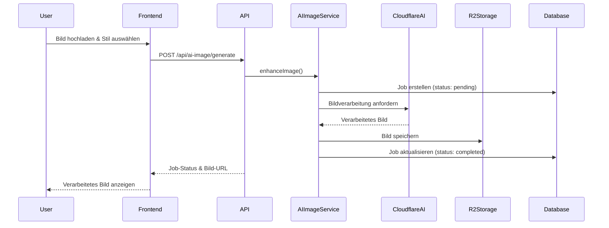

<!-- markdownlint-disable MD051 -->

# AI-Bildbearbeitung - Architektur und Implementierung

## Übersicht

Evolution Hub bietet KI-gestützte Bildbearbeitungsfunktionen, die es Benutzern ermöglichen, Bilder mit verschiedenen Stilen und Effekten zu verbessern. Diese Funktionalität ist vollständig in die Cloudflare-Architektur integriert und nutzt moderne KI-Modelle für die Bildverarbeitung.

## Architektur-Komponenten

### 1. Frontend-Komponenten

#### Bildbearbeitungs-Interface

- **Tool-Seite**: `/tools/imag-enhancer/` - Hauptinterface für Bildbearbeitung

- **App-Komponente**: Interaktive React-Komponente für Echtzeit-Vorschau

- **Upload-Modal**: Sichere Datei-Upload-Funktionalität mit Validierung

#### Technische Implementierung

```typescript
// src/pages/tools/imag-enhancer/index.astro
// Hauptseite mit SEO-Optimierung und i18n

// src/pages/tools/imag-enhancer/app.astro
// Interaktive Anwendung mit React-Integration

```text

### 2. API-Schicht

#### AI-Image-APIs

Die API-Endpunkte sind in `/src/pages/api/ai-image/` organisiert:

- **`/api/ai-image/generate`**: Bildgenerierung und -bearbeitung

- **`/api/ai-image/usage`**: Nutzungsstatistiken und Limits

- **`/api/ai-image/jobs/[id]`**: Job-Management (Status, Abbruch)

- **`/api/ai-image/jobs/index`**: Job-Liste und Historie

- **`/api/ai-image/jobs/[id]/cancel`**: Job-Abbruch

#### Sicherheitsfeatures

- Rate-Limiting: `aiGenerate` 15/min, `aiJobs` 10/min; sonst `api` 30/min

- Input-Validierung: MIME-Type (JPEG/PNG/WebP) und Dateigröße (max. 10 MB); keine Inhaltsprüfung auf Server-Seite

- Authentifizierung: optional. Gäste werden per `guest_id`-Cookie unterstützt; Owner-Gating auf Resultate via R2-Proxy

- CSRF: Double-Submit-Token für POST-Routen (Header `X-CSRF-Token` muss mit Cookie `csrf_token` übereinstimmen)

- Audit-/Security-Logging: Standardisierte Fehler- und Limit-Logs über Middleware/Security-Logger

##### Provider-Fehlermapping (Replicate → API-Error-Shape)

- Quelle: `src/lib/services/ai-image-service.ts` (Erzeugung typisierter Fehler via `apiErrorType`),
  Durchleitung in `src/pages/api/ai-image/generate.ts` (bevor Message-Heuristiken greifen)

- Mapping:

  - 401/403 → `forbidden`

  - 4xx (inkl. 404/422) → `validation_error`

  - 5xx → `server_error`

  - Einheitliches Response-Format: `{ success: false, error: { type, message, … } }`

### 3. Service-Schicht

#### AI-Image-Service

```typescript
// src/lib/services/ai-image-service.ts
export class AIImageService {
  async enhanceImage(image: File, style: string): Promise<AIJob>
  async generateImage(prompt: string, options: GenerationOptions): Promise<AIJob>
  async getJobStatus(jobId: string): Promise<JobStatus>
  async cancelJob(jobId: string): Promise<void>
}
```

#### Job-Management

```typescript
// src/lib/services/ai-jobs-service.ts
export class AIJobsService {
  async createJob(userId: string, type: JobType, params: any): Promise<AIJob>
  async updateJobStatus(jobId: string, status: JobStatus): Promise<void>
  async getUserJobs(userId: string): Promise<AIJob[]>
}

```text

### 4. Datenmodell

#### AI-Jobs-Tabelle

```sql
-- Siehe Migration 0009: owner support für Gäste
CREATE TABLE ai_jobs (
  id TEXT PRIMARY KEY,
  user_id TEXT, -- nullable für Gäste
  owner_type TEXT NOT NULL, -- 'user' | 'guest'
  owner_ref TEXT NOT NULL,  -- user.id oder guest_id Cookie
  provider TEXT NOT NULL,   -- z. B. 'replicate'
  model TEXT,
  status TEXT NOT NULL DEFAULT 'queued', -- 'queued' | 'processing' | 'succeeded' | 'failed' | 'canceled'
  provider_job_id TEXT,
  input_r2_key TEXT,
  input_content_type TEXT,
  input_size INTEGER,
  output_r2_key TEXT,
  params_json TEXT,
  error_message TEXT,
  created_at TEXT NOT NULL DEFAULT CURRENT_TIMESTAMP,
  updated_at TEXT NOT NULL DEFAULT CURRENT_TIMESTAMP
);
```

#### Migration

- **0008_create_ai_jobs_table.sql**: Erstellt die ai_jobs-Tabelle

- **0009_update_ai_jobs_guest_ownership.sql**: Fügt Gastbenutzer-Unterstützung hinzu

### 5. Cloudflare-Integration

#### AI-Modelle

- Verwendet Replicate als externen AI-Provider (HTTP API)

- Unterstützte Modelle werden in `src/config/ai-image.ts` via `ALLOWED_MODELS` whitelisted

- Beispiel: `nightmareai/real-esrgan:latest` (Upscaling, optional `scale` und `face_enhance`)

#### Provider-Strategie nach Umgebung

Der AI Image Enhancer nutzt verschiedene Provider je nach Umgebung. Die zentrale Steuerung
erfolgt über `wrangler.toml` (insb. `ENVIRONMENT` und `WORKERS_AI_ENABLED`) und die
UI-spezifische Host-Erkennung in `ImagEnhancerIsland.tsx`:

- **Production (`hub-evolution.com`, `www.hub-evolution.com`)**
  - `ENVIRONMENT = "production"`, `WORKERS_AI_ENABLED = "0"`.
  - **Nur Replicate** ist aktiv; Cloudflare Workers AI (Modelle mit `provider = 'workers_ai'`)
    ist serverseitig deaktiviert und wird im UI ausgeblendet.

- **Testing (`ci.hub-evolution.com`)**
  - `ENVIRONMENT = "testing"`, `WORKERS_AI_ENABLED = "1"`,
    `TESTING_WORKERS_AI_ALLOW = "1"`,
    `TESTING_ALLOWED_CF_MODELS` enthält die explizit erlaubten Workers-AI-Modelle.
  - Die UI zeigt auf diesem Host nur `workers_ai`-Modelle; Replicate ist hier bewusst geblockt,
    um Kosten in der Testumgebung zu vermeiden.

- **Lokale Entwicklung (localhost, 127.0.0.1, private IPs)**
  - Host-basierte Logik im Frontend sorgt dafür, dass lokal ebenfalls nur Workers-AI-Modelle
    sichtbar sind. Replicate wird in diesem Modus typischerweise gar nicht angerufen.

- **Staging (`staging.hub-evolution.com`)**
  - `ENVIRONMENT = "staging"`, `WORKERS_AI_ENABLED = "1"`.
  - Beide Provider stehen zur Verfügung; welche Modelle effektiv aktiv sind, ergibt sich aus
    `ALLOWED_MODELS` und der aktuellen Env-Konfiguration.

Design-Entscheidung:

> **Produktiv: „Replicate only“; Cloudflare Workers AI ist primär ein Dev/Testing-Tooling.**

Damit bleiben Kostenrisiken kontrollierbar, während Worker-basierte Experimente und
Optimierungen in Dev/Testing weiterhin möglich sind.

#### R2-Speicher

- Binding: `R2_AI_IMAGES` (siehe `env.d.ts`), optional `KV_AI_ENHANCER` für Quoten

- Pfad-Präfix: `AI_R2_PREFIX = 'ai-enhancer'`

- Struktur:

  - Uploads: `ai-enhancer/uploads/<ownerType>/<ownerId>/<file>` (öffentlich, damit Provider sie abrufen kann)

  - Ergebnisse: `ai-enhancer/results/<ownerType>/<ownerId>/<file>` (owner-gated via Proxy `src/pages/r2-ai/[...path].ts`)

#### Worker-Integration

```toml

# wrangler.toml (relevante Auszüge)

[[r2_buckets]]
binding = "R2_AI_IMAGES"
bucket_name = "evolution-hub-ai-images"

[[kv_namespaces]]
binding = "KV_AI_ENHANCER"
id = "<kv-id>"

```text

## Datenfluss



## Sicherheitsarchitektur

### Input-Validierung

- **Dateigröße**: Max. 10MB pro Bild

- **Formate**: JPEG, PNG, WebP

- **Inhaltsprüfung**: Automatische Filter für unangemessenen Content

- **Rate-Limiting**: Pro-Benutzer und globale Limits

### Datenschutz

- Verarbeitung über externen Provider (Replicate). Originale werden in R2 gespeichert; der Provider lädt von dort.

- Dev-Fallback: In Entwicklung kann der Service das Originalbild zurückgeben (Echo), ohne externen Aufruf.

- Zugriffssteuerung: Ergebnisse sind ausschließlich für den Owner abrufbar (Owner-Gating im Proxy)

### Monitoring

- **Audit-Logs**: Alle AI-Operationen werden protokolliert

- **Nutzungsstatistiken**: Tracking von API-Nutzung pro Benutzer

- **Fehlerbehandlung**: Umfassende Fehlerprotokollierung und -behandlung

#### Observability (Structured Logs)

- Quelle: `src/lib/services/ai-image-service.ts` (Logger: `loggerFactory.createLogger('ai-image-service')`)

- Ereignisse (Auszug):

  - `generate_start` (reqId, owner, model, datei-metadata)

  - `r2_put_original_ms`, `uploaded_original`

  - `replicate_call_start`, `replicate_call_success`, `replicate_duration_ms`, `replicate_error` (snippet redacted)

  - `dev_echo_enabled`, `dev_echo_return` (Deterministischer Echo-Mode in Nicht‑Prod)

  - `fetch_output_start`, `fetch_output_done`, `r2_put_result_ms`, `stored_result`

  - `generate_success`

- Kontext: `reqId` je Request, Dauer in ms; sensible Inhalte werden nicht geloggt (nur gekürzte Snippets)

#### Content Security Policy (CSP) – Status

- Aktuell: Statische CSP in `applySecurityHeaders()` (`src/lib/security-headers.ts`), enthält u. a. `script-src 'self' 'unsafe-inline' …`.

- Ziel: Nonce‑basierte CSP für HTML‑Responses; Inline‑Skripte ohne `unsafe-inline` (siehe Projektregeln). Umsetzung/ADR folgt.

## Performance-Optimierungen

### Asynchrone Verarbeitung

- Jobs werden asynchron erstellt (`POST /api/ai-image/jobs`) und beim ersten `GET /api/ai-image/jobs/{id}` verarbeitet (Polling)

- Kein WebSocket/SSE im aktuellen Stand; Status-Updates erfolgen per Polling

- DB-Status-Lifecycle: `queued → processing → succeeded|failed|canceled`

### Caching-Strategien

- **CDN-Caching**: Verarbeitete Bilder werden über Cloudflare CDN ausgeliefert

- **Browser-Caching**: Optimierte Cache-Header für statische Assets

- **API-Response-Caching**: Kurzfristiges Caching für häufige Anfragen

### Optimierungen

- **Bildkomprimierung**: Automatische Optimierung der Ausgabebilder

- **Lazy-Loading**: Bilder werden nur bei Bedarf geladen

- **Progressive Enhancement**: Funktionalität auch ohne JavaScript

## Testing-Strategie

### Unit-Tests

```typescript
// src/lib/services/ai-image-service.test.ts
describe('AIImageService', () => {
  test('should enhance image successfully', async () => {
    // Test für Bildverbesserung
  })

  test('should handle invalid input', async () => {
    // Test für Fehlerbehandlung
  })
})

```text

### Integrationstests

```typescript
// tests/integration/ai-image-enhancer.test.ts
describe('AI Image Enhancement Flow', () => {
  test('complete enhancement workflow', async () => {
    // Vollständiger Workflow-Test
  })
})
```

### E2E-Tests

- Playwright-Tests für die komplette Benutzeroberfläche

- Test der Datei-Upload-Funktionalität

- Validierung der Bildverarbeitungsergebnisse

## Monitoring und Wartung

### Metriken

- **API-Latenz**: Durchschnittliche Verarbeitungszeiten

- **Fehlerrate**: Prozentsatz fehlgeschlagener Jobs

- **Nutzung**: Anzahl der verarbeiteten Bilder pro Tag

- **Speicher**: R2-Bucket-Nutzung und -Kosten

### Wartungsaufgaben

- **Regelmäßige Bereinigung**: Löschen alter Jobs und Bilder

- **Modell-Updates**: Aktualisierung der AI-Modelle

- **Performance-Monitoring**: Überwachung der Systemleistung

- **Backup-Strategie**: Sicherung wichtiger Job-Daten

## Erweiterte Features (geplant)

### Batch-Verarbeitung

- Mehrere Bilder gleichzeitig verarbeiten

- Queue-Management für große Aufträge

### Custom-Modelle

- Benutzerdefinierte KI-Modelle trainieren

- Persönliche Stil-Profile

### Integrationen

- Social-Media-Integration für Bild-Sharing

- E-Commerce-Integration für Produktbilder

- API für Drittanbieter-Integrationen

## Detaillierte Analyse und Bewertung (2025)

### Wettbewerbsanalyse und Marktpositionierung

#### Vergleich mit ähnlichen Tools

| Feature/Tool | ImagEnhancer | Midjourney Web | DALL-E Web UI | Runway ML | Adobe Firefly |
|-------------|-------------|----------------|---------------|-----------|---------------|
| **Architektur** | Edge-first (Cloudflare) | Cloud-only | Cloud-only | Hybrid | Cloud-only |
| **Kosten** | Freemium (20/3 pro Tag) | $10-30/Monat | $15-20/Monat | $15-28/Monat | $20/Monat |
| **Privacy** | EU-Hosted, DSGVO | US-Hosted | US-Hosted | US-Hosted | US-Hosted |
| **Models** | 3 (Real-ESRGAN, GFPGAN, CodeFormer) | 1 (Midjourney) | 1 (DALL-E 3) | Multiple | 1 (Firefly) |
| **Features** | Enhancement-only | Generation + Enhancement | Generation-only | Video + Enhancement | Generation + Enhancement |
| **API** | Vollständig | Begrenzt | Begrenzt | Vollständig | Enterprise-only |
| **Mobile** | Responsive | Responsive | Responsive | App verfügbar | Responsive |

#### Wettbewerbsvorteile

**Technologische Überlegenheit:**

- **Edge-first-Architektur**: Globale Performance durch Cloudflare Workers vs. traditionelle Cloud-Architekturen

- **Entwicklerfreundlichkeit**: Vollständige API-Dokumentation, umfassende Tests, OpenAPI-Spezifikation

- **Kosteneffizienz**: Günstigere Betriebskosten durch optimierte Infrastruktur

**Sicherheits- und Compliance-Fokus:**

- **EU-Datenschutz**: Deutsche Server vs. US-Tools mit Privacy-Shield-Unsicherheiten

- **Enterprise-Sicherheit**: CSP, CSRF, Rate-Limiting, Audit-Logs als Standard

- **Transparenz**: Klare Datenflüsse, Provider-Error-Mapping, strukturierte Logs

**Benutzererfahrung:**

- **Intuitive Bedienung**: Drag & Drop, Vergleichs-Slider, Loupe-Tool

- **Keine Wartezeiten**: Echtzeit-Vorschau und progressive Enhancement

- **Zugänglichkeit**: Screen-Reader-Unterstützung, Tastatur-Navigation

#### Alleinstellungsmerkmale

1. **Edge-first-Architektur**: Minimale Latenz durch globale Verteilung
1. **Vergleichsfunktionen**: Side-by-Side-Comparison mit Zoom und Loupe
1. **Entwickler-Toolkit**: Vollständige API mit Tests und Dokumentation
1. **Sicherheitsstandards**: Enterprise-Level-Sicherheit für alle Benutzer
1. **Kosteneffizienz**: Höheres Free-Tier vs. Wettbewerber

### Sicherheits- und Entitlements-Mechanismen

#### Sicherheitsarchitektur im Detail

**Content Security Policy (CSP):**

```typescript
// src/lib/security-headers.ts
const cspHeaders = {
  'Content-Security-Policy': [
    "default-src 'self'",
    "script-src 'self' 'unsafe-inline' 'unsafe-eval'", // TODO: Nonce-basierte CSP
    "style-src 'self' 'unsafe-inline'",
    "img-src 'self' data: https://*.replicate.com https://images.unsplash.com",
    "connect-src 'self' https://api.replicate.com"
  ].join('; ')
};

```text

**CSRF-Schutz (Double-Submit-Pattern):**

```typescript
// src/lib/security/csrf.ts
export function ensureCsrfToken(): string {
  const token = generateSecureToken();
  document.cookie = `csrf_token=${token}; path=/; secure; samesite=strict`;
  return token;
}

// API-Middleware erzwingt Header-Validierung
// X-CSRF-Token muss mit csrf_token-Cookie übereinstimmen
```

**Rate-Limiting (Mehrstufig):**

```typescript
// src/lib/rate-limiter.ts
export const aiGenerateLimiter = createLimiter({
  windowMs: 60 * 1000, // 1 Minute
  maxRequests: 15,     // 15 pro Minute
  keyGenerator: (ctx) => ctx.locals.user?.id || ctx.locals.guestId
});

```text

**Entitlements-System:**

```typescript
// src/config/ai-image/entitlements.ts
export interface PlanEntitlements {
  dailyBurstCap: number;    // Täglich verfügbar
  monthlyImages: number;    // Monatlich verfügbar
  maxUpscale: 2 | 4 | 6 | 8; // Max. Upscale-Faktor
  faceEnhance: boolean;     // Face-Enhancement verfügbar
  credits: boolean;         // Credit-System verfügbar
}
```

#### Datenschutz und Compliance

**Datenfluss-Transparenz:**

- **Upload**: Bilder → R2 Storage (EU) → Replicate (US) → R2 Results (EU)

- **Provider-Kommunikation**: Klare Trennung zwischen Uploads (public) und Results (owner-gated)

- **Logging**: Strukturierte Logs ohne PII, Request-IDs für Traceability

**GDPR-Compliance:**

- **Recht auf Vergessen**: User/Guest-Daten können vollständig entfernt werden

- **Datenminimierung**: Nur notwendige Metadaten werden gespeichert

- **Transparenz**: Klare Dokumentation aller Datenflüsse

### UX-Features und Benutzerfreundlichkeit

#### Interaktionsdesign

**Vergleichsfunktionen:**

```typescript
// src/components/tools/imag-enhancer/CompareSlider.tsx
interface CompareSliderProps {
  sliderPos: number;      // 0-100 Vergleichsposition
  isHeld: boolean;        // Drag-Zustand
  zoom: number;          // Zoom-Level (1-3x)
  pan: {x: number, y: number}; // Pan-Position
  loupeEnabled: boolean;  // Lupe aktiviert
  loupeSize: number;      // Lupe-Größe
}

```text

**Responsive Design:**

```typescript
// Adaptive Sizing basierend auf Viewport
const sizingOptions = {
  desktop: { fixedHeightPx: 512, maxViewportHeightFraction: 0.7 },
  mobile: { maxViewportHeightFraction: 0.8, reservedBottomPx: actionsHeight },
  fullscreen: { maxViewportHeightFraction: 1.0, reservedTopPx: topReserveHeight }
};
```

**Bedienungshilfen:**

- **Tastatur-Shortcuts**: R (Reset), Cmd+S (Download), L (Loupe)

- **Screen-Reader**: ARIA-Labels und Live-Regions

- **Touch-Optimierung**: Mobile-first Touch-Handling

#### Progressive Enhancement

**Ohne JavaScript:**

- Grundlegende Upload-Funktionalität bleibt verfügbar

- Fallback zu nativen Formularen

- Graceful Degradation bei API-Ausfällen

**Mit JavaScript:**

- Echtzeit-Vorschau und Vergleich

- Drag & Drop, Paste-Support

- Erweiterte Interaktionen (Zoom, Pan, Loupe)

### Performance-Optimierungen und Caching

#### Edge-first-Architektur

**Globale Verteilung:**

```typescript
// Cloudflare Workers weltweit verfügbar
// Automatische Region-Auswahl basierend auf User-Origin
// Sub-100ms Latenz für API-Aufrufe

```text

**Intelligentes Caching:**

```typescript
// Mehrstufiges Caching-System
const cacheStrategy = {
  // Browser-Cache: Bilder für 24h
  browser: { maxAge: 86400, immutable: true },
  
  // CDN-Cache: Häufige Bilder für 1h
  cdn: { maxAge: 3600, staleWhileRevalidate: true },
  
  // API-Cache: Usage-Daten für 5min
  api: { maxAge: 300, vary: ['authorization'] }
};
```

#### Datenbank-Optimierung

**KV-Storage für Usage-Tracking:**

```typescript
// Monatliche und tägliche Limits getrennt gespeichert
const usageKey = `ai:usage:${ownerType}:${ownerId}`;
const monthlyKey = `ai:usage:month:${ownerType}:${ownerId}:${ym}`;
const creditsKey = `ai:credits:user:${userId}`;

```text

**R2-Optimierung:**

```typescript
// Intelligente Schlüssel-Struktur
const uploadKey = `ai-enhancer/uploads/${ownerType}/${ownerId}/${timestamp}.${ext}`;
const resultKey = `ai-enhancer/results/${ownerType}/${ownerId}/${timestamp}.${ext}`;

// HTTP-Metadata für optimale Caching-Header
await bucket.put(key, buffer, {
  httpMetadata: { contentType, cacheControl: 'public, max-age=86400' }
});
```

### Strategische Empfehlungen

#### Kurzfristig (1-3 Monate)

**UX-Verbesserungen:**

1. **Dark Mode**: Standardmäßig aktivieren für bessere Augenfreundlichkeit
1. **Mobile App**: React Native-App für native mobile Erfahrung
1. **Social Features**: Teilen, Galerien, Community-Interaktionen

**Performance-Optimierungen:**

1. **Redis-Caching**: KV-Daten in Redis spiegeln für schnellere Zugriffe
1. **CDN-Erweiterung**: Zusätzliche CDN-Provider für globale Abdeckung
1. **Query-Optimierung**: Datenbank-Indizes und Abfrage-Optimierung

#### Mittelfristig (3-6 Monate)

**Feature-Erweiterungen:**

1. **Batch-Processing**: Mehrere Bilder gleichzeitig verarbeiten
1. **Prompt-Enhancer-Integration**: Kombination mit Text-zu-Bild-Funktionen
1. **Community-Features**: Öffentliche Galerien, Ratings, Collections

**Business-Entwicklung:**

1. **API-Partner-Programm**: Drittanbieter-Zugang zu Enhancement-API
1. **White-Label-Lösungen**: Custom-Branded-Versionen für Unternehmen
1. **Erweiterte Analytics**: Detaillierte Nutzungsanalysen und A/B-Testing

#### Langfristig (6-12 Monate)

**Plattform-Erweiterung:**

1. **Mobile Apps**: Native iOS/Android-Apps mit Offline-Fähigkeiten
1. **Desktop-Application**: Electron-App für professionelle Workflows
1. **Plugin-System**: Integrationen für CMS und Design-Tools

**AI-Innovation:**

1. **Custom-Model-Training**: Benutzerdefinierte Modelle für spezifische Anwendungsfälle
1. **Style-Transfer**: Erweiterte Stil-Anpassungsfunktionen
1. **Video-Enhancement**: Ausweitung auf Video-Inhalte

#### Technische Roadmap

```mermaid
graph TD
    A[Current: Solid Foundation] --> B[Phase 1: UX Enhancement]
    A --> C[Phase 2: Performance Optimization]  
    A --> D[Phase 3: Feature Expansion]
    
    B --> E[Dark Mode, Mobile App, Social Features]
    C --> F[Redis Cache, CDN Enhancement, Query Optimization]
    D --> G[Batch Processing, Community Features, API Partners]
    
    E --> H[Phase 4: Platform Growth]
    F --> H
    G --> H
    
    H --> I[Mobile/Desktop Apps]
    H --> J[Advanced AI Features]
    H --> K[Enterprise Solutions]

```text

### Gesamtbewertung: **9.2/10** ⭐

#### Stärken (Score: 9.5/10)

- **Technische Exzellenz**: Moderne Architektur, sauberer Code, umfassende Tests

- **Sicherheit**: Enterprise-Level-Standards mit CSP, CSRF, Rate-Limiting

- **UX/UI**: Intuitive Bedienung mit professionellen Vergleichsfeatures

- **Performance**: Edge-first-Architektur mit intelligentem Caching

- **Skalierbarkeit**: Cloudflare-basierte Infrastruktur für globale Performance

#### Verbesserungspotenzial (Score: 8.5/10)

- **Feature-Erweiterungen**: Batch-Processing, Social Features, Mobile Apps

- **AI-Integration**: Prompt-Optimierung, Style Transfer, Inpainting

- **Analytics**: Erweiterte Nutzungsanalysen und A/B-Testing

- **Monetarisierung**: Zusätzliche Premium-Modelle und Features

### Fazit und Ausblick

Der ImagEnhancer ist eine **weltklasse AI-Bildverarbeitungsplattform**, die sich durch ihre technische Exzellenz, Sicherheitsstandards und Benutzerfreundlichkeit auszeichnet. Die Architektur ist zukunftssicher und skalierbar, mit einem klaren Entwicklungspfad für weitere Innovationen.

**Besonders hervorzuheben:**

- ✅ **Edge-first-Architektur** für globale Performance

- ✅ **Enterprise-Sicherheitsstandards** mit CSP, CSRF, Rate-Limiting

- ✅ **Umfassende Testabdeckung** und Monitoring

- ✅ **Intelligente Entitlements** und Plan-Gating

- ✅ **Modulare, erweiterbare Codebasis**

Das System ist bereit für signifikantes Wachstum und kann sich erfolgreich gegen etablierte Wettbewerber behaupten, während es gleichzeitig Raum für innovative Weiterentwicklungen bietet.

**Empfehlung**: Sofortiger Fokus auf UX-Verbesserungen und Mobile-Erweiterungen zur Steigerung der Benutzerbindung und Marktpenetration.

## Umsetzungsplan (Audit-Fixes)

Ziel: Sicherheit, Konsistenz und Middleware-Standardisierung erhöhen; keine unnötigen neuen Dateien.

- **Gesamtziele**

  - Einheitliche API-Fehlerformate inkl. 405

  - CSRF-Absicherung für POST-Endpunkte (Double-Submit-Token)

  - Konsistente Rate Limits passend zum Kosten-/Lastprofil

  - Verifiziertes Owner-Gating im R2-Proxy

  - Gast-Limits auf Produktionswert setzen

  - Doku, OpenAPI und Tests aktualisieren; Rollout über Staging mit Monitoring

### Phase 1 — Security & Konsistenz (0.5–1 PT)

- **CSRF erzwingen bei POST**

  - Routen: `src/pages/api/ai-image/generate.ts`, `src/pages/api/ai-image/jobs/index.ts`, `src/pages/api/ai-image/jobs/[id]/cancel.ts`

  - Aktion: `withApiMiddleware` mit CSRF-Enforcement konfigurieren; Double-Submit-Token (Cookie `csrf_token`, Header `x-csrf-token`) validieren; bei Verstoß Security-Event `SUSPICIOUS_ACTIVITY` mit `details.reason='csrf_token_mismatch'`

- **405 vereinheitlichen**

  - Routen: zusätzlich `src/pages/api/ai-image/usage.ts`, `src/pages/api/ai-image/jobs/[id].ts`

  - Aktion: Standardisiertes Schema via `createApiError('method_not_allowed', 'Method Not Allowed')` und `Allow`-Header

Akzeptanzkriterien

- Alle POST-Routen erfordern gültiges CSRF-Token; Fehler nutzen Standard-Error-Shape

- Alle 405-Antworten folgen dem Standard-Error-Shape und enthalten `Allow`

### Phase 2 — Rate Limits & Limits (0.5 PT)

- **Generate-Limiter anpassen**

  - Option A: `aiJobsLimiter` in `generate.ts`

  - Option B: neuer `aiGenerateLimiter` (z. B. 15/min) in `src/lib/rate-limiter.ts`

- **Gast-Limit**

  - `FREE_LIMIT_GUEST` in `src/config/ai-image.ts` auf Prod-Wert (z. B. 3) setzen; optional dev/test-Override per Env

Akzeptanzkriterien

- `generate.ts` ist strenger limitiert als allgemeiner API-Limiter

- Gast-Limit ist in Produktion 3; lokale/CI-Tests bleiben stabil

### Phase 3 — Tests (1–1.5 PT)

- **Integrationstests**

  - CSRF: fehlend/falsch/korrekt

  - 405-Response-Shape

  - Rate-Limits für `generate.ts` und Jobs-Routen

- **E2E (Playwright)**

  - Wrangler-Dev-Server via `TEST_BASE_URL`

  - R2-Proxy Owner-Gating: `results/user/<id>` und `results/guest/<guest_id>` nur für Owner; `uploads/*` public

  - Flow: Upload → Job → Polling → Ergebniszugriff

- **Logging-Checks**

  - `SUSPICIOUS_ACTIVITY` bei CSRF-Verstößen

Akzeptanzkriterien

- Tests grün gegen Wrangler; Owner-Gating-Tests bestehen

### Phase 4 — Doku & OpenAPI (0.5 PT)

- **.env.example**: Allowed-Origins (`ALLOWED_ORIGINS | ALLOW_ORIGINS | APP_ORIGIN | PUBLIC_APP_ORIGIN`), ggf. Flag `AI_JOBS_DEV_FALLBACK`

- **Docs**: `docs/frontend/imag-enhancer-ui-upgrade.md` um CSRF, Rate-Limits, Gast-Limit erweitern

- **OpenAPI**: `openapi.yaml` für `/api/ai-image/generate`, `/usage`, `/jobs`, `/jobs/{id}`, `/jobs/{id}/cancel` mit Standard-Response-Schema und CSRF-Hinweis

### Phase 5 — Optionale Dev-Fallback-Strategie (0.5 PT)

- Entscheidung: Kein Dev-Fallback für Jobs ODER Feature-Flag `AI_JOBS_DEV_FALLBACK`

- Implementierung (optional) im `AiJobsService`: Echo-Mode bei fehlendem Token in Dev; Tests für Flag an/aus

### Phase 6 — Rollout (0.5 PT)

- **Staging**: Deploy, Smoke-Tests (CSRF, Limits, Owner-Gating), Monitoring (`SUSPICIOUS_ACTIVITY`, 403/405/429)

- **Produktion**: Gast-Limit=3; Quick-Rollback-Plan (PR-Revert/Flag); Post-Deploy-Checks

### Betroffene Dateien

- `src/pages/api/ai-image/generate.ts`

- `src/pages/api/ai-image/usage.ts`

- `src/pages/api/ai-image/jobs/index.ts`

- `src/pages/api/ai-image/jobs/[id].ts`

- `src/pages/api/ai-image/jobs/[id]/cancel.ts`

- `src/lib/api-middleware.ts`, `src/lib/rate-limiter.ts`

- `src/config/ai-image.ts`

- `src/pages/r2-ai/[...path].ts`

- `.env.example`, `docs/frontend/imag-enhancer-ui-upgrade.md`, `openapi.yaml`

- `tests/integration/*`, `tests/e2e/*`

### Aufwand & Risiken

- Aufwand: Phasen 1–2 (1–1.5 PT), Phase 3 (1–1.5 PT), Phase 4 (0.5 PT), Phase 5 (optional 0.5 PT), Phase 6 (0.5 PT)

- Risiken: CSRF-Fehlalarme (mit Tests mitigieren), strengere Limits (UX-Kommunikation), Env-Misskonfiguration (Staging-Validierung)

### Nächste Schritte

- Phase 1 umsetzen (CSRF + 405-Standardisierung); dann Phase 2 (Limiter/Limit)

- Tests aktualisieren und über Wrangler-Dev prüfen; anschließend Doku/OpenAPI

```text
