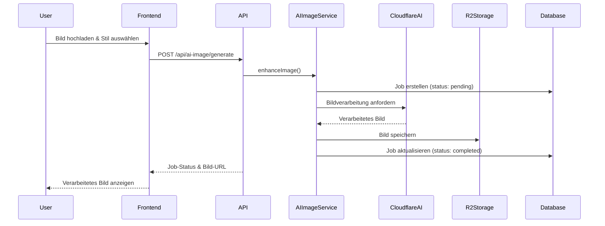

# AI-Bildbearbeitung - Architektur und Implementierung

## Übersicht

Evolution Hub bietet KI-gestützte Bildbearbeitungsfunktionen, die es Benutzern ermöglichen, Bilder mit verschiedenen Stilen und Effekten zu verbessern. Diese Funktionalität ist vollständig in die Cloudflare-Architektur integriert und nutzt moderne KI-Modelle für die Bildverarbeitung.

## Architektur-Komponenten

### 1. Frontend-Komponenten

#### Bildbearbeitungs-Interface

- **Tool-Seite**: `/tools/imag-enhancer/` - Hauptinterface für Bildbearbeitung
- **App-Komponente**: Interaktive React-Komponente für Echtzeit-Vorschau
- **Upload-Modal**: Sichere Datei-Upload-Funktionalität mit Validierung

#### Technische Implementierung

```typescript
// src/pages/tools/imag-enhancer/index.astro
// Hauptseite mit SEO-Optimierung und i18n

// src/pages/tools/imag-enhancer/app.astro
// Interaktive Anwendung mit React-Integration
```

### 2. API-Schicht

#### AI-Image-APIs

Die API-Endpunkte sind in `/src/pages/api/ai-image/` organisiert:

- **`/api/ai-image/generate`**: Bildgenerierung und -bearbeitung
- **`/api/ai-image/usage`**: Nutzungsstatistiken und Limits
- **`/api/ai-image/jobs/[id]`**: Job-Management (Status, Abbruch)
- **`/api/ai-image/jobs/index`**: Job-Liste und Historie
- **`/api/ai-image/jobs/[id]/cancel`**: Job-Abbruch

#### Sicherheitsfeatures

- Rate-Limiting: 10 Anfragen/Minute für AI-Operationen
- Input-Validierung: Dateigröße, Format, Inhaltsprüfung
- Authentifizierung: Erforderlich für alle AI-Operationen
- Audit-Logging: Vollständige Nachverfolgung aller AI-Anfragen

### 3. Service-Schicht

#### AI-Image-Service

```typescript
// src/lib/services/ai-image-service.ts
export class AIImageService {
  async enhanceImage(image: File, style: string): Promise<AIJob>
  async generateImage(prompt: string, options: GenerationOptions): Promise<AIJob>
  async getJobStatus(jobId: string): Promise<JobStatus>
  async cancelJob(jobId: string): Promise<void>
}
```

#### Job-Management

```typescript
// src/lib/services/ai-jobs-service.ts
export class AIJobsService {
  async createJob(userId: string, type: JobType, params: any): Promise<AIJob>
  async updateJobStatus(jobId: string, status: JobStatus): Promise<void>
  async getUserJobs(userId: string): Promise<AIJob[]>
}
```

### 4. Datenmodell

#### AI-Jobs-Tabelle

```sql
CREATE TABLE ai_jobs (
  id TEXT PRIMARY KEY,
  user_id TEXT NOT NULL,
  type TEXT NOT NULL, -- 'enhance', 'generate', 'variation'
  status TEXT NOT NULL, -- 'pending', 'processing', 'completed', 'failed', 'cancelled'
  input_params TEXT, -- JSON mit Eingabeparametern
  output_url TEXT, -- URL zum verarbeiteten Bild in R2
  created_at INTEGER NOT NULL,
  updated_at INTEGER NOT NULL,
  completed_at INTEGER,
  error_message TEXT
);
```

#### Migration

- **0008_create_ai_jobs_table.sql**: Erstellt die ai_jobs-Tabelle
- **0009_update_ai_jobs_guest_ownership.sql**: Fügt Gastbenutzer-Unterstützung hinzu

### 5. Cloudflare-Integration

#### AI-Modelle

- Nutzt Cloudflare AI für verschiedene Bildbearbeitungs-Modelle
- Unterstützt verschiedene Stile: Realistic, Artistic, Vintage, etc.
- Automatische Modellauswahl basierend auf Eingabe

#### R2-Speicher

- **Bucket**: `evolution-hub-avatars` (erweitert für AI-Bilder)
- **Pfad-Struktur**: `/ai-jobs/{jobId}/{filename}`
- **Zugriffssteuerung**: Private Objekte mit signierten URLs

#### Worker-Integration

```toml
# wrangler.toml
[[ai]]
binding = "AI"

[[r2_buckets]]
binding = "R2_AI"
bucket_name = "evolution-hub-ai-images"
```

## Datenfluss



## Sicherheitsarchitektur

### Input-Validierung

- **Dateigröße**: Max. 10MB pro Bild
- **Formate**: JPEG, PNG, WebP
- **Inhaltsprüfung**: Automatische Filter für unangemessenen Content
- **Rate-Limiting**: Pro-Benutzer und globale Limits

### Datenschutz

- **Lokale Verarbeitung**: Bilder werden nicht an externe Dienste gesendet
- **Temporäre Speicherung**: Verarbeitete Bilder werden nach 30 Tagen automatisch gelöscht
- **Zugriffssteuerung**: Nur der Eigentümer kann auf seine Bilder zugreifen

### Monitoring

- **Audit-Logs**: Alle AI-Operationen werden protokolliert
- **Nutzungsstatistiken**: Tracking von API-Nutzung pro Benutzer
- **Fehlerbehandlung**: Umfassende Fehlerprotokollierung und -behandlung

## Performance-Optimierungen

### Asynchrone Verarbeitung

- Jobs werden asynchron verarbeitet, um UI-Blockierung zu vermeiden
- WebSocket/SSE für Echtzeit-Status-Updates
- Queue-basierte Verarbeitung für Lastverteilung

### Caching-Strategien

- **CDN-Caching**: Verarbeitete Bilder werden über Cloudflare CDN ausgeliefert
- **Browser-Caching**: Optimierte Cache-Header für statische Assets
- **API-Response-Caching**: Kurzfristiges Caching für häufige Anfragen

### Optimierungen

- **Bildkomprimierung**: Automatische Optimierung der Ausgabebilder
- **Lazy-Loading**: Bilder werden nur bei Bedarf geladen
- **Progressive Enhancement**: Funktionalität auch ohne JavaScript

## Testing-Strategie

### Unit-Tests

```typescript
// src/lib/services/ai-image-service.test.ts
describe('AIImageService', () => {
  test('should enhance image successfully', async () => {
    // Test für Bildverbesserung
  })

  test('should handle invalid input', async () => {
    // Test für Fehlerbehandlung
  })
})
```

### Integrationstests

```typescript
// tests/integration/ai-image-enhancer.test.ts
describe('AI Image Enhancement Flow', () => {
  test('complete enhancement workflow', async () => {
    // Vollständiger Workflow-Test
  })
})
```

### E2E-Tests

- Playwright-Tests für die komplette Benutzeroberfläche
- Test der Datei-Upload-Funktionalität
- Validierung der Bildverarbeitungsergebnisse

## Monitoring und Wartung

### Metriken

- **API-Latenz**: Durchschnittliche Verarbeitungszeiten
- **Fehlerrate**: Prozentsatz fehlgeschlagener Jobs
- **Nutzung**: Anzahl der verarbeiteten Bilder pro Tag
- **Speicher**: R2-Bucket-Nutzung und -Kosten

### Wartungsaufgaben

- **Regelmäßige Bereinigung**: Löschen alter Jobs und Bilder
- **Modell-Updates**: Aktualisierung der AI-Modelle
- **Performance-Monitoring**: Überwachung der Systemleistung
- **Backup-Strategie**: Sicherung wichtiger Job-Daten

## Erweiterte Features (geplant)

### Batch-Verarbeitung

- Mehrere Bilder gleichzeitig verarbeiten
- Queue-Management für große Aufträge

### Custom-Modelle

- Benutzerdefinierte KI-Modelle trainieren
- Persönliche Stil-Profile

### Integrationen

- Social-Media-Integration für Bild-Sharing
- E-Commerce-Integration für Produktbilder
- API für Drittanbieter-Integrationen

## Fazit

Die AI-Bildbearbeitungsfunktionalität von Evolution Hub demonstriert eine moderne, skalierbare Architektur, die Cloudflare's Edge-Computing, AI und Storage-Dienste optimal nutzt. Die Implementierung folgt bewährten Praktiken für Sicherheit, Performance und Benutzererfahrung.

## Umsetzungsplan (Audit-Fixes)

Ziel: Sicherheit, Konsistenz und Middleware-Standardisierung erhöhen; keine unnötigen neuen Dateien.

- **Gesamtziele**
  - Einheitliche API-Fehlerformate inkl. 405
  - CSRF-Absicherung für POST-Endpunkte (Double-Submit-Token)
  - Konsistente Rate Limits passend zum Kosten-/Lastprofil
  - Verifiziertes Owner-Gating im R2-Proxy
  - Gast-Limits auf Produktionswert setzen
  - Doku, OpenAPI und Tests aktualisieren; Rollout über Staging mit Monitoring

### Phase 1 — Security & Konsistenz (0.5–1 PT)

- **CSRF erzwingen bei POST**
  - Routen: `src/pages/api/ai-image/generate.ts`, `src/pages/api/ai-image/jobs/index.ts`, `src/pages/api/ai-image/jobs/[id]/cancel.ts`
  - Aktion: `withApiMiddleware` mit CSRF-Enforcement konfigurieren; Double-Submit-Token (Cookie `csrf_token`, Header `x-csrf-token`) validieren; bei Verstoß Security-Event `SUSPICIOUS_ACTIVITY` mit `details.reason='csrf_token_mismatch'`
- **405 vereinheitlichen**
  - Routen: zusätzlich `src/pages/api/ai-image/usage.ts`, `src/pages/api/ai-image/jobs/[id].ts`
  - Aktion: Standardisiertes Schema via `createApiError('method_not_allowed', 'Method Not Allowed')` und `Allow`-Header

Akzeptanzkriterien

- Alle POST-Routen erfordern gültiges CSRF-Token; Fehler nutzen Standard-Error-Shape
- Alle 405-Antworten folgen dem Standard-Error-Shape und enthalten `Allow`

### Phase 2 — Rate Limits & Limits (0.5 PT)

- **Generate-Limiter anpassen**
  - Option A: `aiJobsLimiter` in `generate.ts`
  - Option B: neuer `aiGenerateLimiter` (z. B. 15/min) in `src/lib/rate-limiter.ts`
- **Gast-Limit**
  - `FREE_LIMIT_GUEST` in `src/config/ai-image.ts` auf Prod-Wert (z. B. 3) setzen; optional dev/test-Override per Env

Akzeptanzkriterien

- `generate.ts` ist strenger limitiert als allgemeiner API-Limiter
- Gast-Limit ist in Produktion 3; lokale/CI-Tests bleiben stabil

### Phase 3 — Tests (1–1.5 PT)

- **Integrationstests**
  - CSRF: fehlend/falsch/korrekt
  - 405-Response-Shape
  - Rate-Limits für `generate.ts` und Jobs-Routen
- **E2E (Playwright)**
  - Wrangler-Dev-Server via `TEST_BASE_URL`
  - R2-Proxy Owner-Gating: `results/user/<id>` und `results/guest/<guest_id>` nur für Owner; `uploads/*` public
  - Flow: Upload → Job → Polling → Ergebniszugriff
- **Logging-Checks**
  - `SUSPICIOUS_ACTIVITY` bei CSRF-Verstößen

Akzeptanzkriterien

- Tests grün gegen Wrangler; Owner-Gating-Tests bestehen

### Phase 4 — Doku & OpenAPI (0.5 PT)

- **.env.example**: Allowed-Origins (`ALLOWED_ORIGINS | ALLOW_ORIGINS | APP_ORIGIN | PUBLIC_APP_ORIGIN`), ggf. Flag `AI_JOBS_DEV_FALLBACK`
- **Docs**: `docs/frontend/imag-enhancer-ui-upgrade.md` um CSRF, Rate-Limits, Gast-Limit erweitern
- **OpenAPI**: `openapi.yaml` für `/api/ai-image/generate`, `/usage`, `/jobs`, `/jobs/{id}`, `/jobs/{id}/cancel` mit Standard-Response-Schema und CSRF-Hinweis

### Phase 5 — Optionale Dev-Fallback-Strategie (0.5 PT)

- Entscheidung: Kein Dev-Fallback für Jobs ODER Feature-Flag `AI_JOBS_DEV_FALLBACK`
- Implementierung (optional) im `AiJobsService`: Echo-Mode bei fehlendem Token in Dev; Tests für Flag an/aus

### Phase 6 — Rollout (0.5 PT)

- **Staging**: Deploy, Smoke-Tests (CSRF, Limits, Owner-Gating), Monitoring (`SUSPICIOUS_ACTIVITY`, 403/405/429)
- **Produktion**: Gast-Limit=3; Quick-Rollback-Plan (PR-Revert/Flag); Post-Deploy-Checks

### Betroffene Dateien

- `src/pages/api/ai-image/generate.ts`
- `src/pages/api/ai-image/usage.ts`
- `src/pages/api/ai-image/jobs/index.ts`
- `src/pages/api/ai-image/jobs/[id].ts`
- `src/pages/api/ai-image/jobs/[id]/cancel.ts`
- `src/lib/api-middleware.ts`, `src/lib/rate-limiter.ts`
- `src/config/ai-image.ts`
- `src/pages/r2-ai/[...path].ts`
- `.env.example`, `docs/frontend/imag-enhancer-ui-upgrade.md`, `openapi.yaml`
- `tests/integration/*`, `tests/e2e/*`

### Aufwand & Risiken

- Aufwand: Phasen 1–2 (1–1.5 PT), Phase 3 (1–1.5 PT), Phase 4 (0.5 PT), Phase 5 (optional 0.5 PT), Phase 6 (0.5 PT)
- Risiken: CSRF-Fehlalarme (mit Tests mitigieren), strengere Limits (UX-Kommunikation), Env-Misskonfiguration (Staging-Validierung)

### Nächste Schritte

- Phase 1 umsetzen (CSRF + 405-Standardisierung); dann Phase 2 (Limiter/Limit)
- Tests aktualisieren und über Wrangler-Dev prüfen; anschließend Doku/OpenAPI
