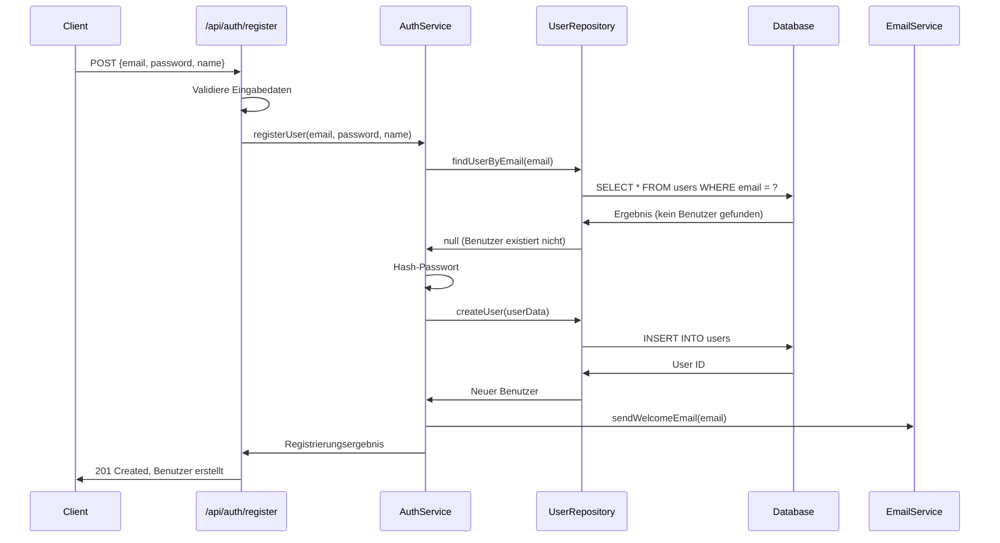
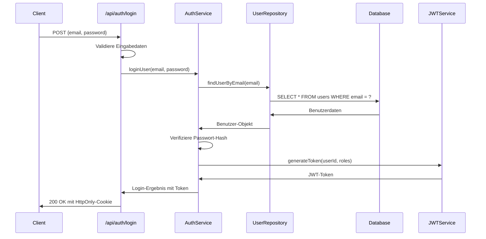
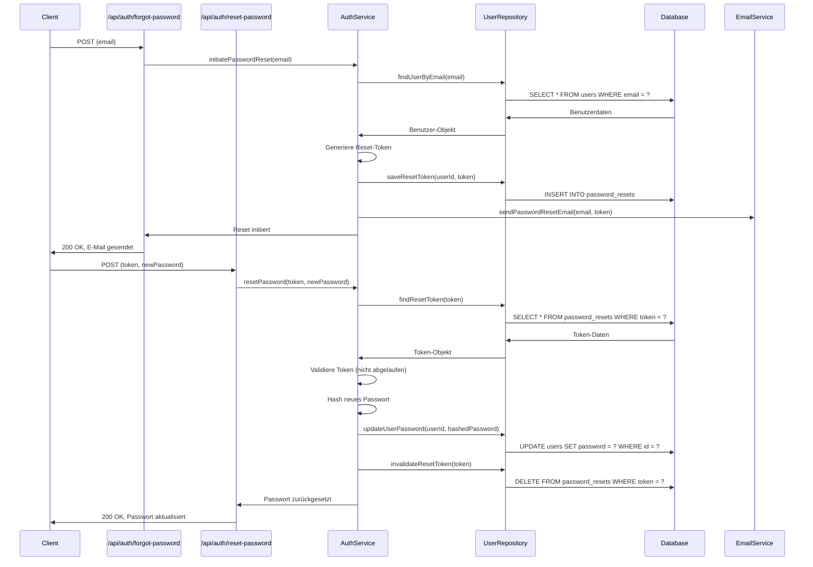
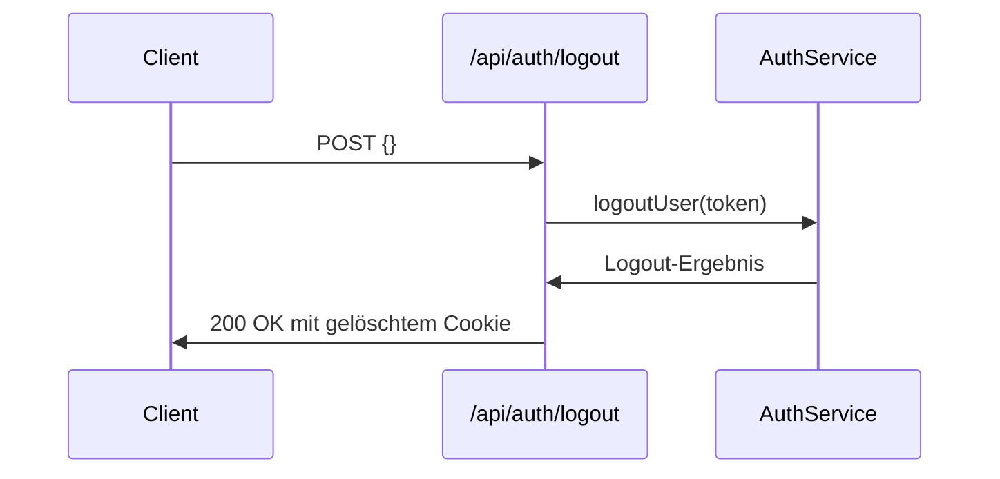

# Authentifizierungsflow

Diese Dokumentation beschreibt den vollständigen Authentifizierungsflow im Evolution Hub System, einschließlich der Benutzerregistrierung, Anmeldung, Sitzungsverwaltung und Sicherheitsmaßnahmen.

## Inhaltsverzeichnis

1. [Überblick](#überblick)
2. [Authentifizierungskomponenten](#authentifizierungskomponenten)
3. [Registrierungsflow](#registrierungsflow)
4. [Anmeldeflow](#anmeldeflow)
5. [Sitzungsverwaltung](#sitzungsverwaltung)
6. [Passwort-Reset-Flow](#passwort-reset-flow)
7. [Abmeldeflow](#abmeldeflow)
8. [Sicherheitsmaßnahmen](#sicherheitsmaßnahmen)
9. [Middleware-Integration](#middleware-integration)

---

## Überblick

Das Evolution Hub Authentifizierungssystem basiert auf einem JWT-basierten (JSON Web Token) Ansatz mit sicheren HttpOnly-Cookies und implementiert Best Practices für Webanwendungssicherheit.

### Grundprinzipien

1. **Zustandslose Authentifizierung**: JWT-basierte Authentifizierung ohne serverseitige Sitzungsspeicherung
2. **Sichere Cookie-Verwaltung**: HttpOnly-Cookies zur Verhinderung von XSS-Angriffen
3. **CSRF-Schutz**: Cross-Site Request Forgery Prävention durch Token-Validierung
4. **Mehrschichtige Sicherheit**: Kombination verschiedener Sicherheitsmaßnahmen
5. **Rollenbasierte Zugriffskontrolle**: Differenzierte Berechtigungen basierend auf Benutzerrollen

---

## Authentifizierungskomponenten

Das Authentifizierungssystem besteht aus folgenden Hauptkomponenten:

### 1. Auth-APIs

- **Registrierung**: `/api/auth/register`
- **Anmeldung**: `/api/auth/login`
- **Passwort vergessen**: `/api/auth/forgot-password`
- **Passwort zurücksetzen**: `/api/auth/reset-password`
- **Abmeldung**: `/api/auth/logout`

### 2. Auth-Service

- **Benutzervalidierung**: Überprüfung von Anmeldedaten
- **Token-Generierung**: Erstellung von JWT-Tokens
- **Passwort-Hashing**: Sichere Speicherung von Passwörtern
- **Berechtigungsprüfung**: Überprüfung von Benutzerberechtigungen

### 3. Auth-Middleware

- **Token-Validierung**: Überprüfung von JWT-Tokens
- **Benutzerkontext**: Bereitstellung des Benutzerkontexts für API-Handler
- **Zugriffskontrolle**: Durchsetzung von Zugriffsrichtlinien

### 4. Security-Services

- **Rate-Limiting**: Begrenzung der Anfragehäufigkeit
- **Security-Headers**: Implementierung von Sicherheits-HTTP-Headers
- **Audit-Logging**: Protokollierung sicherheitsrelevanter Ereignisse

---

## Registrierungsflow

Der Registrierungsprozess umfasst folgende Schritte:



### Registrierungscode

```typescript
// src/pages/api/auth/register.ts
export async function POST({ request, env }) {
  try {
    // Eingabedaten validieren
    const data = await request.json();
    const { email, password, name } = data;
    
    if (!email || !password || !name) {
      return new Response(JSON.stringify({
        error: 'Validation Error',
        message: 'Email, password and name are required'
      }), { status: 400 });
    }
    
    // Rate-Limiting prüfen
    const rateLimitResult = await checkRateLimit(request, 'register', env);
    if (!rateLimitResult.success) {
      return rateLimitResult.response;
    }
    
    // Benutzer registrieren
    const authService = new AuthService(env.DB);
    const result = await authService.registerUser(email, password, name);
    
    // Audit-Logging
    await logSecurityEvent(env, {
      type: 'USER_REGISTERED',
      email,
      success: true,
      ip: request.headers.get('CF-Connecting-IP')
    });
    
    // Erfolgsantwort
    return new Response(JSON.stringify({
      message: 'User registered successfully',
      userId: result.userId
    }), {
      status: 201,
      headers: getSecurityHeaders()
    });
  } catch (error) {
    // Fehlerbehandlung
    if (error.code === 'USER_EXISTS') {
      return new Response(JSON.stringify({
        error: 'Conflict',
        message: 'User with this email already exists'
      }), { status: 409 });
    }
    
    // Audit-Logging bei Fehler
    await logSecurityEvent(env, {
      type: 'USER_REGISTRATION_FAILED',
      email: data?.email,
      success: false,
      error: error.message,
      ip: request.headers.get('CF-Connecting-IP')
    });
    
    return new Response(JSON.stringify({
      error: 'Internal Server Error',
      message: 'Failed to register user'
    }), { status: 500 });
  }
}
```

---

## Anmeldeflow

Der Anmeldeprozess umfasst folgende Schritte:



### Anmeldecode

```typescript
// src/pages/api/auth/login.ts
export async function POST({ request, env }) {
  try {
    // Eingabedaten validieren
    const data = await request.json();
    const { email, password } = data;
    
    if (!email || !password) {
      return new Response(JSON.stringify({
        error: 'Validation Error',
        message: 'Email and password are required'
      }), { status: 400 });
    }
    
    // Rate-Limiting prüfen
    const rateLimitResult = await checkRateLimit(request, 'login', env);
    if (!rateLimitResult.success) {
      return rateLimitResult.response;
    }
    
    // Benutzer anmelden
    const authService = new AuthService(env.DB);
    const result = await authService.loginUser(email, password);
    
    // Cookie-Einstellungen
    const cookieOptions = {
      httpOnly: true,
      secure: true,
      sameSite: 'strict',
      path: '/',
      expires: new Date(Date.now() + 7 * 24 * 60 * 60 * 1000) // 7 Tage
    };
    
    // Audit-Logging
    await logSecurityEvent(env, {
      type: 'USER_LOGIN',
      userId: result.userId,
      email,
      success: true,
      ip: request.headers.get('CF-Connecting-IP')
    });
    
    // Erfolgsantwort mit Cookie
    return new Response(JSON.stringify({
      message: 'Login successful',
      user: {
        id: result.userId,
        name: result.name,
        email: result.email,
        roles: result.roles
      }
    }), {
      status: 200,
      headers: {
        'Set-Cookie': `auth-token=${result.token}; ${serializeCookieOptions(cookieOptions)}`,
        ...getSecurityHeaders()
      }
    });
  } catch (error) {
    // Fehlerbehandlung
    if (error.code === 'INVALID_CREDENTIALS') {
      // Audit-Logging bei fehlgeschlagener Anmeldung
      await logSecurityEvent(env, {
        type: 'USER_LOGIN_FAILED',
        email: data?.email,
        success: false,
        reason: 'INVALID_CREDENTIALS',
        ip: request.headers.get('CF-Connecting-IP')
      });
      
      return new Response(JSON.stringify({
        error: 'Unauthorized',
        message: 'Invalid email or password'
      }), { status: 401 });
    }
    
    // Audit-Logging bei Fehler
    await logSecurityEvent(env, {
      type: 'USER_LOGIN_ERROR',
      email: data?.email,
      success: false,
      error: error.message,
      ip: request.headers.get('CF-Connecting-IP')
    });
    
    return new Response(JSON.stringify({
      error: 'Internal Server Error',
      message: 'Failed to login'
    }), { status: 500 });
  }
}
```

---

## Sitzungsverwaltung

Die Sitzungsverwaltung basiert auf JWT-Tokens, die in HttpOnly-Cookies gespeichert werden:

### Token-Struktur

```javascript
{
  "sub": "user-123", // Benutzer-ID
  "roles": ["user", "admin"], // Benutzerrollen
  "iat": 1628610000, // Ausstellungszeitpunkt
  "exp": 1628696400, // Ablaufzeitpunkt
  "jti": "unique-token-id" // Eindeutige Token-ID
}
```

### Token-Validierung

```typescript
// src/middleware.ts
export async function onRequest({ request, env, next }) {
  // Security-Headers hinzufügen
  const response = await next();
  addSecurityHeaders(response);
  
  // Öffentliche Routen überspringen
  const url = new URL(request.url);
  if (isPublicRoute(url.pathname)) {
    return response;
  }
  
  try {
    // Token aus Cookie extrahieren
    const cookies = parseCookies(request.headers.get('Cookie') || '');
    const token = cookies['auth-token'];
    
    if (!token) {
      throw new Error('No authentication token provided');
    }
    
    // Token validieren
    const authService = new AuthService(env.DB);
    const decoded = await authService.verifyToken(token);
    
    // Benutzerkontext zur Anfrage hinzufügen
    request.user = {
      id: decoded.sub,
      roles: decoded.roles
    };
    
    // Anfrage mit Benutzerkontext weiterleiten
    return next();
  } catch (error) {
    // Bei ungültigem Token Fehler zurückgeben
    return new Response(JSON.stringify({
      error: 'Unauthorized',
      message: 'Invalid or expired authentication token'
    }), {
      status: 401,
      headers: {
        'Content-Type': 'application/json',
        ...getSecurityHeaders()
      }
    });
  }
}
```

### Token-Erneuerung

```typescript
// Token-Erneuerung bei jeder Anfrage
if (shouldRenewToken(decoded)) {
  const newToken = await authService.refreshToken(token);
  
  // Neues Cookie setzen
  const cookieOptions = {
    httpOnly: true,
    secure: true,
    sameSite: 'strict',
    path: '/',
    expires: new Date(Date.now() + 7 * 24 * 60 * 60 * 1000) // 7 Tage
  };
  
  response.headers.set('Set-Cookie', `auth-token=${newToken}; ${serializeCookieOptions(cookieOptions)}`);
}
```

---

## Passwort-Reset-Flow

Der Passwort-Reset-Prozess umfasst folgende Schritte:



---

## Abmeldeflow

Der Abmeldeprozess umfasst folgende Schritte:



### Abmeldecode

```typescript
// src/pages/api/auth/logout.ts
export async function POST({ request, env }) {
  try {
    // Cookie löschen
    const cookieOptions = {
      httpOnly: true,
      secure: true,
      sameSite: 'strict',
      path: '/',
      expires: new Date(0) // Sofort ablaufen lassen
    };
    
    // Benutzer-ID aus Token extrahieren (falls vorhanden)
    const cookies = parseCookies(request.headers.get('Cookie') || '');
    const token = cookies['auth-token'];
    let userId = null;
    
    if (token) {
      try {
        const authService = new AuthService(env.DB);
        const decoded = await authService.verifyToken(token);
        userId = decoded.sub;
      } catch (error) {
        // Token konnte nicht verifiziert werden, ignorieren
      }
    }
    
    // Audit-Logging
    if (userId) {
      await logSecurityEvent(env, {
        type: 'USER_LOGOUT',
        userId,
        success: true,
        ip: request.headers.get('CF-Connecting-IP')
      });
    }
    
    // Erfolgsantwort mit gelöschtem Cookie
    return new Response(JSON.stringify({
      message: 'Logout successful'
    }), {
      status: 200,
      headers: {
        'Set-Cookie': `auth-token=; ${serializeCookieOptions(cookieOptions)}`,
        ...getSecurityHeaders()
      }
    });
  } catch (error) {
    return new Response(JSON.stringify({
      error: 'Internal Server Error',
      message: 'Failed to logout'
    }), { status: 500 });
  }
}
```

---

## Sicherheitsmaßnahmen

Evolution Hub implementiert mehrere Sicherheitsmaßnahmen im Authentifizierungssystem:

### 1. Passwort-Sicherheit

- **Bcrypt-Hashing**: Sichere Passwort-Hashing-Algorithmen
- **Passwort-Richtlinien**: Mindestanforderungen an Passwörter (Länge, Komplexität)
- **Brute-Force-Schutz**: Rate-Limiting für Anmeldeversuche

### 2. Token-Sicherheit

- **Kurze Lebensdauer**: JWT-Tokens mit begrenzter Gültigkeit
- **Sichere Signierung**: Verwendung starker Signierungsalgorithmen
- **HttpOnly-Cookies**: Schutz vor JavaScript-Zugriff auf Tokens

### 3. CSRF-Schutz

- **CSRF-Tokens**: Zusätzliche Tokens für schreibende Operationen
- **SameSite-Cookies**: Einschränkung von Cross-Site-Requests
- **Origin-Validierung**: Überprüfung des Request-Origins

### 4. XSS-Schutz

- **Content-Security-Policy**: Einschränkung von Script-Quellen
- **X-XSS-Protection**: Browser-seitiger XSS-Schutz
- **HttpOnly-Cookies**: Schutz vor Cookie-Diebstahl durch XSS

### 5. Audit-Logging

- **Sicherheitsereignisse**: Protokollierung aller sicherheitsrelevanten Ereignisse
- **Anmeldeversuche**: Erfolgreiche und fehlgeschlagene Anmeldungen
- **Passwort-Änderungen**: Protokollierung von Passwort-Änderungen und -Resets

---

## Middleware-Integration

Die Authentifizierung ist in die Middleware-Pipeline integriert und wird für alle geschützten Routen automatisch angewendet:

### Middleware-Konfiguration

```typescript
// src/middleware.ts
import { defineMiddleware } from 'astro:middleware';
import { isPublicRoute } from './lib/auth';
import { addSecurityHeaders } from './lib/security-headers';
import { checkRateLimit } from './lib/rate-limiter';
import { logRequest } from './lib/security-logger';

export const onRequest = defineMiddleware(async ({ request, env, next }) => {
  // Request-Logging
  await logRequest(request, env);
  
  // Rate-Limiting für alle Anfragen
  const rateLimitResult = await checkRateLimit(request, 'global', env);
  if (!rateLimitResult.success) {
    return rateLimitResult.response;
  }
  
  // Öffentliche Routen überspringen Authentifizierung
  const url = new URL(request.url);
  if (isPublicRoute(url.pathname)) {
    const response = await next();
    addSecurityHeaders(response);
    return response;
  }
  
  // Authentifizierung für geschützte Routen
  try {
    const authResult = await authenticateRequest(request, env);
    if (!authResult.success) {
      return authResult.response;
    }
    
    // Benutzerkontext zur Anfrage hinzufügen
    request.user = authResult.user;
    
    // Anfrage mit Benutzerkontext weiterleiten
    const response = await next();
    
    // Token erneuern, wenn nötig
    if (authResult.shouldRenewToken) {
      const newToken = await refreshToken(authResult.token, env);
      setAuthCookie(response, newToken);
    }
    
    // Security-Headers hinzufügen
    addSecurityHeaders(response);
    return response;
  } catch (error) {
    // Bei Authentifizierungsfehler Fehler zurückgeben
    return new Response(JSON.stringify({
      error: 'Unauthorized',
      message: 'Authentication failed'
    }), {
      status: 401,
      headers: {
        'Content-Type': 'application/json',
        ...getSecurityHeaders()
      }
    });
  }
});
```

### Rollenbasierte Zugriffskontrolle

```typescript
// src/lib/auth.ts
export function requireRole(roles) {
  return async ({ request, env, next }) => {
    // Benutzer muss bereits authentifiziert sein
    if (!request.user) {
      return new Response(JSON.stringify({
        error: 'Unauthorized',
        message: 'Authentication required'
      }), { status: 401 });
    }
    
    // Rollen überprüfen
    const hasRequiredRole = roles.some(role => request.user.roles.includes(role));
    
    if (!hasRequiredRole) {
      return new Response(JSON.stringify({
        error: 'Forbidden',
        message: 'Insufficient permissions'
      }), { status: 403 });
    }
    
    // Anfrage mit ausreichenden Berechtigungen weiterleiten
    return next();
  };
}
```

### Verwendung in API-Routen

```typescript
// src/pages/api/admin/users.ts
import { requireRole } from '../../../lib/auth';

// Nur für Administratoren zugänglich
export const all = [requireRole(['admin'])];

export async function GET({ request, env }) {
  // Implementierung der Admin-API
  // ...
}
```

---

## Lokalisierung der Auth-Routen (Verweis: ADR-0005)

Für Auth-Seiten (z. B. `login`, `register`, `forgot-password`, `reset-password`, `email-verified`) gilt: Die Sprache wird strikt über das URL-Prefix bestimmt (z. B. `/de/*` für Deutsch, `/en/*` für Englisch). Die Middleware normalisiert Auth-Routen nicht, damit die Locale stabil bleibt und Client-seitige Toasts (Sonner) zuverlässig lokalisiert werden.

Details und Begründung siehe ADR:

- [ADR-0005: Auth-Routen – Locale-Normalisierung (DE/EN)](./adrs/0005-auth-route-locale-normalisierung.md)

Konsequenzen für Implementierung und Tests:

- Aufruf von `/de/*` zeigt deutsche Inhalte/Toasts, ungeachtet Cookie/Accept-Language.
- E2E-Tests prüfen strikt locale-spezifische Texte und die URL-Bereinigung nach Toast-Anzeige.
