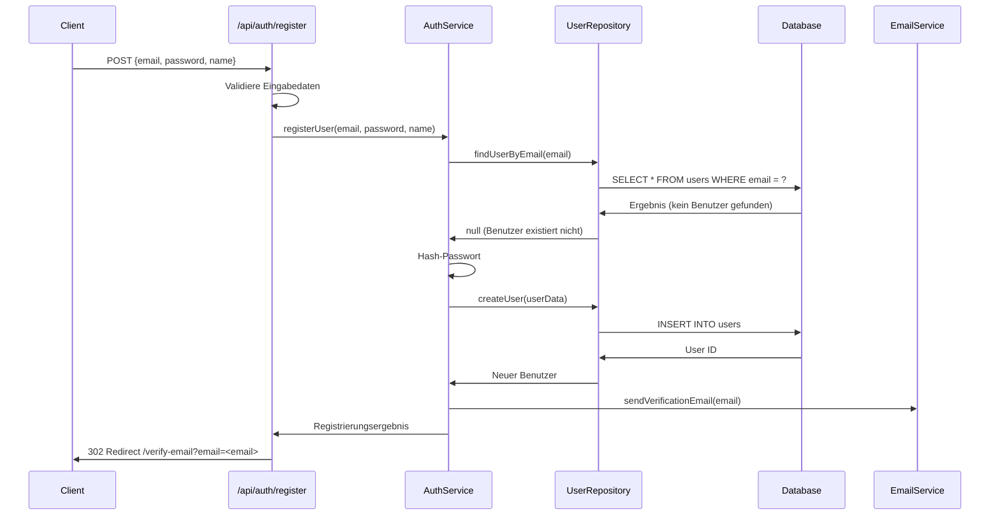
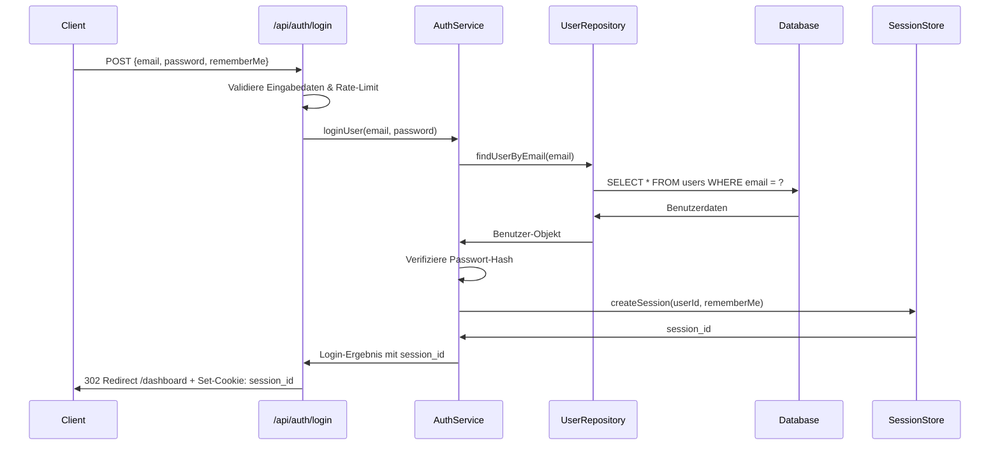
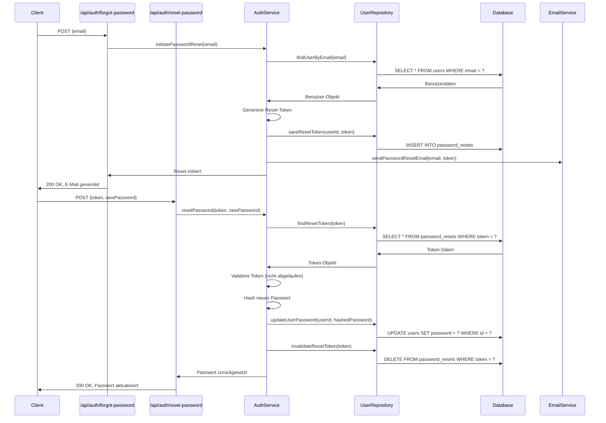
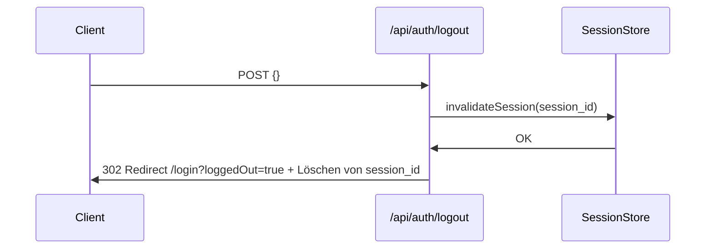

# Authentifizierungsflow

Diese Dokumentation beschreibt den vollständigen Authentifizierungsflow im Evolution Hub System, einschließlich der Benutzerregistrierung, Anmeldung, Sitzungsverwaltung und Sicherheitsmaßnahmen.

## Inhaltsverzeichnis

1. [Überblick](#überblick)
2. [Authentifizierungskomponenten](#authentifizierungskomponenten)
3. [Registrierungsflow](#registrierungsflow)
4. [Anmeldeflow](#anmeldeflow)
5. [Sitzungsverwaltung](#sitzungsverwaltung) <!-- markdownlint-disable-line MD051 -->
6. [Passwort-Reset-Flow](#passwort-reset-flow)
7. [Abmeldeflow](#abmeldeflow)
8. [Sicherheitsmaßnahmen](#sicherheitsmaßnahmen)
9. [Middleware-Integration](#middleware-integration)

---

## Überblick

Das Evolution Hub Authentifizierungssystem verwendet serverseitige Sitzungen mit einem sicheren HttpOnly-Cookie (`session_id`) und implementiert Best Practices für Webanwendungssicherheit. Es werden keine JWTs verwendet.

### Grundprinzipien

1. **Serverseitige Sitzungen**: Authentifizierung über persistente, serverseitig validierte Sitzungen (Cookie: `session_id`)
2. **Sichere Cookie-Verwaltung**: HttpOnly, Secure (prod), SameSite=Lax, Path=/; `maxAge` abhängig von „Remember Me“
3. **CSRF-Schutz**: CSRF-Prävention an relevanten Endpunkten
4. **Mehrschichtige Sicherheit**: Rate-Limiting, Security Headers, Audit-Logging
5. **Rollenbasierte Zugriffskontrolle**: Differenzierte Berechtigungen basierend auf Benutzerrollen

---

## Authentifizierungskomponenten

Das Authentifizierungssystem besteht aus folgenden Hauptkomponenten:

### 1. Auth-APIs

- **Registrierung**: `/api/auth/register`
- **Anmeldung**: `/api/auth/login`
- **Passwort vergessen**: `/api/auth/forgot-password`
- **Passwort zurücksetzen**: `/api/auth/reset-password`
- **Abmeldung**: `/api/auth/logout`

### 2. Auth-Service

- **Benutzervalidierung**: Überprüfung von Anmeldedaten
- **Sitzungserstellung**: Erstellung und Persistierung von Sessions (`session_id`)
- **Passwort-Hashing**: Sichere Speicherung von Passwörtern
- **Berechtigungsprüfung**: Überprüfung von Benutzerberechtigungen

### 3. Auth-Middleware

- **Sitzungsvalidierung**: Überprüfung der Session anhand des `session_id`-Cookies
- **Benutzerkontext**: Bereitstellung des Benutzerkontexts für API-Handler
- **Zugriffskontrolle**: Durchsetzung von Zugriffsrichtlinien

### 4. Security-Services

- **Rate-Limiting**: Begrenzung der Anfragehäufigkeit
- **Security-Headers**: Implementierung von Sicherheits-HTTP-Headers
- **Audit-Logging**: Protokollierung sicherheitsrelevanter Ereignisse

---

## Registrierungsflow

Der Registrierungsprozess umfasst folgende Schritte:



### Registrierungscode

```typescript
// src/pages/api/auth/register.ts (vereinfacht)
export async function POST(context) {
  // Eingabedaten validieren, Rate-Limit etc.
  // Benutzer anlegen (ohne Session) und Verifikationsmail auslösen
  const location = `/verify-email?email=${encodeURIComponent(user.email)}`;
  return Response.redirect(location, 302);
}
```

---

## Anmeldeflow

Der Anmeldeprozess umfasst folgende Schritte:



### Anmeldecode

```typescript
// src/pages/api/auth/login.ts
export async function POST({ request, env }: any) {
  // Eingabedaten validieren
  const form = await request.formData();
  const email = form.get('email');
  const password = form.get('password');
  const rememberMe = form.get('rememberMe') === 'on';

  // Rate-Limiting prüfen
  const rl = await checkRateLimit(request, 'login', env);
  if (!rl.success) return rl.response;

  // Benutzer anmelden und Session erstellen
  const auth = new AuthService(env.DB);
  const { userId } = await auth.loginUser(email, password);
  const sessionId = await auth.createSession(userId, { rememberMe });

  // Cookie setzen (HttpOnly, SameSite=Lax, Secure in Prod)
  const maxAge = rememberMe ? 60 * 60 * 24 * 30 : 60 * 60 * 24; // 30d / 1d
  const secure = process.env.NODE_ENV === 'production' ? 'Secure; ' : '';
  const cookie = `session_id=${sessionId}; ${secure}HttpOnly; Path=/; SameSite=Lax; Max-Age=${maxAge}`;

  return new Response(null, {
    status: 302,
    headers: {
      'Set-Cookie': cookie,
      Location: '/dashboard'
    }
  });
}

---

## Sitzungsverwaltung

Die Sitzungsverwaltung basiert auf serverseitigen Sitzungen, identifiziert durch das HttpOnly-Cookie `session_id`:

### Session-Cookie und Eigenschaften

- Cookie-Name: `session_id`
- Eigenschaften: HttpOnly, Secure (in Produktion), SameSite=Lax, Path=/
- Lebensdauer: Standard 1 Tag, 30 Tage bei „Remember Me“

### Sitzungsvalidierung (aktuell)

```typescript
// src/middleware.ts (vereinfacht)
const cookies = parseCookies(request.headers.get('Cookie') || '');
const sessionId = cookies['session_id'];
if (!sessionId) {
  context.locals.session = null;
  context.locals.user = null;
  // Weiter mit nachfolgenden Handlern; Gating erfolgt separat (z. B. /verify-email)
}
// Session im Store/DB prüfen → context.locals.{session,user} setzen
```

---

## Passwort-Reset-Flow

Der Passwort-Reset-Prozess umfasst folgende Schritte:



### Hinweis: Token-Transport und URL-Bereinigung (aktuell)

- Der Reset-Link verwendet ein Fragment-Token: `/reset-password#token=...` (reduziert die Gefahr von Token-Leaks in Logs/Proxys). Quelle: `src/pages/api/auth/forgot-password.ts`.
- Die Seite `src/pages/reset-password.astro` extrahiert das Token sowohl aus Query als auch Hash, übergibt es als Hidden-Input an das Formular und bereinigt anschließend Query und Hash via `history.replaceState`.
- Nach dem Absenden erfolgt ein Redirect durch `/api/auth/reset-password`; Rückmeldungen werden über `AuthStatusNotifier` als Toasts angezeigt.

---

## Abmeldeflow

Der Abmeldeprozess umfasst folgende Schritte:

Hinweis (aktuell): Das Cookie `session_id` wird gelöscht und der Nutzer wird nach `/login?loggedOut=true` umgeleitet. Die Seite zeigt über `AuthStatusNotifier` eine Bestätigungs-Toast an und bereinigt anschließend die URL.



### Abmeldecode

```typescript
// src/pages/api/auth/logout.ts
import { invalidateSession } from '@/lib/auth-v2';

export async function POST(context: any) {
  // Session invalidieren und Cookie löschen, dann Redirect
  const sessionId = context.cookies.get('session_id')?.value ?? null;
  if (sessionId && context.locals?.runtime) {
    await invalidateSession(context.locals.runtime.env.DB, sessionId);
  }
  // Cookie entfernen
  context.cookies.set('session_id', '', {
    path: '/',
    httpOnly: true,
    sameSite: 'lax',
    secure: new URL(context.request.url).protocol === 'https:',
    maxAge: 0,
  });
  return Response.redirect('/login?loggedOut=true', 302);
}
```

---

## Clientseitige Benachrichtigungen (Sonner) & URL-Bereinigung

- Globaler Toaster wird in `src/layouts/BaseLayout.astro` mit `client:load` eingebunden.
- Auth-Seiten binden die React-Insel `src/components/scripts/AuthStatusNotifier.tsx` mit `client:load` ein (z. B. `login`, `register`, `forgot-password`, `reset-password`, Bestätigungsseiten).
- `AuthStatusNotifier` zeigt lokalisierte Toasts basierend auf URL-Parametern (`success`, `error`, `loggedOut`, ggf. weitere) und entfernt diese Parameter anschließend aus der URL.
- Auf `reset-password` wird zusätzlich das `token`-Fragment/Query nach dem Auslesen bereinigt.
- Strenge CSP ist in Produktion aktiv; der Notifier wartet auf das Mounten des Toasters, um Timing-Probleme zu vermeiden.
- `AuthLayout.astro` deaktiviert AOS/Analytics für Auth-Seiten (siehe `docs/frontend/aos-coordinator.md`).

## Lokalisierung der Auth-Routen (Verweis: ADR-0005)

Für Auth-Seiten (z. B. `login`, `register`, `forgot-password`, `reset-password`, `email-verified`) gilt: Die Sprache wird strikt über das URL-Prefix bestimmt (z. B. `/de/*` für Deutsch, `/en/*` für Englisch). Die Middleware normalisiert Auth-Routen nicht, damit die Locale stabil bleibt und Client-seitige Toasts (Sonner) zuverlässig lokalisiert werden.

Details und Begründung siehe ADR:

- [ADR-0005: Auth-Routen – Locale-Normalisierung (DE/EN)](./adrs/0005-auth-route-locale-normalisierung.md)

Konsequenzen für Implementierung und Tests:

- Aufruf von `/de/*` zeigt deutsche Inhalte/Toasts, ungeachtet Cookie/Accept-Language.
- E2E-Tests prüfen strikt locale-spezifische Texte und die URL-Bereinigung nach Toast-Anzeige.

---

## Sicherheitsmaßnahmen

- **Rate-Limiting**: Schutz vor Brute-Force/Abuse auf allen Auth-APIs und global in der Middleware.
- **Security Headers**: Strenge Standard-Header inkl. CSP (in Produktion strikt), HSTS, Frame-/Referrer-Policies.
- **CSRF/Origin-Checks**: CSRF-Token/Origin-Validierung an state-changing Endpunkten.
- **Cookie-Härtung**: `session_id` als HttpOnly, SameSite=Lax, Secure (prod), kurze Standardlebensdauer.
- **Audit-Logging**: Relevante Ereignisse (Login/Logout, Passwort-Reset) werden protokolliert.

---

## Middleware-Integration

Die Authentifizierung ist in die Middleware-Pipeline integriert und wird für alle geschützten Routen automatisch angewendet:

### Middleware-Konfiguration

```typescript
// src/middleware.ts
import { defineMiddleware } from 'astro:middleware';
import { validateSession } from '@/lib/auth-v2';

export const onRequest = defineMiddleware(async (context, next) => {
  // Session-ID aus Cookie lesen
  const sessionId = context.cookies.get('session_id')?.value ?? null;

  if (!sessionId || !context.locals?.runtime) {
    context.locals.session = null;
    context.locals.user = null;
    return next();
  }

  try {
    const { session, user } = await validateSession(context.locals.runtime.env.DB, sessionId);
    context.locals.session = session;
    context.locals.user = user;
  } catch {
    context.locals.session = null;
    context.locals.user = null;
  }

  return next();
});
```

### Rollenbasierte Zugriffskontrolle

```typescript
// src/lib/auth.ts
export function requireRole(roles) {
  return async ({ request, env, next }) => {
    // Benutzer muss bereits authentifiziert sein
    if (!request.user) {
      return new Response(JSON.stringify({
        error: 'Unauthorized',
        message: 'Authentication required'
      }), { status: 401 });
    }
    
    // Rollen überprüfen
    const hasRequiredRole = roles.some(role => request.user.roles.includes(role));
    
    if (!hasRequiredRole) {
      return new Response(JSON.stringify({
        error: 'Forbidden',
        message: 'Insufficient permissions'
      }), { status: 403 });
    }
    
    // Anfrage mit ausreichenden Berechtigungen weiterleiten
    return next();
  };
}
```

### Verwendung in API-Routen

```typescript
// src/pages/api/admin/users.ts
import { requireRole } from '../../../lib/auth';

// Nur für Administratoren zugänglich
export const all = [requireRole(['admin'])];

export async function GET({ request, env }) {
  // Implementierung der Admin-API
  // ...
}
