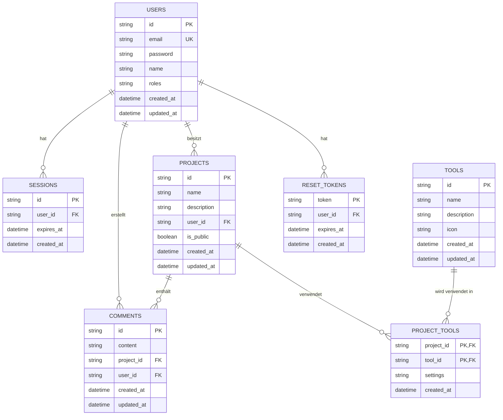

# Datenbank-Schema - Evolution Hub

> **WICHTIG: Diese Dokumentation ist veraltet!**
>
> Die aktuelle und vollständige Dokumentation des Datenbankschemas ist unter [db_schema_update.md](../db_schema_update.md) verfügbar.
> Bitte verwenden Sie ausschließlich die aktuelle Dokumentation für alle Entwicklungsarbeiten.

## Historische Dokumentation

Die folgende Dokumentation wird nur zu Referenzzwecken beibehalten und sollte nicht mehr für aktive Entwicklung verwendet werden.

## Inhaltsverzeichnis

1. [Entity-Relationship-Diagramm](#entity-relationship-diagramm)
2. [Tabellen](#tabellen)
   - [Users](#users)
   - [Sessions](#sessions)
   - [Projects](#projects)
   - [Comments](#comments)
   - [Tools](#tools)
   - [ProjectTools](#projecttools)
   - [ResetTokens](#resettokens)
3. [Beziehungen](#beziehungen)
4. [Indizierungsstrategie](#indizierungsstrategie)
5. [Datentypen und Constraints](#datentypen-und-constraints)
6. [Migrations-Management](#migrations-management)
7. [Performance-Optimierung](#performance-optimierung)

---

## Entity-Relationship-Diagramm

Das folgende Diagramm zeigt die Beziehungen zwischen den Tabellen des Evolution Hub Datenbankschemas:



---

## Tabellen

### Users

Die `users`-Tabelle speichert Benutzerinformationen und Authentifizierungsdaten.

#### Schema

| Spalte      | Typ      | Beschreibung                                      | Constraints                |
|-------------|----------|---------------------------------------------------|----------------------------|
| id          | TEXT     | Eindeutige Benutzer-ID (UUID)                     | PRIMARY KEY                |
| email       | TEXT     | E-Mail-Adresse des Benutzers                      | UNIQUE, NOT NULL           |
| password    | TEXT     | Gehashtes Passwort (bcrypt)                       | NOT NULL                   |
| name        | TEXT     | Anzeigename des Benutzers                         | NOT NULL                   |
| roles       | TEXT     | Benutzerrollen als JSON-Array (z.B. '["user"]')   | NOT NULL                   |
| created_at  | DATETIME | Erstellungszeitpunkt                              | NOT NULL, DEFAULT CURRENT_TIMESTAMP |
| updated_at  | DATETIME | Letzter Aktualisierungszeitpunkt                  | NOT NULL, DEFAULT CURRENT_TIMESTAMP |

#### Indizes

| Name           | Spalten | Typ    | Beschreibung                           |
|----------------|---------|--------|----------------------------------------|
| PRIMARY KEY    | id      | UNIQUE | Primärschlüssel für schnellen Zugriff  |
| idx_users_email| email   | UNIQUE | Index für E-Mail-Suche und -Validierung|

#### Beispiel

```sql
INSERT INTO users (id, email, password, name, roles, created_at, updated_at)
VALUES (
    '550e8400-e29b-41d4-a716-446655440000',
    'user@example.com',
    '$2a$12$rIgJOUbas/QpLz1S3bkJgOTsIrP9KbWNFMrEBHtKceMc7M4fFIYyG',
    'John Doe',
    '["user"]',
    '2023-01-01T00:00:00Z',
    '2023-01-01T00:00:00Z'
);
```

---

### Sessions

Die `sessions`-Tabelle speichert aktive Benutzersitzungen.

#### Schema

| Spalte      | Typ      | Beschreibung                                      | Constraints                |
|-------------|----------|---------------------------------------------------|----------------------------|
| id          | TEXT     | Eindeutige Sitzungs-ID (UUID)                     | PRIMARY KEY                |
| user_id     | TEXT     | Referenz auf die Benutzer-ID                      | FOREIGN KEY, NOT NULL      |
| expires_at  | DATETIME | Ablaufzeitpunkt der Sitzung                       | NOT NULL                   |
| created_at  | DATETIME | Erstellungszeitpunkt                              | NOT NULL, DEFAULT CURRENT_TIMESTAMP |

#### Indizes

| Name                   | Spalten    | Typ    | Beschreibung                                |
|------------------------|------------|--------|---------------------------------------------|
| PRIMARY KEY            | id         | UNIQUE | Primärschlüssel für schnellen Zugriff       |
| idx_sessions_user_id   | user_id    | NORMAL | Index für Benutzer-Sitzungen                |
| idx_sessions_expires_at| expires_at | NORMAL | Index für Ablaufzeitpunkt (für Bereinigung) |

#### Beispiel

```sql
INSERT INTO sessions (id, user_id, expires_at, created_at)
VALUES (
    '7c9e6679-7425-40de-944b-e07fc1f90ae7',
    '550e8400-e29b-41d4-a716-446655440000',
    '2023-01-02T00:00:00Z',
    '2023-01-01T00:00:00Z'
);
```

---

### Projects

Die `projects`-Tabelle speichert Benutzerprojekte und deren Metadaten.

#### Schema

| Spalte      | Typ      | Beschreibung                                      | Constraints                |
|-------------|----------|---------------------------------------------------|----------------------------|
| id          | TEXT     | Eindeutige Projekt-ID (UUID)                      | PRIMARY KEY                |
| name        | TEXT     | Projektname                                       | NOT NULL                   |
| description | TEXT     | Projektbeschreibung                               |                            |
| user_id     | TEXT     | Referenz auf die Benutzer-ID des Erstellers       | FOREIGN KEY, NOT NULL      |
| is_public   | BOOLEAN  | Gibt an, ob das Projekt öffentlich ist            | NOT NULL, DEFAULT 0        |
| created_at  | DATETIME | Erstellungszeitpunkt                              | NOT NULL, DEFAULT CURRENT_TIMESTAMP |
| updated_at  | DATETIME | Letzter Aktualisierungszeitpunkt                  | NOT NULL, DEFAULT CURRENT_TIMESTAMP |

#### Indizes

| Name                   | Spalten    | Typ    | Beschreibung                                |
|------------------------|------------|--------|---------------------------------------------|
| PRIMARY KEY            | id         | UNIQUE | Primärschlüssel für schnellen Zugriff       |
| idx_projects_user_id   | user_id    | NORMAL | Index für Benutzer-Projekte                 |
| idx_projects_is_public | is_public  | NORMAL | Index für öffentliche Projekte              |

#### Beispiel

```sql
INSERT INTO projects (id, name, description, user_id, is_public, created_at, updated_at)
VALUES (
    'f47ac10b-58cc-4372-a567-0e02b2c3d479',
    'Mein Projekt',
    'Eine Beschreibung meines Projekts',
    '550e8400-e29b-41d4-a716-446655440000',
    1,
    '2023-01-01T00:00:00Z',
    '2023-01-01T00:00:00Z'
);
```

---

### Comments

Die `comments`-Tabelle speichert Kommentare zu Projekten.

#### Schema

| Spalte      | Typ      | Beschreibung                                      | Constraints                |
|-------------|----------|---------------------------------------------------|----------------------------|
| id          | TEXT     | Eindeutige Kommentar-ID (UUID)                    | PRIMARY KEY                |
| content     | TEXT     | Kommentarinhalt                                   | NOT NULL                   |
| project_id  | TEXT     | Referenz auf die Projekt-ID                       | FOREIGN KEY, NOT NULL      |
| user_id     | TEXT     | Referenz auf die Benutzer-ID des Kommentators     | FOREIGN KEY, NOT NULL      |
| created_at  | DATETIME | Erstellungszeitpunkt                              | NOT NULL, DEFAULT CURRENT_TIMESTAMP |
| updated_at  | DATETIME | Letzter Aktualisierungszeitpunkt                  | NOT NULL, DEFAULT CURRENT_TIMESTAMP |

#### Indizes

| Name                    | Spalten     | Typ    | Beschreibung                                |
|-------------------------|-------------|--------|---------------------------------------------|
| PRIMARY KEY             | id          | UNIQUE | Primärschlüssel für schnellen Zugriff       |
| idx_comments_project_id | project_id  | NORMAL | Index für Projekt-Kommentare                |
| idx_comments_user_id    | user_id     | NORMAL | Index für Benutzer-Kommentare               |

#### Beispiel

```sql
INSERT INTO comments (id, content, project_id, user_id, created_at, updated_at)
VALUES (
    '6ba7b810-9dad-11d1-80b4-00c04fd430c8',
    'Großartiges Projekt!',
    'f47ac10b-58cc-4372-a567-0e02b2c3d479',
    '550e8400-e29b-41d4-a716-446655440000',
    '2023-01-01T12:00:00Z',
    '2023-01-01T12:00:00Z'
);
```

---

### Tools

Die `tools`-Tabelle speichert Werkzeuge, die in Projekten verwendet werden können.

#### Schema

| Spalte      | Typ      | Beschreibung                                      | Constraints                |
|-------------|----------|---------------------------------------------------|----------------------------|
| id          | TEXT     | Eindeutige Werkzeug-ID (UUID)                     | PRIMARY KEY                |
| name        | TEXT     | Werkzeugname                                      | NOT NULL                   |
| description | TEXT     | Werkzeugbeschreibung                              |                            |
| icon        | TEXT     | Icon-Pfad oder -Name                              |                            |
| created_at  | DATETIME | Erstellungszeitpunkt                              | NOT NULL, DEFAULT CURRENT_TIMESTAMP |
| updated_at  | DATETIME | Letzter Aktualisierungszeitpunkt                  | NOT NULL, DEFAULT CURRENT_TIMESTAMP |

#### Indizes

| Name        | Spalten | Typ    | Beschreibung                           |
|-------------|---------|--------|----------------------------------------|
| PRIMARY KEY | id      | UNIQUE | Primärschlüssel für schnellen Zugriff  |

#### Beispiel

```sql
INSERT INTO tools (id, name, description, icon, created_at, updated_at)
VALUES (
    '123e4567-e89b-12d3-a456-426614174000',
    'Code-Editor',
    'Ein Tool zum Bearbeiten von Code',
    'code-editor-icon',
    '2023-01-01T00:00:00Z',
    '2023-01-01T00:00:00Z'
);
```

---

### ProjectTools

Die `project_tools`-Tabelle verknüpft Projekte mit Werkzeugen (Viele-zu-viele-Beziehung).

#### Schema

| Spalte      | Typ      | Beschreibung                                      | Constraints                |
|-------------|----------|---------------------------------------------------|----------------------------|
| project_id  | TEXT     | Referenz auf die Projekt-ID                       | PRIMARY KEY, FOREIGN KEY   |
| tool_id     | TEXT     | Referenz auf die Werkzeug-ID                      | PRIMARY KEY, FOREIGN KEY   |
| settings    | TEXT     | JSON-Einstellungen für das Werkzeug im Projekt    |                            |
| created_at  | DATETIME | Erstellungszeitpunkt                              | NOT NULL, DEFAULT CURRENT_TIMESTAMP |

#### Indizes

| Name                         | Spalten              | Typ    | Beschreibung                                |
|------------------------------|----------------------|--------|---------------------------------------------|
| PRIMARY KEY                  | project_id, tool_id  | UNIQUE | Zusammengesetzter Primärschlüssel           |
| idx_project_tools_project_id | project_id           | NORMAL | Index für Projekt-Werkzeuge                 |
| idx_project_tools_tool_id    | tool_id              | NORMAL | Index für Werkzeug-Projekte                 |

#### Beispiel

```sql
INSERT INTO project_tools (project_id, tool_id, settings, created_at)
VALUES (
    'f47ac10b-58cc-4372-a567-0e02b2c3d479',
    '123e4567-e89b-12d3-a456-426614174000',
    '{"theme": "dark", "fontSize": 14}',
    '2023-01-01T12:00:00Z'
);
```

---

### ResetTokens

Die `reset_tokens`-Tabelle speichert Token für Passwort-Zurücksetzungen.

#### Schema

| Spalte      | Typ      | Beschreibung                                      | Constraints                |
|-------------|----------|---------------------------------------------------|----------------------------|
| token       | TEXT     | Eindeutiger Token                                 | PRIMARY KEY                |
| user_id     | TEXT     | Referenz auf die Benutzer-ID                      | FOREIGN KEY, NOT NULL      |
| expires_at  | DATETIME | Ablaufzeitpunkt des Tokens                        | NOT NULL                   |
| created_at  | DATETIME | Erstellungszeitpunkt                              | NOT NULL, DEFAULT CURRENT_TIMESTAMP |

#### Indizes

| Name                        | Spalten     | Typ    | Beschreibung                                |
|-----------------------------|-------------|--------|---------------------------------------------|
| PRIMARY KEY                 | token       | UNIQUE | Primärschlüssel für schnellen Zugriff       |
| idx_reset_tokens_user_id    | user_id     | NORMAL | Index für Benutzer-Token                    |
| idx_reset_tokens_expires_at | expires_at  | NORMAL | Index für Ablaufzeitpunkt (für Bereinigung) |

#### Beispiel

```sql
INSERT INTO reset_tokens (token, user_id, expires_at, created_at)
VALUES (
    'eyJhbGciOiJIUzI1NiIsInR5cCI6IkpXVCJ9',
    '550e8400-e29b-41d4-a716-446655440000',
    '2023-01-02T00:00:00Z',
    '2023-01-01T00:00:00Z'
);
```

---

## Beziehungen

Das Datenbankschema verwendet Fremdschlüsselbeziehungen, um die referenzielle Integrität zu gewährleisten:

### 1. Users → Sessions (1:n)

- Ein Benutzer kann mehrere Sitzungen haben
- Eine Sitzung gehört zu genau einem Benutzer
- `sessions.user_id` → `users.id`
- Cascade Delete: Wenn ein Benutzer gelöscht wird, werden alle seine Sitzungen gelöscht

### 2. Users → Projects (1:n)

- Ein Benutzer kann mehrere Projekte haben
- Ein Projekt gehört zu genau einem Benutzer
- `projects.user_id` → `users.id`
- Cascade Delete: Wenn ein Benutzer gelöscht wird, werden alle seine Projekte gelöscht

### 3. Users → Comments (1:n)

- Ein Benutzer kann mehrere Kommentare verfassen
- Ein Kommentar wird von genau einem Benutzer verfasst
- `comments.user_id` → `users.id`
- Cascade Delete: Wenn ein Benutzer gelöscht wird, werden alle seine Kommentare gelöscht

### 4. Projects → Comments (1:n)

- Ein Projekt kann mehrere Kommentare haben
- Ein Kommentar gehört zu genau einem Projekt
- `comments.project_id` → `projects.id`
- Cascade Delete: Wenn ein Projekt gelöscht wird, werden alle zugehörigen Kommentare gelöscht

### 5. Projects ↔ Tools (n:m)

- Ein Projekt kann mehrere Werkzeuge verwenden
- Ein Werkzeug kann in mehreren Projekten verwendet werden
- Verknüpfungstabelle: `project_tools`
- `project_tools.project_id` → `projects.id`
- `project_tools.tool_id` → `tools.id`
- Cascade Delete: Wenn ein Projekt oder Werkzeug gelöscht wird, werden die entsprechenden Verknüpfungen gelöscht

### 6. Users → ResetTokens (1:n)

- Ein Benutzer kann mehrere Reset-Token haben
- Ein Reset-Token gehört zu genau einem Benutzer
- `reset_tokens.user_id` → `users.id`
- Cascade Delete: Wenn ein Benutzer gelöscht wird, werden alle seine Reset-Token gelöscht

---

## Indizierungsstrategie

Die Indizierungsstrategie zielt darauf ab, häufige Abfragemuster zu optimieren und die Datenbankleistung zu verbessern:

### Primärschlüssel

- Alle Tabellen haben einen Primärschlüssel für schnellen Zugriff
- Für Verknüpfungstabellen werden zusammengesetzte Primärschlüssel verwendet

### Fremdschlüssel

- Alle Fremdschlüssel sind indiziert, um Joins zu optimieren
- Dies verbessert die Performance bei Abfragen, die mehrere Tabellen verknüpfen

### Häufig abgefragte Spalten

- `users.email`: Für Login und Benutzersuche
- `projects.is_public`: Für Abfragen öffentlicher Projekte
- `sessions.expires_at` und `reset_tokens.expires_at`: Für Bereinigungsabfragen

### Kombinierte Indizes

- Für häufige Abfragemuster werden kombinierte Indizes verwendet
- Beispiel: Ein kombinierter Index auf `projects.user_id` und `projects.is_public` könnte für Abfragen nützlich sein, die nach öffentlichen Projekten eines bestimmten Benutzers suchen

### Index-Wartung

- Regelmäßige Überprüfung der Index-Nutzung
- Entfernung ungenutzter Indizes
- Hinzufügung neuer Indizes basierend auf Abfragemustern

---

## Datentypen und Constraints

### Primärschlüssel

- UUIDs werden als TEXT gespeichert (nicht als BLOB)
- Dies verbessert die Lesbarkeit und Debugging-Möglichkeiten

### Textfelder

- Keine Längenbeschränkungen für TEXT-Felder in SQLite
- Für große Textfelder (wie `comments.content`) wird der TEXT-Typ verwendet

### Datumsfelder

- Alle Zeitstempel werden als DATETIME im ISO-8601-Format gespeichert
- Beispiel: '2023-01-01T00:00:00Z'

### Boolesche Felder

- Boolesche Werte werden als INTEGER (0 oder 1) gespeichert
- SQLite hat keinen nativen BOOLEAN-Typ

### JSON-Daten

- JSON-Daten werden als TEXT gespeichert
- Beispiele: `users.roles`, `project_tools.settings`
- Validierung erfolgt auf Anwendungsebene

### NOT NULL Constraints

- Kritische Felder haben NOT NULL-Constraints
- Dies verhindert Inkonsistenzen und NULL-Werte in wichtigen Spalten

### DEFAULT-Werte

- Zeitstempel haben DEFAULT CURRENT_TIMESTAMP
- Boolesche Felder haben sinnvolle Standardwerte (z.B. `is_public` = 0)

---

## Migrations-Management

Das Evolution Hub Projekt verwendet ein strukturiertes Migrations-System für Schemaänderungen:

### Migrations-Dateien

- Versionierte SQL-Dateien im Verzeichnis `migrations/`
- Namenskonvention: `YYYYMMDDHHMMSS_description.sql`
- Beispiel: `20230101000000_create_users_table.sql`

### Migrations-Tabelle

```sql
CREATE TABLE migrations (
    id INTEGER PRIMARY KEY AUTOINCREMENT,
    name TEXT NOT NULL,
    applied_at DATETIME NOT NULL DEFAULT CURRENT_TIMESTAMP
);
```

### Migrations-Prozess

1. Identifikation nicht angewendeter Migrationen
2. Ausführung in Transaktionen
3. Protokollierung in der `migrations`-Tabelle

### Rollback-Unterstützung

- Jede Migration hat eine Up- und Down-Funktion
- Up: Anwenden der Migration
- Down: Rückgängigmachen der Migration

### Migrations-Befehle

```bash
# Anwenden aller ausstehenden Migrationen
npm run db:migrate

# Rückgängigmachen der letzten Migration
npm run db:rollback

# Erstellen einer neuen Migration
npm run db:migration:create -- --name add_new_table
```

---

## Performance-Optimierung

### Abfrage-Optimierung

- Verwendung von Prepared Statements für alle Datenbankabfragen
- Vermeidung von SELECT * zugunsten expliziter Spaltenauswahl
- Begrenzung der Ergebnismenge mit LIMIT und OFFSET

### Indizierung

- Sorgfältige Indizierung häufig abgefragter Spalten
- Regelmäßige Überprüfung der Index-Nutzung
- Vermeidung übermäßiger Indizierung

### Caching

- Implementierung von Caching für häufig abgerufene Daten
- Verwendung von Cloudflare Cache für unveränderliche Daten
- Cache-Invalidierung bei Datenänderungen

### Abfrage-Analyse

- Regelmäßige Analyse langsamer Abfragen
- Optimierung problematischer Abfragen
- Überwachung der Datenbankleistung

### Wartung

- Regelmäßige Ausführung von VACUUM zur Optimierung der Datenbankgröße
- Bereinigung abgelaufener Sitzungen und Token
- Überwachung des Datenbankwachstums
