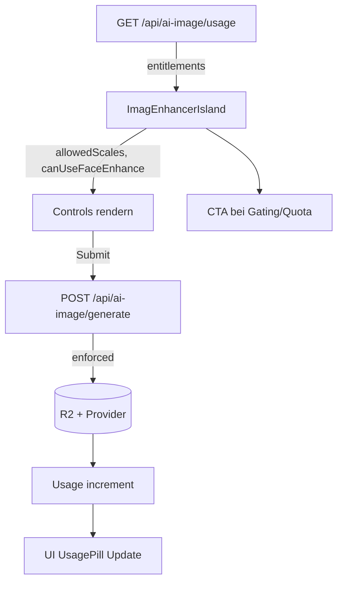

# BEWERTUNG · LOGIK-REVIEW · Image‑Enhancer · UsagePill · Plan‑Anzeige

Stand: 2025‑09‑19 04:45 (lokale Zeit)

## Executive Summary

- **Gesamteinschätzung**: Die Kopplung zwischen Plan/Entitlements → Server‑Enforcement → UI‑Anzeige ist funktionsfähig. Quoten, CSRF, Rate‑Limits und R2‑Owner‑Gating sind korrekt integriert. Die `UsagePill` zeigt den Verbrauch verlässlich; die Plan‑Badge wird angezeigt und ein Upgrade‑CTA erscheint in sinnvollen Situationen.
- **Top‑Risiken/Verbesserungen**:
  - UI blendet planbasierte Einschränkungen (z. B. `faceEnhance`, max. Upscale) nicht aus; Enforcement erfolgt erst serverseitig → potentiell „harte“ Validierungsfehler im UI.
  - Doppelte Limit‑Quellen in API‑Responses (`usage.limit` aus Entitlements vs. `limits.user/guest` als konstante Defaults) können verwirren.
  - Upgrade‑CTA erscheint breit (Gast, Free, oder bei Quota erreicht); feinere Bedingung möglich.
  - Observability uneinheitlich zwischen Sync/Jobs‑Pfad (Logger vs. Konsole).
- **Vertrauensgrad**: Hoch für Kernpfade (Usage, Generate, R2‑Gating, CSRF, Rate‑Limits). Mittel für UX‑Feinschliff (UI‑Gating der Plan‑Features) und semantische Vereinheitlichung der Limits.

## Status‑Update (2025‑09‑19 04:45)

- Phase 1 Frontend umgesetzt (per Feature‑Flag steuerbar):
  - Entitlements‑basiertes UI‑Gating (Scale/FaceEnhance) in `ImagEnhancerIsland.tsx` mit Helfern `gating.ts`.
  - Verfeinerte Upgrade‑CTA‑Regeln inkl. Tooltips; Client‑Telemetry‑Events (`enhancer_control_blocked_plan`, `enhancer_cta_impression/click`) via `useLog()`.
  - Feature‑Flag: Frontend aktiviert über `PUBLIC_ENHANCER_PLAN_GATING_V1=1`.
- Modularisierung Phase A/B umgesetzt:
  - Shared Types: `src/components/tools/imag-enhancer/types.ts`.
  - API‑Client: `src/components/tools/imag-enhancer/api.ts`.
  - CSRF‑Util: `src/lib/security/csrf.ts`.
  - Hooks: `useUsage`, `useRateLimit`, `useEnhance` unter `src/components/tools/imag-enhancer/hooks/`.
  - Island nutzt die neuen Hooks; Retry‑After/429 wird über `useRateLimit` gehandhabt.
  - Phase C gestartet: `ModelControls.tsx` und `hooks/useCompareInteractions.ts` extrahiert und in `ImagEnhancerIsland.tsx` integriert (Pointer/Wheel/Key/Loupe).
- Tests:
  - Unit‑Tests für Gating‑Ableitungen: `gating.test.ts` grün.
  - Nächste Schritte: Hook‑Unit‑Tests und E2E (EN/DE) für Gating/CTA.

## Systemüberblick

- **UI**: `src/components/tools/ImagEnhancerIsland.tsx` steuert Upload, Enhance, Compare, Plan‑Badge, UsagePill, Upgrade‑CTA.
- **API**:
  - `GET /api/ai-image/usage` liefert `ownerType`, `usage`, `plan` (für User), sowie `entitlements` (planbasierte Fähigkeiten/Quoten).
  - `POST /api/ai-image/generate` führt Sync‑Enhance mit CSRF‑Schutz aus; 429 bei Rate‑Limit.
- **Services**:
  - `AiImageService` (Sync): Validiert Content‑Type, Modell‑Fähigkeiten, setzt Plan‑Constraints (maxUpscale/faceEnhance), schreibt Artefakte in R2, inkrementiert Usage (daily/monthly, inkl. Credits‑Bypass), protokolliert strukturiert.
  - `AiJobsService` (Async Jobs): Validiert, queued, verarbeitet beim Polling, schreibt R2, inkrementiert Usage/Monthly; Logs eher minimal.
- **Entitlements**: `src/config/ai-image/entitlements.ts` mappt `Plan → { monthlyImages, dailyBurstCap, maxUpscale, faceEnhance }`. Gäste haben separate, konservative Defaults.
- **R2‑Proxy**: `src/pages/r2-ai/[...path].ts` erzwingt Owner‑Gating für `results/…/<ownerType>/<ownerId>/…`.
- **Rate‑Limits**: `src/lib/rate-limiter.ts` stellt vordefinierte Limiter bereit (u. a. `aiGenerateLimiter` 15/min, `aiJobsLimiter` 10/min) und antwortet bei Überschreitung mit 429 inkl. `Retry-After`.

## Wichtige Beobachtungen (mit Evidenz)

- **Plan‑Badge & UsagePill in der Toolbar**
  - `ImagEnhancerIsland.tsx`: Plan‑Badge und `UsagePill` werden im rechten Slot gerendert.
    - Plan‑Badge: Zeilen `1575–1582` zeigen `planLabel` (z. B. „Guest“/„Starter“).
    - `UsagePill`: Zeilen `1583–1590` mit `usage`, `ownerType`, `percent`, `critical`.
    - Upgrade‑CTA: Zeilen `1591–1598` zeigen CTA wenn Gast, Free‑Plan oder Quote erreicht ist.
- **Plan‑Labeling**
  - `ImagEnhancerIsland.tsx` Zeilen `1148–1155`: Gäste → „Guest“, User ohne/mit `free` → „Starter“, sonst Capitalized Plan.
- **Usage‑Fallback und Prozent/Status**
  - `ImagEnhancerIsland.tsx` Zeilen `1159–1176`: Fallback `usage` für Anzeige (bis API‑Antwort vorliegt), Berechnung von Prozent/Kritisch.
- **Model‑Controls & fehlendes UI‑Gating der Plan‑Features**
  - `ImagEnhancerIsland.tsx` Zeilen `1447–1487`: UI zeigt `scale` und `faceEnhance` abhängig von Modell‑Fähigkeiten – jedoch nicht vom Plan.
  - Server erzwingt Plan‑Limits: `AiImageService.generate()` Zeilen `232–249` blockieren zu hohes `scale` bzw. `face_enhance` bei Plan‑Verbot.
- **429‑Handling im UI**
  - `ImagEnhancerIsland.tsx` Zeilen `1051–1066`: Behandelt 429 (`Retry-After`/JSON `retryAfter`), setzt Countdown/Toast.
- **Nutzungsabfrage & Response‑Form**
  - `src/pages/api/ai-image/usage.ts` Zeilen `49–59`: Response enthält `ownerType`, `usage`, `limits.user/guest` (statische Defaults), optional `plan` und `entitlements`.
  - Response‑Header setzen introspektive Felder: Zeilen `70–83` (`Cache-Control`, `X-Usage-*`, `X-Debug-*`).
- **Rate‑Limiter Konfiguration**
  - `src/lib/rate-limiter.ts` Zeilen `170–175`: `aiGenerateLimiter` 15/min.
- **R2 Owner‑Gating**
  - `src/pages/r2-ai/[...path].ts` Zeilen `62–76`: Zugriff auf `results/…` nur für passenden Owner (Typ & ID), sonst 403.
- **UsagePill Verhalten**
  - `src/components/tools/imag-enhancer/UsagePill.tsx` Zeilen `43–72`: Tooltip mit `usage.used/limit`, optional `reset` (formatiert) und `owner`.
  - Visualisierung (Pill + Progress‑Bar): Zeilen `74–91`, `critical` färbt rot.
- **Credits‑Checkout (In‑App CTA)**
  - `ImagEnhancerIsland.tsx` Zeilen `1228–1260`: POST `/api/billing/credits` (200/1000) mit CSRF‑Header; bei 401 Redirect `/login`.

## Befunde (priorisiert)

1. **UI‑Gating fehlt für Plan‑Entitlements**

- Befund: UI blendet `scale`/`faceEnhance` nur basierend auf Modell‑Fähigkeiten ein/aus, nicht auf Plan‑Entitlements.
- Auswirkung: Nutzer können Optionen wählen, die ihr Plan serverseitig verbietet → Validierungsfehler (UX‑Bruch).
- Evidenz: `ImagEnhancerIsland.tsx` `1447–1487`; `AiImageService.generate()` `232–249`.

1. **Semantische Doppelquelle für Limits**

- Befund: `usage` enthält das tatsächlich verwendete Limit (aus `entitlements.dailyBurstCap`), zusätzlich liefert die API `limits.user/guest` als konstante Defaults.
- Auswirkung: Potenzielle Verwirrung bei Client‑Code; Mehrdeutigkeit bei UI‑Anzeige/Debugging.
- Evidenz: `usage.ts` `49–59`.

1. **Upgrade‑CTA Bedingung grob**

- Befund: CTA wird für Gast, Free oder bei Quota erreicht gezeigt.
- Verbesserungspotential: Kontextsensitive Anzeige (z. B. nur bei niedriger Restquote oder wenn Feature per Plan gesperrt).
- Evidenz: `ImagEnhancerIsland.tsx` `1591–1598`.

1. **Observability uneinheitlich**

- Befund: Sync‑Service nutzt strukturierten Logger; Jobs‑Service setzt eher auf `console.debug/warn`.
- Auswirkung: Inkonsistente Diagnose/Monitoring zwischen Pfaden.
- Evidenz: `AiImageService` (z. B. `loggerFactory`, `generate_start`/`replicate_duration_ms`), `AiJobsService` Zeilen `412–438`.

1. **Feinschliff bei Nutzerführung**

- Befund: `UsagePill` zeigt Reset‑Zeitpunkt roh (lokal formatiert) und Owner; könnte lokalisiert werden.
- Auswirkung: Leicht inkonsistente Darstellung in internationalen Umgebungen; aktuell bewusst „ISO‑ähnlich“, was Tests vereinfacht.
- Evidenz: `UsagePill.tsx` `51–66`.

## Empfehlungen

- **UI‑Gating für Plan‑Features**
  - Entitlements von `/api/ai-image/usage` an `ImagEnhancerIsland` propagieren und Controls entsprechend rendern/disable:
    - `scale`‑Buttons nur bis `entitlements.maxUpscale` aktivieren.
    - `faceEnhance` nur rendern, wenn `entitlements.faceEnhance === true`.
  - Optional: Inline‑Hinweis/Tooltip „Upgrade erforderlich für x4/Face Enhance“.

- **Limits‑Felder vereinheitlichen**
  - Auf API‑Ebene klar dokumentieren: `usage.limit` ist maßgeblich (plan‑bereinigt). `limits.user/guest` als Debug/Legacy deklarieren oder entfernen.

- **CTA‑Logik verfeinern**
  - CTA anzeigen bei: `quotaExceeded` oder `Feature gesperrt durch Plan` oder `Restquote < 10%`.
  - Gäste weiterhin frühe CTAs (Onboarding‑Funnel), aber Free‑User kontextsensitiver.

- **Observability angleichen**
  - Jobs‑Service auf strukturierten Logger heben (Korrelation/reqId, Dauer‑Metriken), analog `AiImageService`.

- **i18n/UX für Reset‑Zeit**
  - `UsagePill`: Reset‑Zeit i18n‑fähig gestalten (z. B. `toLocaleString` per Locale aus App‑Kontext), mit Fallback auf ISO‑ähnlich für Tests.

- **Dokumentation**
  - In `docs/` Abschnitt „Entitlements & UI‑Gating“ ergänzen: Wie UI Plan‑Constraints spiegelt; Beispiel‑Screenshots.

## Nächste Schritte (konkret)

- [x] Entitlements an `ImagEnhancerIsland` durchreichen und Controls dynamisch anpassen.
- [ ] API‑Dokumentation: Semantik von `usage.limit` vs. `limits.user/guest` klarstellen.
- [x] CTA‑Regeln gemäß oben implementieren und A/B‑fähig machen.
- [ ] Logger im Jobs‑Pfad harmonisieren (einheitliches Format/Level).
- [ ] Optional: `UsagePill` Zeitformat lokalisieren (+ Tests aktualisieren).

## Anhang: Code‑Referenzen

- `src/components/tools/ImagEnhancerIsland.tsx`
  - Plan‑Badge/Usage/CTA: `1670–1689`
  - Usage‑Berechnung: `1175–1212`
  - Retry‑UI („Retry in …s“): `1459–1485`
  - Model‑Controls (Scale/FaceEnhance, Gating/Tooltips/Telemetry): `1499–1576`
  - Credits‑Checkout: `1230–1256`
  - Plan‑Label: `1167–1174`

- `src/components/tools/imag-enhancer/UsagePill.tsx`
  - Tooltip/Anzeige: `43–72`, Visualisierung: `74–91`

- Neue Module (Modularisierung A/B):
  - `src/components/tools/imag-enhancer/gating.ts` · Helfer `computeAllowedScales`, `computeCanUseFaceEnhance` (+ Tests in `gating.test.ts`).
  - `src/components/tools/imag-enhancer/types.ts` · Shared Types (Usage, API‑Schemas).
  - `src/components/tools/imag-enhancer/api.ts` · `getUsage`, `postGenerate`, `postCredits`.
  - `src/lib/security/csrf.ts` · `ensureCsrfToken()` (Double‑Submit).
  - `src/components/tools/imag-enhancer/hooks/useUsage.ts` · Laden/Refresh (focus/visibility/auth/storage/pageshow).
  - `src/components/tools/imag-enhancer/hooks/useRateLimit.ts` · 429/Retry‑After (Header/JSON) + Countdown.
  - `src/components/tools/imag-enhancer/hooks/useEnhance.ts` · POST‑Generate inkl. CSRF.
  Neue Module (Modularisierung C, laufend):
  - `src/components/tools/imag-enhancer/ModelControls.tsx` · UI‑Komponente für Scale/Face inkl. Tooltips/Telemetry.
  - `src/components/tools/imag-enhancer/hooks/useCompareInteractions.ts` · Compare/Zoom/Loupe Interaktionen (Pointer/Wheel/Key) als Hook.

- `src/pages/api/ai-image/usage.ts`
  - Response‑Shape inkl. `plan`/`entitlements`: `49–59`
  - Introspektions‑Header: `70–83`

- `src/lib/services/ai-image-service.ts`
  - Plan‑Enforcement (scale/faceEnhance): `232–249`
  - Monthly/Daily Quota inkl. Credits: u. a. `294–325`, `410–415`
  - Dev‑Echo & Provider‑Call: `343–381`, `383–394`, `396–419`

- `src/lib/services/ai-jobs-service.ts`
  - Monthly/Daily Quota (overridefähig): `121–146`, `281–289`
  - Provider‑Error‑Mapping (vereinfachte Logs): `417–439`

- `src/pages/r2-ai/[...path].ts`
  - Owner‑Gating für Results: `62–76`

- `src/lib/rate-limiter.ts`
  - `aiGenerateLimiter` 15/min: `170–175`

## SOTA‑Umsetzungsplan (Plan‑Gating, Usage‑Pill, CTA, Services)

Ziel: Nahtloses, planbewusstes UX mit konsistentem Server‑Enforcement, hoher Testabdeckung,
einheitlicher Observability und sicherem Rollout. Gäste behalten eigene Quoten; User erhalten
Plan‑basierte Entitlements. Credits (In‑App) werden konsistent in Sync/Jobs berücksichtigt.

### 0) Architektur‑Zielbild

- UI liest Entitlements einmalig via `GET /api/ai-image/usage` und spiegelt sie in Controls.
- Server setzt Entitlements strikt durch (bereits umgesetzt), harmonisiert Fehlerformen.
- Sync (`AiImageService`) und Jobs (`AiJobsService`) nutzen identische Entitlement/Limit‑Pfadlogik
  inkl. Credits.
- Einheitliches Logging/Tracing mit korrelierbarem `reqId` / `jobId`.

### 1) API & Verträge

- `src/pages/api/ai-image/usage.ts`
  - Beibehalten: Response enthält `ownerType`, `usage`, `plan`, `entitlements`.
  - Klarstellung: `limits.user/guest` als „legacy/debug“ markieren. Empfehlung: OpenAPI Doku
    anpassen („usage.limit ist maßgeblich; limits.* sind statische Defaults“).
- OpenAPI (`openapi.yaml`)
  - Response‑Schemas für `usage`/`generate` aktualisieren: `entitlements` aufnehmen;
    Fehlerobjekte standardisieren (`{ success: false, error: { type, message, details? } }`).
  - Rate‑Limit 429 dokumentieren: `Retry-After` Header und JSON `retryAfter` Feld.
- Einheitliches Fehler‑Mapping (Provider): 401/403 → `forbidden`, 4xx → `validation_error`, 5xx → `server_error`.

### 2) UI: Plan‑Gating in `ImagEnhancerIsland.tsx`

- State: `entitlements` aus `usage` speichern (bereits vorhanden in Response; im State halten).
- Abgeleitete Flags/Funktionen:
  - `canUseFaceEnhance = selectedModel?.supportsFaceEnhance && entitlements.faceEnhance`.
  - `allowedScales = selectedModel?.supportsScale ? [2,4].filter(s => s <= entitlements.maxUpscale) : []`.
- Rendering‑Änderungen:
  - `scale`‑Buttons nur bis `entitlements.maxUpscale` aktiv; höhere Optionen verstecken oder disabled
    mit Tooltip „Upgrade erforderlich“ (lokalisiert, z. B. `strings.ui.upgrade`).
  - `faceEnhance` nur anzeigen, wenn `canUseFaceEnhance`; sonst optional disabled mit Tooltip.
- CTA‑Logik:
  - Zeige Upgrade‑CTA, wenn: `quotaExceeded` OR `!canUseFaceEnhance` (bei Model‑Support) OR
    `requestedScale > entitlements.maxUpscale` OR `usagePercent >= 90` OR `ownerType==='guest'`.
- Telemetrie (nur Events, ohne PII):
  - `enhancer_control_blocked_plan` (welches Feature, Plan, modelSlug).
  - `enhancer_cta_impression` / `enhancer_cta_click` (Kontext: quota/feature/guest).

### 3) Services: Entitlements‑Kohärenz & Credits

- `src/lib/services/ai-image-service.ts` (Sync)
  - Bereits vorhanden: Plan‑Enforcement (`scale`, `face_enhance`), Credits‑Bypass bei monatlichem Limit.
  - Ergänzen: Explizite Logzeilen für „credits_consumed“ und „credits_missing“.
- `src/lib/services/ai-jobs-service.ts` (Async)
  - Hinzufügen: Credits‑Bypass (analog Sync) bei monatlichem Limit.
  - Übernahme der Plan‑Overrides (`limitOverride`, `monthlyLimitOverride`) aus API‑Schicht;
    sicherstellen, dass `maxUpscale`/`faceEnhance` bereits bei Job‑Erstellung validiert werden
    (falls Parameter in Jobs‑Pfad ergänzt werden).
- Fehler‑Mapping in Jobs vereinheitlichen (analog Sync) und testbar machen.

### 4) Observability (SOTA)

- Einheitlicher strukturierter Logger in Jobs‑Service (via `loggerFactory`).
- Korrelations‑IDs:
  - Sync: `reqId` (bereits vorhanden). Jobs: `jobId` als Korrelationsanker; bei Poll mitschleifen.
- Metriken (z. B. Log‑basierte SLI):
  - Provider‑Dauer (P95), R2 PUT/GET‑Dauer, Fehlerraten je Fehlerklasse, 429‑Rate.
- Minimal redacted Logging (keine Roh‑Provider‑Payloads; Snippets trunkiert, bereits in Sync vorhanden).

### 5) Rate‑Limiting und CSRF

- Beibehalten: `aiGenerateLimiter` 15/min, `aiJobsLimiter` 10/min (`src/lib/rate-limiter.ts`).
- Bei 429 immer Header `Retry-After` plus JSON `retryAfter` (bereits so implementiert);
  UI behandelt Countdown (bestehend, Zeilen `1051–1066`).
- CSRF Double‑Submit beibehalten (Header + Cookie) auf POSTs.

### 6) Security & Compliance

- R2 Owner‑Gating bleibt unverändert (`/r2-ai/[...path].ts`).
- CSP‑Nonce Entscheidung finalisieren und in `BaseLayout` anwenden (siehe globale Regeln).
- Cookies sicher (`HttpOnly`, `Secure`, `SameSite=Lax`), bereits so praktiziert.
- Keine Geheimnisse im Client; API‑Keys via Bindings/Env.

### 7) Tests (Unit, Integration, E2E)

- Unit
  - Provider‑Error‑Mapping: Sync/Jobs (Mocked fetch), Mapping 401/403/4xx/5xx.
  - UI‑Gating Logik: Ableitungen `allowedScales`, `canUseFaceEnhance` (reine Funktionen).
- Integration
  - `GET /api/ai-image/usage` liefert `entitlements` + korrekte `X-Usage-*` Header.
  - `POST /api/ai-image/generate` mit verbotenen Parametern → `validation_error` (400)
    und aussagekräftige Message.
  - 429‑Flow inkl. Countdown‑Header/JSON.
- E2E
  - EN/DE‑Route: Controls disabled/hidden gemäß Entitlements (Guest/Free/Pro Szenarien).
  - CTA‑Sichtbarkeit: Gast, Free nahe Limit, Feature‑Gating.
  - R2 Owner‑Gating: 403 für fremde Ergebnisse.

### 8) Migrations/Dokumentation

- OpenAPI aktualisieren (Schemas/Fehler), `docs/development/stripe-setup.md` ggf. ergänzen
  um Hinweis auf Credits und Plan‑Propagierung.
- Neue Seite `docs/frontend/entitlements-ui-gating.md` mit Screenshots/Beispielen.

### 9) Rollout‑Plan (Feature‑Flagged)

- Feature‑Flag: `enhancer.planGating.v1` (Front‑ und Backend toggelbar via Env/Config). Frontend: `PUBLIC_ENHANCER_PLAN_GATING_V1`.
- Stufen:
  1. Dev: Flag ON, Tests grün (CI: `astro check`, `vitest`, Playwright E2E EN/DE).
  2. Staging: Limitierte Nutzer, Monitoring aktiv, Log‑Sampling prüfen.
  3. Production: Canary 5–10%, dann 50%, dann 100% bei grünem Monitoring.
- Fallback: Flag OFF ohne Deploy‑Rollback (UI zeigt wieder modellbasierte Controls).

### 10) Akzeptanzkriterien (DoD)

- UI zeigt nie aktiv bedienbare Controls für planverbotene Features/Skalen.
- Bei Plan‑Verstoß werden verständliche Tooltips/CTAs angeboten (kein „stiller“ Fehler).
- Sync/Jobs liefern identische Fehlerformen; Credits‑Verhalten konsistent.
- E2E EN/DE grün (inkl. Artefakte) und Integrationstests > 70% Abdeckung kritischer Pfade.
- Observability: Dauer‑Metriken vorhanden; Warnrate (validation_error/forbidden) < definierter Schwelle.

### 11) Risiken & Gegenmaßnahmen

- Falsches Gating führt zu zu restriktiver UI → Manuelles Override: Flag OFF, Hotfix UI.
- Divergierende Plan‑Daten (Webhook Delay) → UI lädt `usage` on focus und nach `auth:changed`.
- Provider‑Instabilität → Dev‑Echo in Non‑Prod aktiv, sauberes Error‑Mapping, Retries bei 5xx optional.

### 12) Umsetzungsschritte (Backlog fein)

- Backend
  - [ ] OpenAPI aktualisieren (usage/generate, Fehlerformen, 429 Doku).
  - [ ] Jobs‑Service: Credits‑Bypass + Logger‑Harmonisierung.
  - [ ] Einheitliches Fehler‑Mapping in Jobs.
- Frontend
  - [ ] Entitlements in `ImagEnhancerIsland` einlesen und `allowedScales`/`canUseFaceEnhance` ableiten.
  - [ ] Controls per Entitlements rendern/disable (+ Tooltips, i18n).
  - [ ] CTA‑Bedingungen verfeinern und Telemetrie‑Events senden.
  - [ ] `UsagePill` optional mit lokalisierter Reset‑Zeit (Fallback beibehalten).
- Tests/CI
  - [ ] Unit: Mapping, Ableitungen.
  - [ ] Integration: usage/generate Fehlerfälle, 429.
  - [ ] E2E EN/DE: Gating/CTA‑Szenarien.

### 13) Verantwortlichkeiten & Timeline (Vorschlag)

- Woche 1: Backend (OpenAPI, Jobs‑Service Angleichen), Unit/Integration.
- Woche 2: Frontend‑Gating/CTA, E2E Anpassungen, Observability.
- Woche 3: Staging Canary, Monitoring‑Feinschliff, Prod Rollout.

— Ende —
