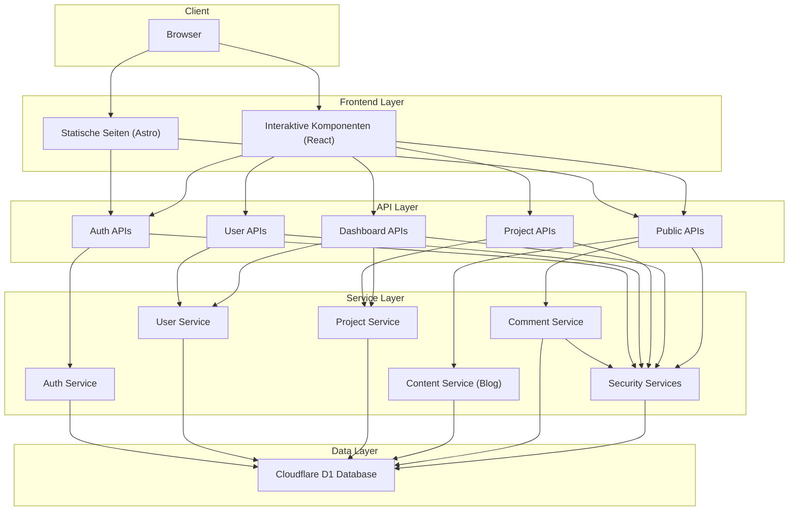
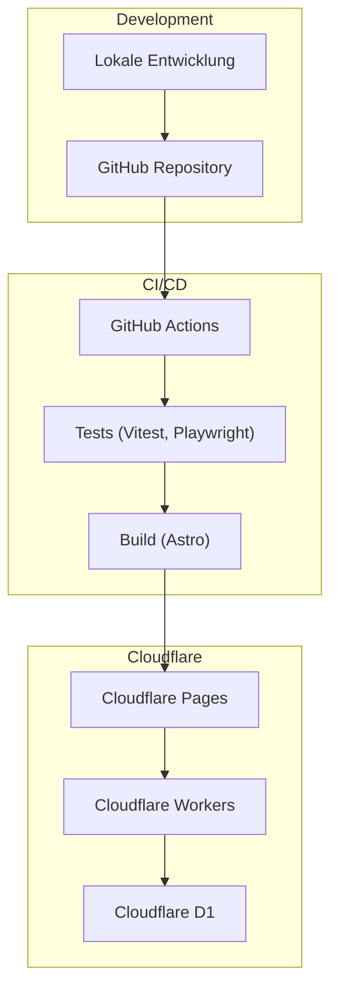

# Systemübersicht - Evolution Hub

Diese Dokumentation bietet einen umfassenden Überblick über die Systemarchitektur des Evolution Hub Projekts. Sie beschreibt die wichtigsten Komponenten, deren Zusammenspiel und die technologischen Grundlagen.

## Inhaltsverzeichnis

1. [Technologie-Stack](#technologie-stack)
2. [Systemkomponenten](#systemkomponenten)
3. [Architekturdiagramm](#architekturdiagramm)
4. [Deployment-Architektur](#deployment-architektur)
5. [Sicherheitsarchitektur](#sicherheitsarchitektur)

---

## Technologie-Stack

Evolution Hub basiert auf einem modernen Web-Stack mit folgenden Haupttechnologien:

### Frontend

- **Astro**: Framework für die Seitenerstellung mit Insel-Architektur
- **React**: Für interaktive UI-Komponenten
- **Tailwind CSS**: Utility-First CSS-Framework für das Styling
- **TypeScript**: Typsicheres JavaScript für Frontend und Backend

### Backend

- **Cloudflare Workers**: Serverless Edge-Computing-Plattform
- **Cloudflare D1**: Serverless SQL-Datenbank
- **Cloudflare Pages**: Hosting und Deployment-Plattform

### Testing

- **Vitest**: Unit- und Integrationstests
- **Playwright**: End-to-End-Tests
- **MSW (Mock Service Worker)**: API-Mocking für Tests

### CI/CD

- **GitHub Actions**: Automatisierte Workflows für Tests und Deployment

---

## Systemkomponenten

Das Evolution Hub System besteht aus folgenden Hauptkomponenten:

### 1. Frontend-Layer

Die Benutzeroberfläche ist mit Astro und React implementiert und folgt dem Islands-Architektur-Muster:

- **Statische Seiten**: Hauptseiten wie Homepage, Blog, Dokumentation
- **Interaktive Inseln**: React-Komponenten für dynamische Funktionen
- **Dashboard**: Benutzer-Dashboard mit Projektübersicht und Aktivitäten
- **Benutzerverwaltung**: Login, Registrierung, Profilverwaltung

### 2. API-Layer

Die API-Schicht ist mit Astro API-Routen implementiert und in mehrere Bereiche unterteilt:

- **Auth-APIs**: Authentifizierung und Autorisierung
  - Login, Registrierung, Passwort-Reset, Logout
  - JWT-basierte Sitzungsverwaltung
  - Zwei-Faktor-Authentifizierung

- **User-APIs**: Benutzerverwaltung
  - Profilinformationen
  - Einstellungen
  - Berechtigungen

- **Project-APIs**: Projektverwaltung
  - CRUD-Operationen für Projekte
  - Projektmitglieder
  - Projekteinstellungen

- **Dashboard-APIs**: Dashboard-Funktionalitäten
  - Aktivitätsfeeds
  - Statistiken
  - Benachrichtigungen

- **Public-APIs**: Öffentliche APIs
  - Blog-Content (Astro Content Collections)
  - Kommentare (CRUD, Moderation, Reporting)
  - Tools (AI Image Enhancer, Prompt Enhancer)
  - Newsletter & Lead-Magnets

### 3. Service-Layer

Die Service-Schicht enthält die Geschäftslogik und Dienstleistungen:

- **Auth-Service**: Authentifizierung und Autorisierung
- **User-Service**: Benutzerverwaltung
- **Project-Service**: Projektverwaltung
- **Content-Service**: Content-Management (BlogService, ContentService)
- **Comment-Service**: Kommentarverwaltung (CRUD, Moderation, Spam-Detection)
- **Security-Services**: Rate-Limiting, Security-Headers, Audit-Logging, XSS-Sanitization

### 4. Daten-Layer

Die Datenschicht ist mit Cloudflare D1 implementiert:

- **Benutzer**: Benutzerinformationen und Anmeldedaten
- **Sitzungen**: Aktive Benutzersitzungen
- **Projekte**: Projektdaten und Metadaten
- **Aktivitäten**: Benutzeraktivitäten und Ereignisse
- **Kommentare**:
  - `comments` (Haupttabelle)
  - `comment_moderation` (Moderations-Historie)
  - `comment_reports` (User-Reports)
  - `comment_audit_logs` (Audit-Trail)
- **Blog-Content**: Markdown-Dateien (Astro Content Collections, nicht in D1)
- **Tools**: Tool-Definitionen und Metadaten

---

## Architekturdiagramm

### Datenfluss

1. Der Client (Browser) sendet Anfragen an die Frontend-Layer
2. Statische Inhalte werden direkt von Astro bereitgestellt
3. Interaktive Komponenten kommunizieren mit den API-Endpunkten
4. Die API-Layer validiert Anfragen und leitet sie an die Service-Layer weiter
5. Die Service-Layer implementiert die Geschäftslogik und interagiert mit der Daten-Layer
6. Die Daten-Layer speichert und ruft Daten aus der Cloudflare D1-Datenbank ab
7. Antworten fließen zurück zum Client durch die gleichen Schichten

---

## Deployment-Architektur

Evolution Hub wird auf Cloudflare Pages und Cloudflare Workers deployed:

### Deployment-Workflow

1. Entwickler arbeiten lokal mit `wrangler` für Cloudflare-Entwicklung
2. Code wird in das GitHub-Repository gepusht
3. GitHub Actions führt Tests und Builds aus
4. Bei erfolgreichen Tests wird der Code auf Cloudflare Pages deployed
5. Cloudflare Pages stellt die statischen Assets bereit und leitet API-Anfragen an Workers weiter
6. Cloudflare Workers führen die serverless Funktionen aus und interagieren mit D1

---

## Sicherheitsarchitektur

Evolution Hub implementiert mehrere Sicherheitsschichten:

### Authentifizierung und Autorisierung

- **JWT-basierte Authentifizierung**: Sichere, zustandslose Authentifizierung
- **HttpOnly-Cookies**: Schutz vor XSS-Angriffen
- **CSRF-Schutz**: Cross-Site Request Forgery Prävention
- **Rollenbasierte Zugriffskontrolle**: Differenzierte Berechtigungen

### API-Sicherheit

- **Rate-Limiting**: Schutz vor Brute-Force- und DoS-Angriffen
- **Input-Validierung**: Strenge Validierung aller Benutzereingaben
- **Security-Headers**: Content-Security-Policy, X-XSS-Protection, etc.
- **Audit-Logging**: Protokollierung sicherheitsrelevanter Ereignisse

### Datensicherheit

- **Passwort-Hashing**: Sichere Speicherung von Passwörtern
- **Datenminimierung**: Nur notwendige Daten werden gespeichert
- **Verschlüsselte Übertragung**: HTTPS für alle Verbindungen
- **Datenvalidierung**: Strenge Typisierung und Validierung

Weitere Details zur Sicherheitsarchitektur finden sich in der [SECURITY.md](../../SECURITY.md) Dokumentation.
