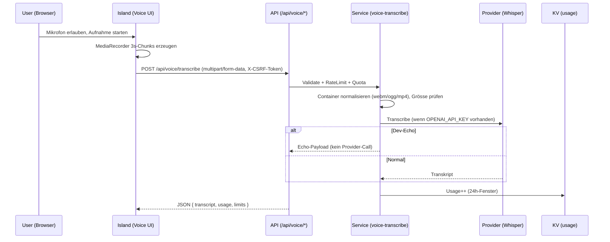

# Voice Visualizer + Transcriptor — Architektur

## Overview

- **Ziel**: Sprachaufnahmen im Browser (Visualizer + Pegel), segmentiertes Uploaden, serverseitige Normalisierung und Transkription via Whisper‑Provider; Rückgabe von Teil‑Transkripten und Usage/Limits für UI‑Feedback.
- **Status**: Chunk‑basiert implementiert; Streaming (SSE/Poll) ist Phase 2 (geplant, Flags reserviert), Tages‑Quoten (Gast/User), Rate‑Limit, MIME‑Validierung, CSRF/Origin; optional Dev‑Echo (`VOICE_DEV_ECHO=1`) ohne Provider‑Call; optionale R2‑Archivierung (Flag reserviert).

## Architektur



### Hauptbausteine

- `src/pages/api/voice/transcribe.ts`: POST‑Endpoint (Multipart, CSRF, Same‑Origin, Rate‑Limit, Quoten, Fehler‑Mapping).
- `src/pages/api/voice/usage.ts`: GET‑Endpoint (aktuelle Nutzung + Limits)
- `src/lib/services/voice-transcribe-service.ts`: Normalisierung, Provider‑Call, Fehlerabbildung, Usage‑Aktualisierung.
- `src/config/voice/`: erlaubte MIME‑Typen, Max‑Größen, Default‑Modelle.
- UI: `src/components/tools/voice-visualizer/*` (z. B. `hooks/useMicrophone.ts`, `api.ts`).

## Security & Middleware

- API‑Routen mit `withApiMiddleware` aus `src/lib/api-middleware.ts` (gemäß Projektregeln):
  - **CSRF/Same‑Origin**: Standard aktiviert; Double‑Submit optional via `X-CSRF-Token` ↔ `csrf_token`.
  - **Security‑Headers**: HSTS, X‑Frame‑Options `DENY`, `nosniff`, strikte `Permissions-Policy`.
- **Permissions‑Policy (Mikrofon)**: Tools‑Route erhält eine Route‑Ausnahme für `microphone=()`, damit die Seite den Zugriff explizit anfragt (siehe `src/middleware.ts`).
  - Regex deckt neutrale und lokalisierte Pfade ab: `^\/(?:(?:de|en)\/)?tools\/voice-visualizer(?:\/app)?\/?$`.
  - DE ist neutral (kein `/de`‑Prefix), EN lebt unter `/en/...`.

## Limits & Quoten

- **Rate‑Limit**: `voiceTranscribeLimiter` = 15/min (siehe `src/lib/rate-limiter.ts`).
- **Quota‑Einheit**: Chunks/Tag (24h‑Fenster‑Key)
  - `guest = 60`, `user = 300`.
- **Fehler‑Mapping**: Provider‑401/403 → `forbidden`, 4xx → `validation_error`, 5xx → `server_error`. 429 → enthält `Retry-After`.

## Env & Bindings

- `OPENAI_API_KEY` (Provider‑Zugriff; wenn fehlt → Dev‑Echo).
- `WHISPER_MODEL` (z. B. `whisper-1`).
- `KV_VOICE_TRANSCRIBE` (KV‑Namespace für Usage/Quoten).
- Wrangler‑Bindings je Environment (siehe `wrangler.toml`).

Zusätzliche Flags/Funktionalität:

- `VOICE_STREAM_SSE` ("1"/"0"): reserviert; `GET /api/voice/stream` (SSE) ist geplant, Endpunkt derzeit nicht implementiert.
- `VOICE_STREAM_POLL` ("1"/"0"): reserviert; `GET /api/voice/poll` (Polling) ist geplant, Endpunkt derzeit nicht implementiert.
- `VOICE_R2_ARCHIVE` ("1"/"0"): optionale Roh‑Audio‑Archivierung nach R2 (keine PII im Key; Rollout noch offen).
- `VOICE_DEV_ECHO` ("1"/"0"): Dev‑Echo‑Bypass für Provider‑Call (nützlich in Integration/CI).

Hinweise DEV:

- Aggregator (`VoiceStreamAggregator`) ist KV‑optional gehärtet → in lokaler DEV ohne KV keine Exceptions; Snapshot wird best‑effort gehalten.

## Formate & Validierung (Client/Server)

- **MediaRecorder bevorzugt**: `audio/webm;codecs=opus`; Fallbacks `audio/ogg;codecs=opus`, `audio/mp4;codecs=mp4a.40.2`; auch Container‑Only Varianten (`audio/webm`, `audio/ogg`, `audio/mp4`).
- **Kadenz**: Segment‑basiert, Default `3s` je Chunk (Recorder wird alle ~3s gestoppt und neu erstellt, vollständige Dateien je Segment).
- **Max‑Größe**: `VOICE_MAX_CHUNK_BYTES = 1_200_000`.
- **Upload**: bei `dataavailable` Blobs als `chunk` an `POST /api/voice/transcribe`, Header `X-CSRF-Token` (via `ensureCsrfToken()`), Dateiendung aus MIME abgeleitet (`.webm|.ogg|.mp4`). Zu kleine Blobs `<8KB` clientseitig verwerfen.
- **Server‑Normalisierung**: Verpackung/Container stabilisieren (`.webm|.ogg|.mp4`) vor Whisper‑Call.

## API‑Verträge (gekürzt; Details in `openapi.yaml`)

- `POST /api/voice/transcribe` (`x-source`: `src/pages/api/voice/transcribe.ts`)

```json
{
  "data": {
    "transcript": "hello world",
    "usage": { "count": 12, "window": "24h" },
    "limit": { "max": 60 }
  }
}
```

- `GET /api/voice/usage` (`x-source`: `src/pages/api/voice/usage.ts`)

```json
{
  "data": {
    "usage": { "count": 12, "window": "24h" },
    "limit": { "max": 60 },
    "plan": "guest"
  }
}
```

Siehe vollständige Schemas/Fehlerfälle in `openapi.yaml` (`/api/voice/transcribe`, `/api/voice/usage`).

## Client‑Module

- `hooks/useMicrophone.ts`: Geräte‑Zugriff, Visualizer‑Daten, 3s‑Chunking.
- `api.ts`: Upload (multipart), CSRF‑Header via `ensureCsrfToken()`.
- UI‑Island: Start/Stop, Pegel‑Visualizer, Status/Fehler, Anzeige von Usage/Limits.
  - UI‑Polish: Partials (Live) und Final separat, Status‑Chips (Connected/Backoff/JobId), Dev‑Test‑Button nur in DEV.

## Routing & i18n

- DE neutral: `src/pages/tools/voice-visualizer/app.astro` (Pfad `/tools/voice-visualizer/app`).
- EN lokalisiert: `src/pages/en/tools/voice-visualizer/app.astro` (Pfad `/en/tools/voice-visualizer/app`).
- Locale‑Switch hält DE neutral; EN benutzt `/en/...` (`src/lib/locale-path.ts`).

## Observability & Debugging

- Requests werden in Middleware geloggt (requestId, Dauer). Client‑Logs optional via Debug‑Panel (`/api/debug/client-log`).
- Typische Fehler: kein Mikrofon, MIME nicht erlaubt, Chunk zu klein/groß, 429 (Rate‑Limit), 403 (Origin/CSRF), Provider‑Fehler (Mapping siehe oben).

Aktuelle strukturierte Voice‑Events (Server):

- `transcribe_api_success` (Kennzahlen: `latencyMs`, `sizeBytes`, `ownerType`, `isFinal`, `sessionId`, `jobId`)
- `transcribe_api_error` (Feldern: `errorType`, `message`, `latencyMs`, `sessionId`, `jobId`)
- `voice_stream_connected` | `voice_stream_disconnected` | `voice_stream_disabled`
- `voice_poll_success` | `voice_poll_not_found` | `voice_poll_disabled`

Hinweis: Frühere Eventnamen (`voice_limit`, `whisper_error`, `transcribe_success`) können in älteren Logs erscheinen; neue Namen oben sind maßgeblich.

Test‑Flags in CI: `wrangler.ci.toml` setzt `VOICE_STREAM_SSE=1`, `VOICE_STREAM_POLL=1`, `VOICE_R2_ARCHIVE=0`, `VOICE_DEV_ECHO=1`.

Test‑Harness (Integration):

- Dev‑Server wird fix auf `http://localhost:8787` gestartet; vorhandene Prozesse auf `:8787` werden vorab beendet.
- Vor dem Start wird immer neu gebaut (`build:worker:dev`) um Flag‑Änderungen zu übernehmen.
- URL‑Erkennung bevorzugt die zuletzt geloggte `:8787`‑Adresse; Fallback‑Probe nur als letzte Option.

## Risiken & Mitigation

- **SSE‑Drops/Idle‑Timeouts**: Lange Verbindungen können durch Proxies/Netzwerk getrennt werden. Mitigation: Server‑Heartbeats alle ~25s (`:keep-alive\n\n`), Client‑Reconnect mit Exponential Backoff (0.5–8s), Fallback auf Polling nach 3 Fehlversuchen (<60s).
- **CPU‑Time‑Budget**: Workers haben CPU‑Limits, aber Streaming/I/O blockiert CPU nicht. Mitigation: SSE‑Handler führt nur I/O aus; rechenintensive Arbeit bleibt im `POST /api/voice/transcribe`.
- **Concurrent Connections**: Verbindungs‑Limits pro Invocation. Mitigation: Nur 1 aktiver Stream pro `jobId`/Nutzer; neue Verbindung schließt alte.
- **KV Eventual Consistency & Write‑Rate**: KV ist eventual consistent und empfiehlt ≤1 write/sek/Key. Mitigation: Single‑Writer (Upload‑Pfad), 3s‑Chunk‑Kadenz, optional segmentierte Keys `voice:job:{id}:p:{n}` und kompakter Snapshot‑Key; Retry bei get‑modify‑put Konflikten.
- **R2 Sicherheit/PII**: R2 privat, presigned URLs mit kurzer TTL; keine PII in Keys; restriktive CORS. Archivierung per Flag deaktivierbar.
- **CSRF/Origin**: Nur POST erfordert CSRF; GET (SSE/Poll) mit Origin‑Check + Security‑Headers.

Referenzen: Workers Limits/Streams/EventSource, KV How it works/FAQ/Write, R2 Presigned URLs/Access/CORS.

## Backout‑Plan

- Feature‑Flags: `VOICE_STREAM_SSE=0`, `VOICE_STREAM_POLL=0`, `VOICE_R2_ARCHIVE=0` → sofortige Deaktivierung ohne Schema‑Rollback.
- Fallback‑Kaskade: SSE → Poll → No‑Stream (nur Chunk‑Antworten). UI zeigt Status/Hinweis.
- Operational: Rate‑Limits reduzieren, Logs/Events (`voice:error`, `voice:limit`, `voice:disconnect`) prüfen.

## Rollout & Next (Phase 2)

- **Streaming**: `GET /api/voice/stream` (SSE) oder Poll‑Mechanik, Zwischenspeicher in KV‑Queue.
- **Optionale Archivierung**: R2 für Audios (Proxy‑Route), Retention‑Policy.
- **Entitlements**: Planspezifische Limits analog AI Image Enhancer.
- **Metriken**: Events/Counts in Observability sink.

### Streaming‑Endpunkte (Phase 2)

- `GET /api/voice/stream` — SSE‑Stream für Feedback‑Events (z. B. `connected` mit `jobId`, später `partial`/`final`/`usage`).
  - Flag‑Gate: `VOICE_STREAM_SSE` (1=an, 0=aus)
  - Quelle (geplant): `src/pages/api/voice/stream.ts` (TBD)
- `GET /api/voice/poll?jobId=…` — Polling des Job‑Zustands (Snapshot mit `status`, `partials`, optional `final`, `usage`).
  - Flag‑Gate: `VOICE_STREAM_POLL` (1=an, 0=aus)
  - Quelle (geplant): `src/pages/api/voice/poll.ts` (TBD)
- Aggregator: `src/lib/services/voice-stream-aggregator.ts` (KV‑State: `voice:job:{id}`)
- Upload‑Pfad: `POST /api/voice/transcribe` wird optional `jobId`/`isLastChunk` verarbeiten und den Aggregator aktualisieren (geplant).

### Lokaler Testablauf (Happy‑Path)

1. SSE verbinden: Browser öffnet `/api/voice/stream` und liest `jobId` aus dem `connected`‑Event.
2. Kurzes Sprach‑Sample aufnehmen (1–2 s via `MediaRecorder`, `audio/webm;codecs=opus`).
3. Upload: `POST /api/voice/transcribe` mit `chunk`, `sessionId`, `jobId`, `isLastChunk=true`, Header `X‑CSRF‑Token` (Double‑Submit) setzen.
4. Poll: `GET /api/voice/poll?jobId=…` liefert `usage`‑Anstieg und (je nach Provider) `final`‑Text.
5. Flags: `VOICE_STREAM_SSE=1`, `VOICE_STREAM_POLL=1`, `VOICE_R2_ARCHIVE=0` (Backout: Flags auf 0 setzen).

Schnell‑Verifikation per curl (DEV):

```sh
JOB="job-$(date +%s)"
curl -i -N --max-time 3 "http://127.0.0.1:8787/api/voice/stream?jobId=$JOB"  # erwartet: 200 + event: connected
curl -i "http://127.0.0.1:8787/api/voice/poll?jobId=$JOB"                     # erwartet: 200 + { status: "active"|snapshot }
```

## Nächste Umsetzungsschritte (konkret)

- **Integration‑Test** `tests/integration`: `POST /api/voice/transcribe` → Aggregator `setFinal()`/`setUsage()`; `GET /api/voice/poll` spiegelt Snapshot (Dev‑Echo möglich). Priorität: hoch. (Siehe `tests/integration/api/voice/transcribe-and-poll.test.ts`).
- **Observability v1**: strukturierte Logs + einfache Counter/Latenz‑Buckets in `voice-transcribe-service.ts` und `/api/voice/*`. Priorität: hoch. (Aktuelle Events siehe oben.)
- **OpenAPI ergänzen**: `/api/voice/stream` (SSE) + `/api/voice/poll` dokumentieren (Snap‑Schema). Priorität: mittel.
- **R2‑Archiv‑Entscheidung**: Binding `R2_VOICE`, Key‑Schema (ohne PII), Retention/TTL; erst danach Flag aktivieren. Priorität: mittel.
- **Entitlements finalisieren**: Tageskappen je Plan bestätigen/angleichen. Priorität: mittel.
- **E2E‑Test (SSE/Poll)**: einfacher Smoke für Connected‑Event + Poll‑Snapshot. Priorität: mittel. (Siehe `test-suite-v2/src/e2e/voice/stream-and-poll.spec.ts`.)

## Offene Entscheidungsfragen

- **Entitlements Zahlen**: Voice‑Tageslimits pro Plan bestätigt? Derzeit in `src/config/voice/entitlements.ts`:
  - `free` = `VOICE_FREE_LIMIT_USER`, `pro` = 600, `premium` = 1200, `enterprise` = 3000.
  - Alternativ: an AI‑Image‑Tageskappen anlehnen oder niedrigere Werte festlegen.
- **R2 Archiv**: Bucket‑Binding (z. B. `R2_VOICE`), Key‑Schema (keine PII; z. B. `voice/{jobId}/{ts}.webm`), Retention‑Dauer, CORS/Presign‑Fenster.
- **Observability‑Sink**: Wo landen Events/Kennzahlen? (Cloudflare Analytics Engine, Logpush, externes APM?) Namensschema, Sampling.
- **SSE Default in PROD**: Standard an/aus? (Backout via Flags ist vorbereitet.)

## Readiness

- **Implementierungsstand**: Chunk‑basierte Transkription implementiert (`POST /api/voice/transcribe`, `GET /api/voice/usage`). SSE/Poll + Aggregator sind geplant (Phase 2), noch nicht implementiert; Flags sind reserviert. Neutral‑Route (DE) vorhanden; Permissions‑Policy deckt neutral/EN ab.
- **Datenpunkte**: Basis vorhanden für Integration‑Tests (Transcribe/Usage) und minimale Observability. Für R2‑Archivierung fehlen konkrete Bucket/Retention‑Entscheidungen. Entitlements ggf. zu bestätigen.

## Referenzen

- Code: `src/pages/api/voice/transcribe.ts`, `src/pages/api/voice/usage.ts`, `src/lib/services/voice-transcribe-service.ts`, `src/config/voice/index.ts`
- Doku: `openapi.yaml` (Abschnitte `/api/voice/transcribe`, `/api/voice/usage`)
- Projektregeln: `src/lib/api-middleware.ts`, `src/middleware.ts`, `src/lib/rate-limiter.ts`
