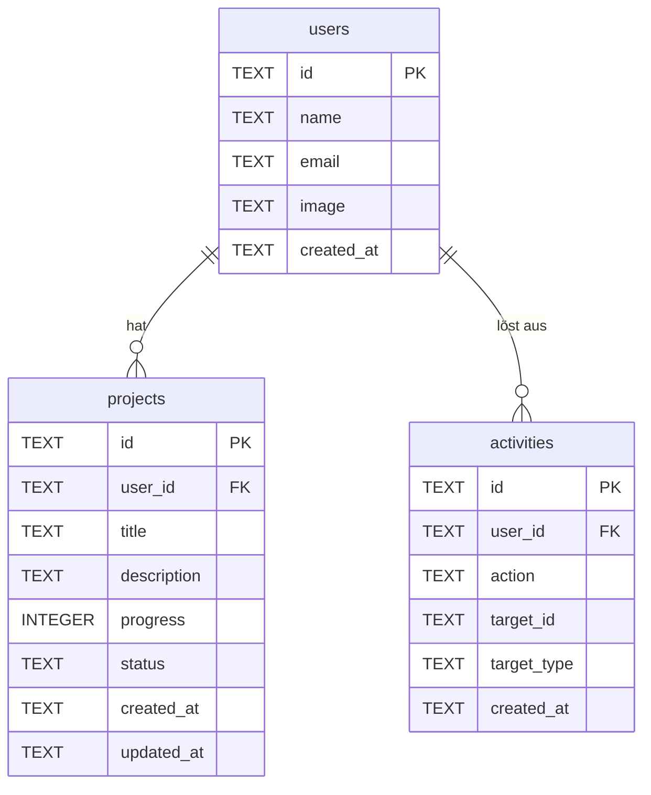

# Datenbankschema für Dashboard-Funktionen

Dieses Dokument beschreibt das Datenbankschema für die neuen Dashboard-Funktionen in EvolutionHub. Die Tabellen werden in der Cloudflare D1-Datenbank `evolution-hub-comments` gespeichert.

## 1. Tabellen

### 1.1. `users`

Diese Tabelle speichert die Informationen der Benutzer, die sich über einen Authentifizierungsanbieter anmelden.

| Spaltenname | Datentyp | Beschreibung |
| :--- | :--- | :--- |
| `id` | `TEXT` | Primärschlüssel. Die eindeutige ID vom Authentifizierungsanbieter (z.B. von Google, GitHub). |
| `name` | `TEXT` | Der Anzeigename des Benutzers. |
| `email` | `TEXT` | Die E-Mail-Adresse des Benutzers (eindeutig). |
| `image` | `TEXT` | URL zum Profilbild des Benutzers. |
| `created_at` | `TEXT` | Zeitstempel der Erstellung des Benutzers (ISO 8601). |

### 1.2. `projects`

Diese Tabelle speichert die von den Benutzern erstellten Projekte.

| Spaltenname | Datentyp | Beschreibung |
| :--- | :--- | :--- |
| `id` | `TEXT` | Primärschlüssel (z.B. UUID). |
| `user_id` | `TEXT` | Fremdschlüssel, der auf `users(id)` verweist. |
| `title` | `TEXT` | Der Titel des Projekts. |
| `description` | `TEXT` | Eine detaillierte Beschreibung des Projekts. |
| `progress` | `INTEGER` | Der Fortschritt des Projekts in Prozent (0-100). |
| `status` | `TEXT` | Der aktuelle Status des Projekts (z.B. "active", "paused", "completed"). |
| `created_at` | `TEXT` | Zeitstempel der Erstellung des Projekts (ISO 8601). |
| `updated_at` | `TEXT` | Zeitstempel der letzten Aktualisierung (ISO 8601). |

### 1.3. `activities`

Diese Tabelle dient als Feed für die letzten Aktivitäten der Benutzer im System.

| Spaltenname | Datentyp | Beschreibung |
| :--- | :--- | :--- |
| `id` | `TEXT` | Primärschlüssel (z.B. UUID). |
| `user_id` | `TEXT` | Fremdschlüssel, der auf `users(id)` verweist. |
| `action` | `TEXT` | Die durchgeführte Aktion (z.B. "created_project", "updated_profile"). |
| `target_id` | `TEXT` | Die ID des Ziels der Aktion (z.B. die `id` eines Projekts). |
| `target_type` | `TEXT` | Der Typ des Ziels (z.B. "project", "user"). |
| `created_at` | `TEXT` | Zeitstempel der Aktivität (ISO 8601). |

## 2. Beziehungen

Die Beziehungen zwischen den Tabellen stellen sicher, dass die Daten konsistent und miteinander verknüpft sind.

* **`users` und `projects`**: Ein Benutzer kann viele Projekte haben (1-zu-n). Die `projects.user_id` verweist auf `users.id`.
* **`users` und `activities`**: Ein Benutzer kann viele Aktivitäten auslösen (1-zu-n). Die `activities.user_id` verweist auf `users.id`.

### Mermaid-Diagramm



## 3. SQL `CREATE TABLE`-Anweisungen

Die folgenden SQL-Anweisungen sind für die Verwendung mit Cloudflare D1 optimiert.

### `users`

```sql
CREATE TABLE users (
    id TEXT PRIMARY KEY,
    name TEXT NOT NULL,
    email TEXT NOT NULL UNIQUE,
    image TEXT,
    created_at TEXT NOT NULL DEFAULT CURRENT_TIMESTAMP
);
```

### `projects`

```sql
CREATE TABLE projects (
    id TEXT PRIMARY KEY,
    user_id TEXT NOT NULL,
    title TEXT NOT NULL,
    description TEXT,
    progress INTEGER DEFAULT 0,
    status TEXT NOT NULL DEFAULT 'active',
    created_at TEXT NOT NULL DEFAULT CURRENT_TIMESTAMP,
    updated_at TEXT NOT NULL DEFAULT CURRENT_TIMESTAMP,
    FOREIGN KEY (user_id) REFERENCES users(id) ON DELETE CASCADE
);
```

### `activities`

```sql
CREATE TABLE activities (
    id TEXT PRIMARY KEY,
    user_id TEXT NOT NULL,
    action TEXT NOT NULL,
    target_id TEXT,
    target_type TEXT,
    created_at TEXT NOT NULL DEFAULT CURRENT_TIMESTAMP,
    FOREIGN KEY (user_id) REFERENCES users(id) ON DELETE CASCADE
);
```
