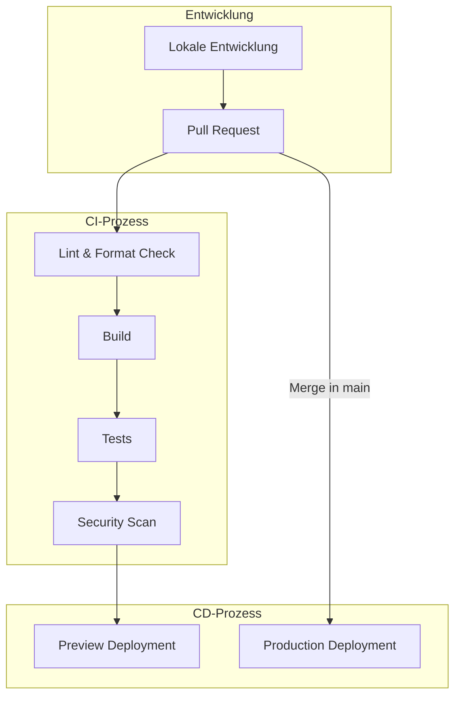
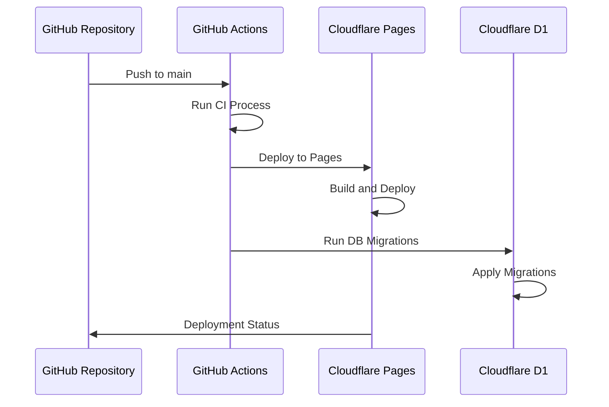

# CI/CD-Pipeline - Evolution Hub

Diese Dokumentation beschreibt die Continuous Integration und Continuous Deployment (CI/CD) Pipeline für das Evolution Hub Projekt. Sie bietet einen detaillierten Überblick über die automatisierten Prozesse, die bei der Entwicklung, dem Testen und dem Deployment der Anwendung verwendet werden.

## Inhaltsverzeichnis

1. [Überblick](#überblick)
2. [GitHub Actions Workflows](#github-actions-workflows)
3. [CI-Prozess](#ci-prozess)
4. [CD-Prozess](#cd-prozess)
5. [Umgebungen](#umgebungen)
6. [Konfiguration und Anpassung](#konfiguration-und-anpassung)
7. [Fehlerbehebung](#fehlerbehebung)

---

## Überblick

Die CI/CD-Pipeline des Evolution Hub Projekts ist darauf ausgelegt, einen effizienten und zuverlässigen Entwicklungs- und Deployment-Prozess zu gewährleisten. Sie automatisiert das Testen, Bauen und Deployen der Anwendung und stellt sicher, dass nur qualitativ hochwertiger Code in die Produktion gelangt.

### Ziele der CI/CD-Pipeline

- **Codequalität sicherstellen**: Automatisierte Tests und Linting
- **Konsistente Builds**: Reproduzierbare Build-Prozesse
- **Schnelles Feedback**: Sofortiges Feedback zu Code-Änderungen
- **Automatisiertes Deployment**: Reduzierung manueller Eingriffe
- **Sicherheit gewährleisten**: Automatisierte Sicherheitsscans

### Pipeline-Übersicht



---

## GitHub Actions Workflows

Die CI/CD-Pipeline wird mit GitHub Actions implementiert. Die Workflow-Konfigurationen befinden sich im Verzeichnis `.github/workflows/`.

### Hauptworkflows

1. **CI Workflow** (`ci.yml`):
   - Ausgelöst bei Pull Requests und Pushes auf den `main`-Branch
   - Führt Linting, Build und Tests durch
   - Führt Sicherheitsscans für Abhängigkeiten durch

2. **Preview Workflow** (`preview.yml`):
   - Ausgelöst bei Pull Requests
   - Erstellt ein temporäres Deployment für Testzwecke
   - Ermöglicht das Testen von Änderungen vor dem Merge

3. **Production Workflow** (`deploy.yml`):
   - Ausgelöst bei Pushes auf den `main`-Branch
   - Führt das Deployment in die Produktionsumgebung durch
   - Führt Datenbank-Migrationen aus

### Workflow-Beispiel: CI

```yaml
name: CI

on:
  push:
    branches: [main]
  pull_request:
    branches: [main]

jobs:
  lint:
    runs-on: ubuntu-latest
    steps:
      - uses: actions/checkout@v3
      - uses: actions/setup-node@v3
        with:
          node-version: '18'
          cache: 'npm'
      - run: npm ci
      - run: npm run lint

  build:
    runs-on: ubuntu-latest
    needs: lint
    steps:
      - uses: actions/checkout@v3
      - uses: actions/setup-node@v3
        with:
          node-version: '18'
          cache: 'npm'
      - run: npm ci
      - run: npm run build
      - uses: actions/upload-artifact@v3
        with:
          name: build-output
          path: dist/

  test:
    runs-on: ubuntu-latest
    needs: build
    steps:
      - uses: actions/checkout@v3
      - uses: actions/setup-node@v3
        with:
          node-version: '18'
          cache: 'npm'
      - run: npm ci
      - run: npm test
      - run: npm run test:coverage
      - uses: actions/upload-artifact@v3
        with:
          name: coverage-report
          path: coverage/

  security:
    runs-on: ubuntu-latest
    needs: test
    steps:
      - uses: actions/checkout@v3
      - uses: actions/setup-node@v3
        with:
          node-version: '18'
          cache: 'npm'
      - run: npm audit
      - uses: snyk/actions/node@master
        with:
          args: --severity-threshold=high
```

---

## CI-Prozess

Der CI-Prozess besteht aus mehreren Schritten, die sicherstellen, dass Code-Änderungen den Qualitätsstandards entsprechen.

### 1. Linting und Formatierung

- **ESLint**: Überprüft den JavaScript/TypeScript-Code auf Stilprobleme und potenzielle Fehler
- **Prettier**: Stellt eine konsistente Formatierung sicher
- **TypeScript**: Führt Typüberprüfungen durch

```bash
# Lokal ausführen
npm run lint
```

### 2. Build-Prozess

- Kompiliert TypeScript zu JavaScript
- Bündelt Assets mit Vite
- Optimiert für Produktion

```bash
# Lokal ausführen
npm run build
```

### 3. Tests

- **Unit-Tests**: Testet einzelne Funktionen und Komponenten
- **Integrationstests**: Testet die Interaktion zwischen Komponenten
- **E2E-Tests**: Testet die Anwendung aus Benutzerperspektive

```bash
# Lokal ausführen
npm test
npm run test:coverage
```

### 4. Sicherheitsscans

- **npm audit**: Überprüft Abhängigkeiten auf bekannte Sicherheitslücken
- **Snyk**: Führt erweiterte Sicherheitsanalysen durch
- **Dependabot**: Automatische Aktualisierung von Abhängigkeiten

```bash
# Lokal ausführen
npm audit
```

---

## CD-Prozess

Der CD-Prozess automatisiert das Deployment der Anwendung in verschiedene Umgebungen.

### 1. Preview Deployment

Für jeden Pull Request wird ein temporäres Deployment erstellt, um die Änderungen zu testen:

- **Umgebung**: Cloudflare Pages Preview
- **URL-Format**: `https://pr-{PR_NUMBER}.evolution-hub.pages.dev`
- **Lebensdauer**: Bleibt aktiv, bis der PR geschlossen wird

### 2. Production Deployment

Nach dem Merge in den `main`-Branch wird die Anwendung automatisch in die Produktionsumgebung deployed:

- **Umgebung**: Cloudflare Pages Production
- **URL**: `https://hub-evolution.pages.dev`
- **Datenbank-Migrationen**: Werden automatisch ausgeführt

### 3. Deployment-Prozess



---

## Umgebungen

Das Evolution Hub Projekt verwendet mehrere Umgebungen für verschiedene Phasen des Entwicklungszyklus.

### 1. Lokale Entwicklungsumgebung

- **Zweck**: Lokale Entwicklung und Tests
- **Setup**: Siehe [SETUP.md](../../SETUP.md)
- **Datenbank**: Lokale SQLite-Datenbank oder D1 Local
- **URL**: `http://localhost:3000`

### 2. Preview-Umgebung

- **Zweck**: Testen von Änderungen vor dem Merge
- **Bereitstellung**: Automatisch für jeden Pull Request
- **Datenbank**: Isolierte Testdatenbank
- **URL**: `https://pr-{PR_NUMBER}.evolution-hub.pages.dev`

### 3. Staging-Umgebung (optional)

- **Zweck**: Integration und UAT-Tests
- **Bereitstellung**: Automatisch nach Merge in den `develop`-Branch
- **Datenbank**: Staging-Datenbank mit anonymisierten Daten
- **URL**: `https://staging.hub-evolution.pages.dev`

### 4. Produktionsumgebung

- **Zweck**: Live-System für Endbenutzer
- **Bereitstellung**: Automatisch nach Merge in den `main`-Branch
- **Datenbank**: Produktionsdatenbank
- **URL**: `https://hub-evolution.pages.dev`

---

## Konfiguration und Anpassung

### Umgebungsvariablen

Die CI/CD-Pipeline verwendet verschiedene Umgebungsvariablen, die in GitHub Actions Secrets konfiguriert sind:

- `CF_API_TOKEN`: Cloudflare API-Token für Deployments
- `CF_ACCOUNT_ID`: Cloudflare Account-ID
- `CF_PROJECT_NAME`: Cloudflare Pages Projektname
- `D1_DATABASE_ID`: Cloudflare D1 Datenbank-ID

### Workflow-Anpassung

Um die Workflows anzupassen:

1. Bearbeite die YAML-Dateien im Verzeichnis `.github/workflows/`
2. Committe die Änderungen in einen Feature-Branch
3. Erstelle einen Pull Request für Code-Review
4. Nach Genehmigung werden die Änderungen wirksam

### Lokale Workflow-Tests

GitHub Actions Workflows können lokal mit [act](https://github.com/nektos/act) getestet werden:

```bash
# Installiere act
brew install act

# Führe den CI-Workflow lokal aus
act -j build

# Führe einen bestimmten Job aus
act -j test
```

---

## Fehlerbehebung

### Häufige CI-Fehler

1. **Lint-Fehler**:
   - Problem: Code entspricht nicht den Stilrichtlinien
   - Lösung: Führe `npm run lint:fix` aus und committe die Änderungen

2. **Build-Fehler**:
   - Problem: TypeScript-Fehler oder ungültige Imports
   - Lösung: Überprüfe die Build-Logs und behebe die gemeldeten Fehler

3. **Test-Fehler**:
   - Problem: Tests schlagen fehl
   - Lösung: Führe Tests lokal aus, um das Problem zu identifizieren und zu beheben

### Häufige CD-Fehler

1. **Deployment-Fehler**:
   - Problem: Deployment auf Cloudflare Pages schlägt fehl
   - Lösung: Überprüfe die Build-Logs in der Cloudflare Pages-Konsole

2. **Migrations-Fehler**:
   - Problem: Datenbank-Migrationen schlagen fehl
   - Lösung: Überprüfe die Migrations-Logs und stelle sicher, dass die Migrationen kompatibel sind

### Support

Bei anhaltenden Problemen mit der CI/CD-Pipeline:

1. Überprüfe die GitHub Actions Logs für detaillierte Fehlerinformationen
2. Konsultiere die Dokumentation für [GitHub Actions](https://docs.github.com/en/actions) und [Cloudflare Pages](https://developers.cloudflare.com/pages/)
3. Erstelle ein Issue im Repository mit einer detaillierten Beschreibung des Problems
