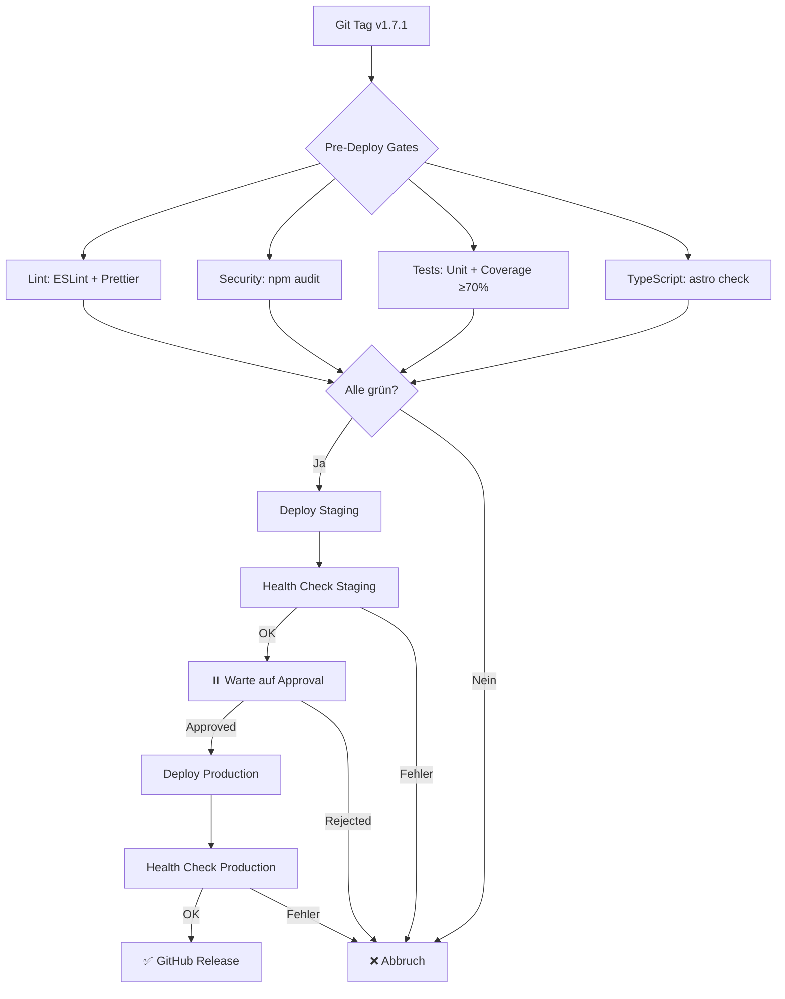

# CI/CD-Pipeline - Evolution Hub

Diese Dokumentation beschreibt die vollständig automatisierte Continuous Integration und Continuous Deployment (CI/CD) Pipeline für Evolution Hub.

## Inhaltsverzeichnis

1. [Überblick](#überblick)
2. [GitHub Actions Workflows](#github-actions-workflows)
3. [CI-Gates (Qualitätssicherung)](#ci-gates-qualitätssicherung)
4. [Deployment-Prozess](#deployment-prozess)
5. [Umgebungen](#umgebungen)
6. [Health-Check-System](#health-check-system)
7. [Secrets & Konfiguration](#secrets--konfiguration)
8. [Rollback-Strategien](#rollback-strategien)
9. [Fehlerbehebung](#fehlerbehebung)
10. [Entwicklungs-Workflow](#entwicklungs-workflow)

---

## Überblick

Die CI/CD-Pipeline implementiert alle Anforderungen aus [CLAUDE.md](../../CLAUDE.md#testing):

✅ **CI-Gates (alle müssen grün sein):**

- Lint/Format Check (ESLint + Prettier)
- TypeScript Check (`astro check`)
- Unit/Integration Tests (Coverage ≥70%)
- E2E-Smoke-Tests
- Security-Scan (`npm audit`)

✅ **Deployment:**

- Automatisch via Git Tags oder manuell via GitHub Actions UI
- Health-Check nach jedem Deployment
- Production-Deployment erfordert manuelle Approval

### Pipeline-Übersicht



---

## GitHub Actions Workflows

### 1. **Unit and E2E Tests** (`.github/workflows/unit-tests.yml`)

**Trigger:** Push auf `main`/`develop`, PRs zu `main`, manuell

**Jobs (parallel):**

#### A) `lint` — Lint & Format Check

```bash
npm run lint              # ESLint (max-warnings=280)
npm run format:check      # Prettier Check
```

#### B) `security` — Security Audit

```bash
npm audit --audit-level=moderate
```

Schlägt fehl bei moderate/high/critical Vulnerabilities.

#### C) `unit` — Unit Tests + Coverage

```bash
npx vitest run --coverage
```

- Coverage-Threshold: **≥70%** (statements, branches, functions, lines)
- Upload zu Codecov

#### D) `e2e` — E2E Tests

```bash
# Testing-Environment (Chromium-only example)
TEST_BASE_URL=https://ci.hub-evolution.com npm run test:e2e:chromium -- src/e2e/smoke

# Lokal (auto-startet Dev-Worker auf 127.0.0.1:8787)
npm run test:e2e -- src/e2e/tools
```

Struktur E2E v2 (`test-suite-v2/src/e2e/`):

- `auth/` – OAuth, Magic Link, Session, Middleware
- `features/` – App-Features (z. B. Dashboard, Kommentare)
- `tools/` – Tools wie Prompt- und Image-Enhancer
- `smoke/` – Leichte Smokes für CI/Staging/Prod

Konfiguration: `test-suite-v2/playwright.config.ts` (Projects, Retries, Reports, Auto-WebServer, Origin-Header)

#### E) `check` — TypeScript Check

```bash
npx astro check --tsconfig tsconfig.astro.json
```

#### F) `openapi` — OpenAPI Validation

```bash
npx swagger-cli validate openapi.yaml
npx redoc-cli build openapi.yaml -o api-docs.html
```

#### G) `prompt-enhancer-tests` — Spezielle Tests

- Startet Dev-Worker (Background)
- Unit + Integration Tests für Prompt-Enhancer

---

### 2. **Deploy to Cloudflare** (`.github/workflows/deploy.yml`)

**Trigger:**

- **Git Tags:** `v*.*.*` (z.B. `v1.7.1`)
- **Manuell:** Actions UI → "Run workflow" → Environment wählen

**Jobs:**

#### A) `pre-deploy` — Alle CI-Gates

Führt parallel aus:

- Lint + Format Check
- TypeScript Check
- Unit Tests mit Coverage (≥70%)
- Security Audit

**Nur wenn alle grün:** Weiter zu Deploy.

#### B) `deploy-staging`

```yaml
environment:
  name: staging
  url: https://staging.hub-evolution.com

steps: 1. npm run build:worker
  2. wrangler deploy --env staging
  3. Health Check (3 Retries, 10s Timeout)
```

**Nur wenn Staging OK:** Weiter zu Production.

#### C) `deploy-production`

```yaml
environment:
  name: production
  url: https://hub-evolution.com

protection_rules:
  - Required reviewers: 1
  - Deployment branches: main + v*

steps: 1. ⏸️ Warte auf manuelle Approval
  2. npm run build:worker
  3. wrangler deploy --env production
  4. Health Check
  5. GitHub Release erstellen (bei Tag-Push)
```

#### E) Warmup nach Deploy

Nach erfolgreichem Deploy wird ein leichtgewichtiger Warmup-Run gestartet:

- Scope Pages: `/`, `/en/`, `/tools`, `/en/tools`, Tool-Apps (`/tools/*/app`, `en/*/app`), Blog-Index und top Blog-Posts via RSS.
- Scope APIs (öffentlich/leicht): `/api/tools`, `/api/dashboard/quick-actions`, `/api/*/usage`, `/api/lead-magnets/download` (GET Metadaten).
- Admin ist bewusst ausgeschlossen: `/admin` sowie `/api/admin/*` erfordern Auth und führen sonst zu 401/Timeouts. Admin-Seiten sind durch SSR optimiert und werden on-demand geladen.
- Timeouts: 10s pro Request, geringer Retry (`RETRIES=1`).

Siehe `scripts/warmup.ts` für Details.

#### D) `notify-failure`

Loggt Fehlerdetails bei Deployment-Failure.

---

### 3. **E2E Tests** (`.github/workflows/e2e-tests.yml`)

**Trigger:** Push/PRs (wenn relevante Pfade geändert), manuell

**Jobs:**

1. **unit** (Node 22): Astro Check, Vitest Coverage
2. **integration** (benötigt `unit`): Vitest Integration gegen `vars.TEST_BASE_URL`
3. **test** (benötigt `unit` + `integration`): Playwright E2E, i18n-Report

**Concurrency:** Cancelation bei neuen Pushes.

---

#### E2E v2 – Selektoren & Artefakte

- **Stabile Selektoren:** Verwende `data-testid` statt textbasierter/i18n-abhängiger Selektoren. Beispiel: `input-text`, `enhance-button`, `compare-before-label`.
- **Keine visuellen Snapshots standardmäßig:** Playwright-Snapshots (`toMatchSnapshot`) sind in E2E v2 deaktiviert. Stattdessen werden **Screenshots/Videos als Artefakte** angehängt (Reports).
- **Determinismus:** Für Happy-Path-Tests Tool-APIs stubben (z. B. `/api/prompt-enhance`) und deterministische Antworten liefern.
- **Gating & Validierung:**
  - Plan/Entitlements: wenn Optionen gesperrt sind, **`toBeDisabled()`** statt Interaktion erzwingen.
  - Clientseitige Limits (z. B. `maxLength`): Server‑Regeln, die dadurch nicht erreichbar sind, im E2E **skippen** und auf Unit/Integration verschieben.
- **Hydration/Timing:** Keine harten Checks auf Hydrationsmarker; warte auf interaktive Controls (z. B. Button enabled) vor Interaktion.
- **Lokaler Dev‑Server:** `reuseExistingServer: true` in `test-suite-v2/playwright.config.ts`, um Portkonflikte lokal zu vermeiden.

#### CSRF-Schutz in E2E-Tests (Astro/Cloudflare Workers)

- **Same‑Origin**: Unsichere Methoden (POST/PUT/PATCH/DELETE) erfordern `Origin`/`Referer` und müssen mit der erlaubten Origin übereinstimmen. Playwright‑Configs injizieren standardmäßig den `Origin`‑Header für Requests.
- **Double‑Submit (optional)**: Wenn Endpunkte `enforceCsrfToken: true` nutzen, muss `X‑CSRF‑Token` dem `csrf_token`‑Cookie entsprechen. In E2E kann der Cookie via Setup gesetzt und der Header pro Request mitgegeben werden.
- **Empfehlung**: Verwende die Request‑API von Playwright für API‑Tests und setze explizit `Origin`/`X‑CSRF‑Token`, wenn der Endpoint dies verlangt. Siehe Server‑Middleware in `src/lib/api-middleware.ts`.

### 4. **Smoke-Tests** (gezielte Überwachung)

#### **enhancer-e2e-smoke.yml**

- **Trigger:** PRs zu `main`, manuell
- **Zweck:** Schneller UI-Smoke für Image Enhancer (EN, optional DE)
- **Browser:** Chromium-only (Caches `~/.cache/ms-playwright`)
- **Target:** Lokaler Dev-Worker (`http://127.0.0.1:8787`), Fallback in Enhancer-Config identisch
- **Preflight:** `GET /en/tools/imag-enhancer/app` und `GET /api/ai-image/usage` (Diagnostik)
- **Workers AI erzwingen (Staging/Local):** Setze `FORCE_CF_MODELS=1`, um bei Smokes ausschließlich die Cloudflare Workers AI Modelle zu verwenden (vermeidet Replicate-Abhängigkeit in Staging/Local).
- **Spec/Config:** `test-suite-v2/src/e2e/tools/image-enhancer.spec.ts` mit `test-suite-v2/playwright.enhancer.config.ts`
- **Artefakte:** via `E2E_RECORD` gesteuert (CI default: `0` → Trace nur bei Fail, Screenshots only-on-failure)
- **Stabilisierung in der Spec:**
  - Warte auf `GET /api/ai-image/usage` nach Navigation (Usage-Preflight)
  - Warte nach Klick auf Enhance auf `POST /api/ai-image/generate` (Erfolg prüfen)
  - Enhance-Button-Enable-Wartezeit bis 60s; nach Upload best‑effort auf Preview

#### **prompt-enhancer-e2e-smoke.yml**

- **Trigger:** PRs zu `main`, manuell
- **Zweck:** Prompt-Enhancer E2E (Chromium, Firefox, WebKit)
- **Target:** Lokaler Dev-Worker (Auto-Start via Playwright Config)

#### **pricing-smoke.yml**

- **Trigger:** PRs/Pushes (Pricing-Änderungen), täglich 02:00 UTC, manuell
- **Zweck:** Pricing-Seite Smoke
- **Target:** `TEST_BASE_URL` (Standard: `ci.hub-evolution.com`)

#### **prod-auth-smoke.yml**

- **Trigger:** Täglich 04:00 UTC, manuell (mit Gate)
- **Zweck:** Production Auth-Flow-Test gegen `hub-evolution.com`
- **Gated:** `E2E_PROD_AUTH_SMOKE=1` + `STYTCH_TEST_EMAIL` erforderlich
- **Optimierung:** Keine Browser-Installation (Playwright Request API)

#### Production smokes (Health-only)

- **Hinweis:** In Production sind Tool-Flows (z. B. Image Enhancer) durch Turnstile/Anti-Abuse geschützt; automatisierte Generations-Tests sind blockiert.
- **Empfehlung:** Führe für Production nur Health-Checks aus.

  ```bash
  npm run health-check -- --url https://hub-evolution.com
  ```

---

### 5. **i18n Validation** (`.github/workflows/i18n-validate.yml`)

**Trigger:** PRs, Push auf `main`

**Jobs:**

- Validiert i18n-Parity (EN/DE) via `scripts/i18n-validate.mjs`
- Non-blocking Diff-Report

---

## CI-Gates (Qualitätssicherung)

Alle Gates laufen **parallel** und müssen **grün** sein:

### 1. Lint/Format ✅

```bash
npm run lint              # ESLint
npm run format:check      # Prettier
```

**Lokal ausführen:**

```bash
npm run format            # Auto-Fix
npm run lint              # Check
```

**Pre-Commit-Hook:** Husky führt automatisch aus:

- `eslint --fix` auf geänderte `*.{ts,tsx,astro}`-Files
- `prettier --write` auf geänderte Files

### 2. TypeScript Check ✅

```bash
npx astro check --tsconfig tsconfig.astro.json
```

### 3. Tests + Coverage ✅

```bash
npm run test:coverage
```

**Coverage-Thresholds (global):**

- Statements: ≥70%
- Branches: ≥70%
- Functions: ≥70%
- Lines: ≥70%

**Lokal ausführen:**

```bash
npm test                  # Watch-Mode
npm run test:once         # Single Run
npm run test:coverage     # Mit Coverage-Report
```

### 4. Security-Scan ✅

```bash
npm audit --audit-level=moderate
```

Schlägt fehl bei:

- Moderate Vulnerabilities
- High Vulnerabilities
- Critical Vulnerabilities

**Lokal ausführen:**

```bash
npm audit
npm audit fix             # Auto-Fix (wenn möglich)
```

### 5. E2E-Smoke ✅

Playwright-Tests gegen Testing-Environment.

---

## Deployment-Prozess

### Automatisches Deployment (Empfohlen)

#### **Via Git Tags** (Production + Staging)

```bash
# 1. Erstelle Tag
git tag v1.7.1 -m "Release v1.7.1"

# 2. Push Tag (startet Workflow)
git push origin v1.7.1
```

**Was passiert:**

1. Pre-Deploy Checks (alle CI-Gates)
2. Deploy Staging → Health Check
3. ⏸️ Warte auf manuelle Approval
4. Deploy Production → Health Check
5. GitHub Release erstellen

#### **Via GitHub Actions UI** (Staging oder Production einzeln)

1. Gehe zu **Actions** → **Deploy to Cloudflare**
2. Klicke **"Run workflow"**
3. Wähle Environment: `staging` oder `production`
4. Klicke **"Run workflow"**

### Production-Approval

Sobald Staging erfolgreich deployed wurde:

1. Gehe zu **Actions** → Laufender Workflow
2. Klicke auf Job **"Deploy to Production"**
3. Klicke **"Review deployments"**
4. Wähle ☑️ `production`
5. Klicke **"Approve and deploy"**

### Manuelles Deployment (Fallback)

Falls GitHub Actions nicht verfügbar ist:

```bash
# 1. Build erstellen
npm run build:worker

# 2. Deploy
npx wrangler deploy --env staging
# oder
npx wrangler deploy --env production

# 3. Health Check
npm run health-check -- --url https://staging.hub-evolution.com
```

---

## Umgebungen

### 1. **Development** (Lokal)

- **URL:** `http://127.0.0.1:8787`
- **D1:** Lokale SQLite (`evolution-hub-main-local`)
- **KV/R2:** Lokale Bindings
- **Start:** `npm run dev:worker:dev`

### 2. **Testing/CI** (`env.testing`)

- **URL:** `https://ci.hub-evolution.com`
- **Zweck:** CI/E2E-Tests
- **D1:** `evolution-hub-main-local` (separate Instanz)
- **Deploy:** Automatisch via CI (nicht in deploy.yml)

### 3. **Staging** (`env.staging`)

- **URL:** `https://staging.hub-evolution.com`
- **Zweck:** Pre-Production Testing
- **D1:** `evolution-hub-main-local`
- **Deploy:** Automatisch via `deploy.yml` (bei Tag oder manuell)
- **Protection:** Keine

### 4. **Production** (`env.production`)

- **URL:** `https://hub-evolution.com` + `www.hub-evolution.com`
- **Zweck:** Live-System
- **D1:** `evolution-hub-main` (Production DB)
- **Deploy:** Automatisch via `deploy.yml` (bei Tag oder manuell)
- **Protection:** ✅ 1 Reviewer, nur `main` + Tags `v*`

---

## Health-Check-System

### Endpoint: `GET /api/health`

Prüft Konnektivität zu allen kritischen Services:

```bash
curl https://hub-evolution.com/api/health | jq
```

**Response (200 OK):**

```json
{
  "status": "ok",
  "services": {
    "d1": true,
    "kv": true,
    "r2": true
  },
  "duration": "45ms",
  "timestamp": "2025-01-15T10:30:00.000Z",
  "version": "production"
}
```

**Response (503 Service Unavailable):**

```json
{
  "status": "degraded",
  "services": {
    "d1": true,
    "kv": false,
    "r2": true
  },
  "errors": ["KV: Could not read/write test key"],
  "duration": "102ms",
  "timestamp": "2025-01-15T10:30:00.000Z",
  "version": "production"
}
```

### CLI-Script

```bash
npm run health-check -- --url https://hub-evolution.com
```

**Features:**

- 3 Retries mit 5s Delay
- 10s Timeout pro Request
- Exit Code: 0 (OK), 1 (Fehler)

**Verwendung in Deployment:**

- Automatisch nach jedem Deploy
- Schlägt Deployment fehl, wenn Health Check fehlschlägt

---

## Cron-Worker Monitoring & Manuelle Trigger (Testing)

Der Cron-Worker überwacht Pricing, Auth-Health und Docs-Registry. Für das Testing-Environment stehen manuelle Trigger und KV-Überprüfung bereit.

### Voraussetzungen

- App-Worker (Testing) Secret gesetzt: `INTERNAL_HEALTH_TOKEN`
- Cron-Worker (Testing) Env-Var: `E2E_PROD_AUTH_SMOKE="1"` (aktiviert Auth-Job)

#### App Health (intern)

```bash
curl -sS -i "https://ci.hub-evolution.com/api/health/auth" \
  -H "X-Internal-Health: $INTERNAL_HEALTH_TOKEN"
```

#### Cron-Worker manuell ausführen (Testing)

```bash
# Auth-Health Job (schreibt KV: prod-auth:last)
curl -s "https://evolution-hub-cron-testing.<account>.workers.dev/__cron/run/auth" \
  -H "X-Internal-Health: $INTERNAL_HEALTH_TOKEN"

# Docs-Registry (schreibt KV: docs-registry:last und R2 artifacts)
curl -s "https://evolution-hub-cron-testing.<account>.workers.dev/__cron/run/docs" \
  -H "X-Internal-Health: $INTERNAL_HEALTH_TOKEN"

# Status-Snapshot (liest KV)
curl -s "https://evolution-hub-cron-testing.<account>.workers.dev/__cron/run/status" \
  -H "X-Internal-Health: $INTERNAL_HEALTH_TOKEN" | jq .
```

#### KV prüfen (remote)

```bash
# aus workers/cron-worker/
npx wrangler kv key list --env testing --binding=KV_CRON_STATUS --config wrangler.toml --remote --prefix prod-auth:
npx wrangler kv key get  --env testing --binding=KV_CRON_STATUS --config wrangler.toml --remote "prod-auth:last" | cat
npx wrangler kv key get  --env testing --binding=KV_CRON_STATUS --config wrangler.toml --remote "docs-registry:last" | cat
```

Hinweise:

- Keys mit Doppelpunkten immer in Anführungszeichen setzen (z. B. `"prod-auth:last"`).
- R2-Artefakte liegen unter `evolution-hub-maintenance` (z. B. `maintenance/prod-auth/YYYY-MM-DD/...`).

---

## Secrets & Konfiguration

### GitHub Secrets

**Settings** → **Secrets and variables** → **Actions** → **New repository secret**

| Secret Name             | Beschreibung                                               | Erforderlich für |
| ----------------------- | ---------------------------------------------------------- | ---------------- |
| `CLOUDFLARE_API_TOKEN`  | Cloudflare API Token (Workers:Edit)                        | Deployment       |
| `CLOUDFLARE_ACCOUNT_ID` | Cloudflare Account-ID (`39434b5635d8beb4bde93e1792b628d7`) | Deployment       |
| `E2E_PROD_AUTH_SMOKE`   | Gate für Prod-Auth-Smoke (`1` oder `true`)                 | Prod-Smoke-Tests |
| `STYTCH_TEST_EMAIL`     | E-Mail für Auth-E2E-Tests                                  | Prod-Smoke-Tests |

### GitHub Environments

**Settings** → **Environments**

#### **staging**

- ❌ Keine Protection Rules
- Automatisches Deployment ohne Approval

#### **production**

- ✅ **Required reviewers:** 1
- ✅ **Deployment branches:** `main` + Pattern `v*`
- Manuelle Approval erforderlich

### Cloudflare API Token erstellen

1. **Cloudflare Dashboard** → **My Profile** → **API Tokens**
2. **Create Token** → Vorlage: **"Edit Cloudflare Workers"**
3. **Permissions:**
   - Account: `Workers Scripts:Edit`
   - Account: `Workers KV Storage:Edit` (optional)
   - Account: `Workers Routes:Edit` (optional)
4. **Account Resources:** Wähle deinen Account
5. **Continue to summary** → **Create Token**
6. Kopiere Token und füge als GitHub Secret ein

---

## Rollback-Strategien

### Option 1: Cloudflare Rollback (Empfohlen)

Cloudflare speichert automatisch vorherige Deployments:

```bash
# Liste aller Deployments anzeigen
npx wrangler deployments list --env production

# Rollback zum vorherigen Deployment
npx wrangler rollback --env production
```

### Option 2: Git Tag Rollback

Deploy vorherigen Tag:

```bash
# 1. Checkout vorheriger Tag
git checkout v1.7.0

# 2. Deploy
npx wrangler deploy --env production

# 3. Health Check
npm run health-check -- --url https://hub-evolution.com
```

### Option 3: Hotfix-Deployment

Bei kritischem Bug:

```bash
# 1. Erstelle Hotfix-Branch von letztem stabilen Tag
git checkout -b hotfix/critical-bug v1.7.0

# 2. Fixe Bug
# ... Code-Änderungen ...

# 3. Commit + Tag
git commit -am "hotfix: critical bug"
git tag v1.7.1
git push origin v1.7.1

# 4. Deployment läuft automatisch
```

---

## Fehlerbehebung

### CI schlägt fehl

#### **Lint-Fehler**

```bash
# Lokal fixen
npm run format
npm run lint

# Commit
git add .
git commit -m "style: fix lint errors"
```

#### **Test-Fehler**

```bash
# Tests lokal ausführen
npm test

# Coverage prüfen
npm run test:coverage

# Einzelnen Test debuggen
npx vitest tests/unit/example.test.ts
```

#### **Security-Fehler**

```bash
# Vulnerabilities anzeigen
npm audit

# Auto-Fix (wenn möglich)
npm audit fix

# Manuelle Updates
npm update <package>
```

#### **TypeScript-Fehler**

```bash
# Lokal prüfen
npx astro check

# Alternative Config testen
npx astro check --tsconfig tsconfig.astro.json
```

### Deployment schlägt fehl

#### **Pre-Deploy Gates fehlgeschlagen**

- Prüfe GitHub Actions Logs
- Fixe fehlerhafte CI-Gates (siehe oben)
- Push Fix → Workflow läuft erneut

#### **Health Check fehlgeschlagen**

```bash
# Manueller Health Check
npm run health-check -- --url https://staging.hub-evolution.com

# Logs anschauen
npx wrangler tail --env staging

# Häufige Ursachen:
# - D1: Migration fehlgeschlagen → Prüfe `migrations/`
# - KV: Binding fehlt → Prüfe `wrangler.toml`
# - R2: Bucket nicht verfügbar → Prüfe Cloudflare Dashboard
```

#### **Wrangler Deploy Error**

```bash
# Secrets prüfen
npx wrangler secret list --env production

# Manuell setzen (falls fehlend)
npx wrangler secret put STYTCH_PROJECT_ID --env production
npx wrangler secret put STYTCH_SECRET --env production

# Bindings prüfen
npx wrangler deployments list --env production
```

### Approval funktioniert nicht

1. **Prüfe GitHub Environment Settings:**
   - Settings → Environments → `production`
   - Required reviewers muss konfiguriert sein
   - Du musst als Reviewer eingetragen sein

2. **Prüfe Deployment Branches:**
   - Pattern `v*` muss erlaubt sein
   - Oder: "All branches" aktivieren

### GitHub Actions hängt

1. **Cancel laufenden Workflow:**
   - Actions → Laufender Workflow → "Cancel workflow"

2. **Re-run:**
   - Actions → Fehlgeschlagener Workflow → "Re-run failed jobs"

3. **Logs prüfen:**
   - Klicke auf fehlgeschlagenen Job
   - Scroll zu roter Zeile
   - Lies Fehler-Message

---

## Weitere Dokumentation

- **Setup:** [README.md](../../README.md#-deployment)
- **Projektrichtlinien:** [CLAUDE.md](../../CLAUDE.md)
- **Smoke-Tests:** Siehe jeweilige Workflow-Dateien in `.github/workflows/`
- **CSRF-Schutz in Tests:** Siehe Abschnitt weiter oben

---

## Workflow-Trigger (Quick Reference)

```bash
# Manuell via GitHub CLI

# Deploy Staging
gh workflow run deploy.yml -f environment=staging

# Deploy Production
gh workflow run deploy.yml -f environment=production

# Smoke-Tests
gh workflow run enhancer-e2e-smoke.yml
gh workflow run prompt-enhancer-e2e-smoke.yml
gh workflow run pricing-smoke.yml -f test_base_url=https://ci.hub-evolution.com
gh workflow run prod-auth-smoke.yml -f run=true  # Erfordert Secrets

# Workflow-Status prüfen
gh run list --workflow=deploy.yml -L 5
gh run watch  # Live-Monitoring
```

---

---

## Entwicklungs-Workflow

### Übersicht

Für eine optimale Entwicklungserfahrung wurden die strengen Pre-commit Hooks angepasst. Die CI/CD Pipeline läuft weiterhin vollständig auf GitHub Actions, aber lokale Commits werden nicht mehr blockiert.

### Aktuelle Konfiguration

#### ✅ **Deaktivierte Pre-commit Hooks**

```bash
# .husky/pre-commit
# npx lint-staged  # Disabled for development
```

**Auswirkung:** Keine automatische Code-Formatierung oder Linting bei Commits mehr.

#### ✅ **Entspannte ESLint-Konfiguration**

```bash
# eslint.config.dev.js verfügbar für Entwicklung
# - @typescript-eslint/no-explicit-any: 'off'
# - @typescript-eslint/no-unused-vars: 'off'
# - Weitere Regeln als 'warn' statt 'error'
```

### Empfohlener Entwicklungs-Workflow

#### **Tägliche Entwicklung:**

```bash
# 1. Code entwickeln (keine strengen Prüfungen)
git add .
git commit -m "feat: implement new feature"

# 2. Optional: Grundlegende Qualitätsprüfung
npm run lint              # ESLint (nur warnings)
npx astro check           # TypeScript Check
```

#### **Vor PR-Erstellung:**

```bash
# 1. Vollständige Qualitätsprüfung
npm run format            # Formatierung korrigieren
npm run lint              # Code-Qualität prüfen
npx astro check           # TypeScript prüfen
npm run test:coverage     # Tests mit Coverage

# 2. Bei Bedarf: Strenge Prüfung
npx eslint 'src/**/*.{ts,astro}' --fix --max-warnings=280
```

#### **Für Releases:**

```bash
# Alle CI-Gates lokal durchführen
npm run lint
npm run format:check
npx astro check --tsconfig tsconfig.astro.json
npm run test:coverage
npm audit --audit-level=moderate
```

### Temporäres Überspringen von Hooks

Für eilige Commits:

```bash
git commit --no-verify -m "WIP: Your message"
```

#### Pre-Push Hook (lokal)

Der Pre-Push Hook führt schnelle Gates aus, ohne lokal einen neuen Dev‑Server zu starten (vermeidet Port‑Konflikte auf 8787):

```bash
# .husky/pre-push (Kurzfassung)
npm run test:once                 # Vitest Single-Run
npm run -s security:scan          # Leichter Secret-Scan (repo‑weit)
export PW_NO_SERVER=1             # Playwright startet keinen lokalen Server
# E2E-Smoke nur wenn TEST_BASE_URL erreichbar ist
curl -sf -m 2 "$TEST_BASE_URL" && npm run test:e2e:chromium -- src/e2e/auth/welcome-redirect.spec.ts
```

Hinweise:

- Setze optional `TEST_BASE_URL` auf eine Remote‑URL (z. B. `https://ci.hub-evolution.com`), um die E2E‑Smoke gegen Remote auszuführen.
- Wenn kein Server erreichbar ist, wird die E2E‑Smoke übersprungen; die CI führt weiterhin vollständige E2E‑Tests aus.
- Der Secret‑Scan blockiert Pushes bei offensichtlichen Schlüsseln (z. B. `sk_live_...`).

### Verfügbare Qualitätsprüfungen

| Befehl                  | Zweck                | Dauer | Wann verwenden |
| ----------------------- | -------------------- | ----- | -------------- |
| `npm run lint`          | Grundlegende Linting | ~10s  | Täglich        |
| `npm run format`        | Code formatieren     | ~5s   | Bei Bedarf     |
| `npx astro check`       | TypeScript prüfen    | ~15s  | Vor PR         |
| `npm run test:coverage` | Tests + Coverage     | ~30s  | Vor PR         |
| `npm audit`             | Sicherheitslücken    | ~10s  | Vor Release    |

### IDE-Integration

#### **VS Code Empfehlungen:**

- **ESLint Extension:** Echtzeit-Feedback (konfiguriere auf `eslint.config.dev.js`)
- **Prettier Extension:** Automatische Formatierung bei Speichern
- **Astro Extension:** TypeScript-Unterstützung

#### **Andere Editoren:**

```bash
# Verwende die entspannte Konfiguration
npx eslint --config eslint.config.dev.js src/
```

### Troubleshooting

#### **ESLint blockiert nicht mehr, aber:**

```bash
# Bei vielen Warnungen: Entspannte Regeln verwenden
npx eslint --config eslint.config.dev.js src/

# Bei Bedarf: Zurück zu strengen Regeln
npx eslint --config eslint.config.js src/
```

#### **Formatierung inkonistent:**

```bash
# Schnelle Korrektur
npm run format

# Einzelne Dateien
npx prettier --write src/components/Example.tsx
```

### Migration von altem Workflow

#### **Falls du die strengen Hooks wieder brauchst:**

```bash
# 1. Pre-commit Hook reaktivieren
echo "npx lint-staged" > .husky/pre-commit

# 2. Strenge ESLint-Konfiguration verwenden
# Bearbeite .lintstagedrc.json oder verwende eslint.config.js
```

#### **Für Team-Entwicklung:**

- Pre-commit Hooks können pro Entwickler aktiviert werden
- CI/CD Pipeline bleibt unverändert streng
- Nur lokale Entwicklung wird entspannter

### Nächste Schritte

Nach der Entwicklungsphase kannst du:

1. **Hooks wieder aktivieren:** Wenn das Team strengere lokale Prüfungen wünscht
2. **Custom ESLint-Regeln:** Team-spezifische Regeln für bessere Balance
3. **IDE-Settings:** Automatische Formatierung bei Speichern aktivieren

**Ergebnis:** Schnellere Entwicklung ohne Qualitätsverlust - die CI/CD Pipeline sichert weiterhin hohe Code-Qualität vor dem Merge.

---

**Stand:** 2025-01-15 (v1.7.1)
