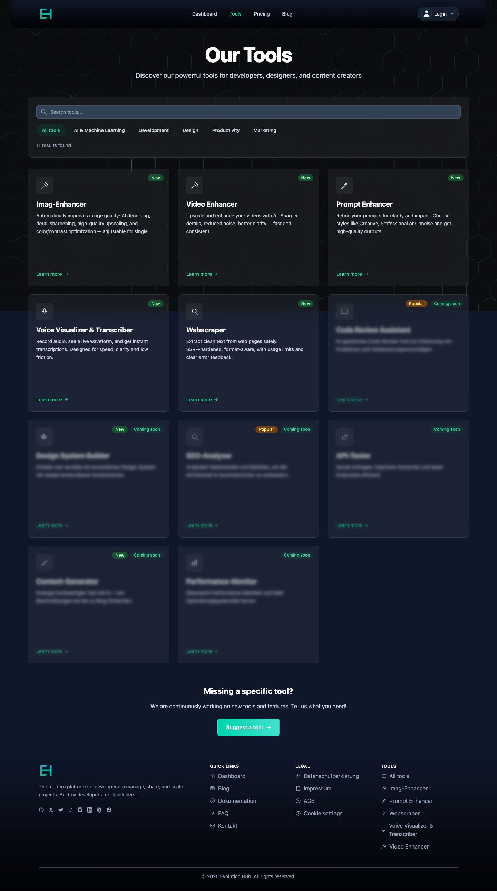

<!-- markdownlint-disable MD051 -->

# Deployment Guide — Cloudflare Workers

Dieser Leitfaden beschreibt den standardisierten Ablauf, um Evolution Hub sicher nach **Staging** und **Production** zu deployen. Er ergänzt die Production-Readiness-Checkliste und bündelt die relevanten Skripte, Workflows und Nacharbeiten.

## 1. Voraussetzungen & Checks

### 1.1 Lokale Validierung

Führe vor jedem Release lokal bzw. im Feature-Branch folgende Prüfungen aus:

```bash
npm run openapi:validate
npm run lint
npm run format:check
npm run test:once
npm run test:integration:run
npm run test:e2e:chromium  # optional, falls UI-Änderungen
```

> Hinweis: CI führt dieselben Checks im Job `pre-deploy` aus. Lokale Runs beschleunigen den Feedback-Zyklus.

### 1.2 Environment Secrets & Bindings

Stelle sicher, dass alle Secrets und Bindings in `wrangler.toml` und im Cloudflare Dashboard gepflegt sind:

- **Secrets**: `STYTCH_*`, `TURNSTILE_SECRET_KEY`, `STRIPE_SECRET`, `STRIPE_WEBHOOK_SECRET`, `REPLICATE_API_TOKEN`, AI/Voice Flags (`VOICE_STREAM_SSE`, `VOICE_STREAM_POLL`)
- **Bindings**: `DB` (D1), `R2_AI_IMAGES`, `KV_*` (Session, AI, Voice, Rate Limits)
- **Origins**: `APP_ORIGIN`, `PUBLIC_APP_ORIGIN`, optional `ALLOWED_ORIGINS`
- **Pricing**: `PRICING_TABLE`, `PRICING_TABLE_ANNUAL` mit Live-Price-IDs

Details siehe [Production Readiness Checklist](./production-readiness-checklist.md).

## 2. Automatischer Deployment-Workflow (GitHub Actions)

Workflow-Datei: `.github/workflows/deploy.yml`

### 2.1 Trigger

- **Tag-Push (`v*.*.*`)**: Staging & Production laufen automatisch durch.
- **Manueller Dispatch (`workflow_dispatch`)**: Auswahl `environment = staging | production`.

### 2.2 Job-Übersicht

1. **pre-deploy**
   - Checks: Lint, Format, OpenAPI, Test Coverage, `npm audit`
   - Keine Deployments

2. **deploy-staging**
   - Build (`npm run build:worker:staging`)
   - Wrangler Deploy `--env staging`
   - Health Check gegen `https://staging.hub-evolution.com`

3. **staging-smokes** *(nur für Production-Deploys oder wenn `environment=production`)*
   - CURL-Preflights (Image Enhancer UI/API, Magic Link Request)
   - Playwright Smoke (`test-suite-v2/src/e2e/tools/image-enhancer.spec.ts`)

4. **deploy-production**
   - Build (`npm run build:worker`)
   - Wrangler Deploy `--env production`
   - Health Check `https://hub-evolution.com`
   - GitHub Release bei Tag-Push

5. **notify-failure**
   - Slack/Logs placeholder (derzeit Konsolen-Output)

### 2.3 Gate-Logik

- Production-Job wartet auf erfolgreiche Staging-Smokes.
- Bei manuellem Dispatch ist Production erst möglich, nachdem Staging erfolgreich durchgelaufen ist (Workflow erneut mit `environment=production` starten).

## 3. Manuelle Deployments (nur mit Approval)

Für Einzeltests oder Hotfixes können die Skripte aus `package.json` verwendet werden:

```bash
npm run deploy:staging
npm run deploy:production
```

Diese Skripte rufen `scripts/deploy.ts` auf und spiegeln die Wrangler-Befehle aus dem Workflow. Voraussetzungen:

- `CLOUDFLARE_API_TOKEN` und `CLOUDFLARE_ACCOUNT_ID` sind lokal als Umgebungsvariablen vorhanden.
- Branch ist gemergt bzw. enthält freigegebene Commits.

> **Warnung:** Direkte `wrangler deploy`-Befehle (z. B. `wrangler deploy --env production`) dürfen nur nach Freigabe durch das Ops-Team ausgeführt werden. Dabei müssen alle CI-Checks vorab lokal bestanden sein.

## 4. Post-Deploy Verifikation

Unabhängig vom Pfad (CI oder manuell):

1. **Health Checks**
   - `npm run health-check -- --url https://staging.hub-evolution.com`
   - `npm run health-check -- --url https://hub-evolution.com`

2. **Logs & Monitoring**
   - `npm run tail:staging` oder `npm run tail:prod`
   - UptimeRobot & Healthchecks.io (siehe [Monitoring & Runbook](./monitoring.md))

3. **Functional Smoke** (Production)
   - Magic Link Request (Turnstile aktiv) → `POST /api/auth/magic/request`
   - Image Enhancer Generate/Jobs → `{ success: true }`, Rate Limits korrekt
   - R2 Proxy: Upload + Result URL funktionieren für erlaubte Nutzer, Fremde erhalten 403

4. **Security Spot Checks**
   - Response-Header: HSTS, Referrer-Policy, Permissions-Policy
   - 405-Antworten enthalten `Allow`
   - CSRF-geschützte Endpunkte prüfen `enforceCsrfToken`

## 5. Visuelle Referenzen & Runbook-Ausschnitte

- 
  - Markierungen: `pre-deploy`, `deploy-staging`, `staging-smokes`, `deploy-production` — helfen beim Troubleshooting, wenn ein Gate hängt.
- Image-Enhancer UI Smoke (Production) – Referenz: 
  - Erwarteter Zustand nach Deploy: Vergleichsansicht mit Original/Resultat, keine UI-Errors.
- CLI-Runbookauszug (aus [Runbook: Image Enhancer Go-Live](./runbook-image-enhancer-go-live.md)):

  ```bash
  # CSRF-geschütztes Generieren (Ausschnitt aus Abschnitt "Smoke Tests")
  CSRF=$(LC_ALL=C tr -dc A-Za-z0-9 </dev/urandom | head -c 16)
  curl -sS -D headers.txt -o resp.json \
    -H "Origin: $APP_ORIGIN" \
    -H "Cookie: guest_id=$GUEST_ID; csrf_token=$CSRF" \
    -H "X-CSRF-Token: $CSRF" \
    -F "image=@/tmp/eh_test.jpg" \
    --form-string "model=@cf/runwayml/stable-diffusion-v1-5-img2img" \
    "$APP_ORIGIN/api/ai-image/generate"
  ```

  > Erwartung: HTTP 200, `success: true`, Rate-Limit-Header im Normalbereich.

## 6. Rollback & Incident Response

- **Rollback**: Vorheriges Tag via GitHub Release oder `wrangler deploy --env production --branch <tag>`
- **Stripe Webhooks**: Bei Störungen vorübergehend pausieren, nach Fix wieder aktivieren
- **Kommunikation**: Incident-Note erstellen, Status Page (falls vorhanden) aktualisieren
- Siehe auch [Production Readiness Checklist](./production-readiness-checklist.md#operational-runbook-short)

## 6. Häufige Fehlerquellen

| Bereich | Symptom | Maßnahme |
| --- | --- | --- |
| Secrets | 5xx beim Enhancer, fehlende Stytch-Logins | Secrets in `wrangler.toml` + Dashboard prüfen |
| Staging-Smokes | Playwright schlägt fehl | `npm run test:e2e:chromium` lokal ausführen, Logs checken |
| Origin Checks | `forbidden` bei POST | `Origin`-Header und Allowlist (`APP_ORIGIN`, `ALLOWED_ORIGINS`) abgleichen |
| Stripe Plan Mapping | Nutzerplan bleibt `free` | `PRICING_TABLE*` mit Live-IDs aktualisieren, Webhook-Logs prüfen |
| Rate Limits | Spikes in 429 | Monitor `KV_RATE_LIMIT` (falls KV-Limiter aktiviert) oder Skalenentscheid W1 (Checklist) |

## 7. Referenzen & weiterführende Dokumente

- [Production Readiness Checklist](./production-readiness-checklist.md)
- [Monitoring & Runbook](./monitoring.md)
- [Runbook: Image Enhancer Go-Live](./runbook-image-enhancer-go-live.md)
- [.github/workflows/deploy.yml](../..//.github/workflows/deploy.yml)
- `package.json` (Deploy- und Build-Skripte)

---

**Letzte Aktualisierung:** 2025-11-06 — Überprüfung empfohlen nach Änderungen an Deploy-Workflows oder Infrastruktur.
