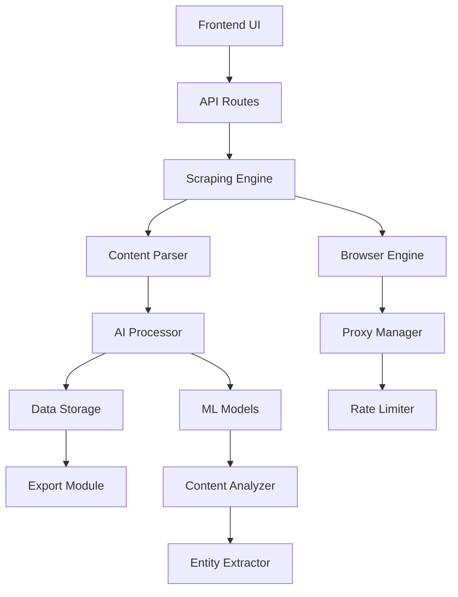

# Webscraper Tool - Spezifikation

## Übersicht

Das Webscraper-Tool ist ein automatisiertes System zur intelligenten Extraktion, Verarbeitung und Strukturierung von Web-Inhalten. Es integriert sich nahtlos in die bestehende EvolutionHub-Tool-Palette und erweitert die Möglichkeiten durch externe Datenquellen.

## Ziele

- **Intelligente Datensammlung**: Automatische Erkennung und Extraktion strukturierter und unstrukturierter Daten
- **KI-gestützte Verarbeitung**: Verwendung von Machine Learning zur Content-Analyse und -aufbereitung
- **Nahtlose Integration**: Kompatibilität mit bestehenden Tools (Image Enhancer, Prompt Enhancer)
- **Compliance & Ethik**: Respektierung rechtlicher Rahmenbedingungen und Web-Standards

## Kernfunktionen

### 1. URL-basierte Extraktion

**Eingabe-Interface**
- Einzelne URL oder Batch-Verarbeitung
- Unterstützung verschiedener Content-Types (Artikel, Produktseiten, Foren, etc.)
- Konfigurierbare Tiefen für Multi-Page-Sites

**Extraktions-Engine**
- DOM-parsing mit struktureller Analyse
- JavaScript-Rendering für dynamische Inhalte
- Intelligente Content-Erkennung (Titel, Text, Metadaten)

### 2. KI-gestützte Verarbeitung

**Content-Analyse**
- Automatische Zusammenfassung langer Artikel
- Sentiment-Analyse und Stimmungsbestimmung
- Entitäten-Erkennung (Personen, Organisationen, Orte)
- Thematische Kategorisierung

**Datenaufbereitung**
- Automatische Bereinigung von HTML-Artefakten
- Duplikaterkennung und -entfernung
- Strukturierte Datenausgabe (JSON, CSV, Markdown)

### 3. Monitoring & Alerts

**Änderungsüberwachung**
- Regelmäßige Überprüfung von Webseiten
- Erkennung von Content-Updates
- Konfigurierbare Benachrichtigungen

**Preis-Monitoring**
- E-Commerce-Preisverfolgung
- Alert-System bei Preisänderungen
- Historische Preisanalyse

## Technische Architektur

### System-Komponenten



### Technologie-Stack

**Frontend**
- Astro Island für UI-Komponente
- React/TypeScript für interaktive Elemente
- Tailwind CSS für konsistentes Design

**Backend**
- Cloudflare Workers für verteilte Verarbeitung
- Hono.js für API-Routen
- Drizzle ORM für Datenpersistierung

**Scraping-Engine**
- Puppeteer für Headless-Browser-Funktionalität
- Cheerio für DOM-Parsing
- Custom Parser für strukturierte Daten

**AI-Komponenten**
- OpenAI GPT für Textverarbeitung
- Custom Models für Entitäten-Erkennung
- TensorFlow.js für client-seitige Analyse

## API-Design

### Endpunkte

```typescript
// Hauptextraktion
POST /api/webscraper/extract
{
  "url": "string",
  "options": {
    "depth": "number",
    "includeImages": "boolean",
    "summarize": "boolean"
  }
}

// Batch-Verarbeitung
POST /api/webscraper/batch
{
  "urls": ["string"],
  "config": "ScrapingConfig"
}

// Monitoring einrichten
POST /api/webscraper/monitor
{
  "url": "string",
  "frequency": "cron",
  "alerts": "AlertConfig"
}
```

### Datenmodelle

```typescript
interface ScrapingJob {
  id: string;
  url: string;
  status: 'pending' | 'running' | 'completed' | 'failed';
  createdAt: Date;
  completedAt?: Date;
  result?: ScrapingResult;
}

interface ScrapingResult {
  url: string;
  title: string;
  content: string;
  metadata: {
    author?: string;
    publishDate?: Date;
    tags?: string[];
    sentiment?: 'positive' | 'negative' | 'neutral';
  };
  entities: {
    persons: string[];
    organizations: string[];
    locations: string[];
  };
  images?: ImageData[];
  links: string[];
}
```

## UI/UX-Design

### Hauptinterface

**Dashboard-Layout**
- URL-Eingabefeld mit Validierung
- Konfigurationspanel (akkordeon-artig)
- Live-Preview während der Extraktion
- Ergebnis-Darstellung mit Export-Optionen

**Ergebnisseite**
- Strukturierte Darstellung der extrahierten Daten
- Interaktive Entitäten-Hervorhebung
- Export-Interface für verschiedene Formate
- Visualisierung von Sentiment und Themen

### Responsive Design

- Mobile-first Ansatz
- Tablet-Optimierung für Recherche-Workflows
- Desktop-Erweiterungen für Power-User

## Sicherheitsaspekte

### Compliance

**Robots.txt-Respektierung**
- Automatische Erkennung und Einhaltung
- User-Override mit Warnhinweisen
- Logging von Compliance-Verstößen

**Rate Limiting**
- Adaptive Verzögerungen basierend auf robots.txt
- User-Agent-Rotation
- Automatische Backoff-Strategie

**Content-Filter**
- Erkennung von sensiblen Inhalten
- PII-Detektion und -maskierung
- Rechtliche Content-Prüfung

### Datenschutz

**Minimale Datenpersistierung**
- Temporäre Speicherung während Verarbeitung
- Automatische Bereinigung nach Export
- Opt-in für Langzeitspeicherung

## Integration mit bestehenden Tools

### Synergien

**Image Enhancer Integration**
- Automatische Bildextraktion von Webseiten
- Batch-Verarbeitung für Bildergalerien
- Metadaten-Transfer zwischen Tools

**Prompt Enhancer Integration**
- Web-Content als Prompt-Eingabe
- Extrahierte Entitäten für Prompt-Anreicherung
- Cross-Tool-Content-Pipeline

**Content Generator Integration**
- Research-Material aus dem Web
- Automatische Quellen-Zitation
- Content-Validierung gegen Originale

## Testing-Strategie

### Unit-Tests

**Parser-Tests**
- Verschiedene HTML-Strukturen
- Edge-Cases und Fehlerbehandlung
- Performance-Tests für große Dokumente

**AI-Komponenten-Tests**
- Sentiment-Analyse-Genauigkeit
- Entitäten-Erkennung-Qualität
- Zusammenfassungs-Qualitätsmetriken

### Integration-Tests

**End-to-End-Scraping**
- Komplette Website-Extraktion
- Multi-Page-Navigation
- JavaScript-lastige Anwendungen

**Cross-Tool-Integration**
- Datenfluss zwischen Tools
- Format-Kompatibilität
- Fehlerpropagation-Tests

### E2E-Tests

**User-Workflows**
- Komplette Scraping-Sessions
- Export-Funktionalitäten
- Monitoring-Setup und -ausführung

## Deployment & Infrastruktur

### Cloudflare-Integration

**Workers-Funktionen**
- Verteilte Scraping-Jobs
- Edge-nahe Verarbeitung
- Globale Proxy-Verteilung

**Storage-Strategie**
- D1 für Job-Metadaten
- R2 für temporäre Assets
- KV für Cache und Konfiguration

### Skalierungsaspekte

**Horizontale Skalierung**
- Worker-Instance-Management
- Load-Balancing für große Jobs
- Queue-System für Batch-Operationen

**Performance-Optimierung**
- Browser-Pooling
- Intelligente Caching-Strategie
- Kompression für große Datenmengen

## Erfolgsmetriken

### Technische KPIs

- **Extraktionsgenauigkeit**: >95% für strukturierte Daten
- **Verarbeitungsgeschwindigkeit**: <5s für durchschnittliche Seiten
- **Systemverfügbarkeit**: >99.5% Uptime
- **Fehlerrate**: <1% bei Standard-Webseiten

### User-Experience-KPIs

- **Task-Completion-Rate**: >90% erfolgreiche Scraping-Operationen
- **User-Satisfaction-Score**: >4.5/5
- **Feature-Adoption**: >70% der aktiven User nutzen das Tool

## Detaillierte Entwicklungs-Roadmap

### **Phase 1: MVP-Grundlagen (Woche 1-4)**

#### **Woche 1: Setup & Foundation**
- Projektstruktur anlegen (`src/components/tools/webscraper/`, `src/lib/services/webscraper-service.ts`)
- Package.json Dependencies hinzufügen (`puppeteer`, `cheerio`, `@types/cheerio`)
- Grundlegende TypeScript-Interfaces definieren (`ScrapingJob`, `ScrapingResult`, `WebscraperConfig`)
- Basis-Konfiguration für Scraping-Engine erstellen

#### **Woche 2: Core Engine Development**
- Grundlegende Scraping-Engine implementieren (URL-Fetching, HTML-Parsing)
- Content-Extraktion entwickeln (Titel, Text, Metadaten, Links)
- Basis-Fehlerbehandlung und Logging integrieren
- Rate-Limiting nach Projektstandards implementieren

#### **Woche 3: API & Backend**
- API-Endpunkt `POST /api/webscraper/extract` implementieren
- Hono.js Route mit Validierung und Fehlerbehandlung
- Datenbank-Schema für Scraping-Jobs (D1-Migration)
- Grundlegende Authentifizierung und CSRF-Schutz

#### **Woche 4: Frontend & UI**
- Astro-Island-Komponente `WebscraperIsland.tsx` erstellen
- Einfaches URL-Eingabeformular mit Validierung
- Ergebnis-Display-Komponente entwickeln
- Responsive Design nach Projektstandards

### **Phase 2: Kernfunktionen (Woche 5-10)**

#### **Woche 5-6: KI-Integration**
- OpenAI GPT-Integration für Textverarbeitung
- Sentiment-Analyse implementieren
- Entitäten-Erkennung entwickeln (NER)
- Automatische Zusammenfassung von Artikeln

#### **Woche 7-8: Erweiterte Features**
- Batch-Verarbeitung für mehrere URLs
- Export-Funktionalitäten (JSON, CSV, Markdown)
- Bild-Extraktion und -verarbeitung
- Monitoring-System-Grundlagen

#### **Woche 9-10: Advanced Features**
- JavaScript-Rendering für dynamische Inhalte
- Intelligente Content-Filter und -bereinigung
- Cache-System für wiederholte Anfragen
- Performance-Optimierung und Browser-Pooling

### **Phase 3: Integration & Testing (Woche 11-12)**

#### **Woche 11: Cross-Tool-Integration**
- Integration mit Image Enhancer testen
- Integration mit Prompt Enhancer entwickeln
- Datenfluss zwischen Tools validieren
- Cross-Tool-API-Endpunkte implementieren

#### **Woche 12: Testing & Quality**
- Umfassende Unit-Test-Suite entwickeln
- Integration-Tests für alle Features
- E2E-Tests mit Playwright implementieren
- Sicherheitsaudit und Penetration-Testing

### **Phase 4: Deployment & Launch (Woche 13-14)**

#### **Woche 13: Production-Setup**
- Cloudflare Workers-Konfiguration optimieren
- Datenbank-Migrationen durchführen
- Monitoring und Logging einrichten (Sentry, Analytics)
- Load-Testing und Performance-Validierung

#### **Woche 14: Launch-Vorbereitung**
- Dokumentation finalisieren (User-Guides, API-Docs)
- Beta-Testing mit ausgewählten Usern
- Security-Review und Compliance-Check
- Launch-Planung und Marketing-Materialien

## Milestones & Deliverables

### **MVP-Milestone (Ende Woche 4)**
- ✅ Einzelne URL-Extraktion funktioniert
- ✅ Grundlegende UI ist benutzbar
- ✅ API-Endpunkt ist verfügbar
- ✅ Basis-Testing ist implementiert

### **Feature-Complete-Milestone (Ende Woche 10)**
- ✅ Alle Kernfunktionen sind implementiert
- ✅ KI-Integration ist funktionsfähig
- ✅ Export-Funktionen arbeiten korrekt
- ✅ Performance-Ziele sind erreicht

### **Production-Ready-Milestone (Ende Woche 12)**
- ✅ Vollständige Test-Coverage erreicht
- ✅ Sicherheitsaudit bestanden
- ✅ Cross-Tool-Integration getestet
- ✅ Dokumentation ist vollständig

### **Launch-Milestone (Ende Woche 14)**
- ✅ Produktionsumgebung ist stabil
- ✅ Monitoring ist eingerichtet
- ✅ Beta-Testing erfolgreich abgeschlossen
- ✅ Launch-Kriterien erfüllt

## Risiken & Mitigation

### Technische Risiken

**Anti-Scraping-Mechanismen**
- Mitigation: Adaptive Browser-Fingerprints
- Fallback: Alternative Extraktionsmethoden

**JavaScript-lastige Seiten**
- Mitigation: Vollständiges Browser-Rendering
- Fallback: Hybride Parsing-Ansätze

### Rechtliche Risiken

**Copyright-Inhalte**
- Mitigation: Faire-Nutzung-Prüfung
- User-Education: Richtlinien und Warnhinweise

**Datenschutz**
- Mitigation: PII-Detektion und -entfernung
- Compliance: GDPR-konforme Verarbeitung

## Budget & Ressourcen

### Entwicklung

- **Entwicklungszeit**: 14 Wochen
- **Team-Größe**: 2-3 Entwickler
- **QA-Ressourcen**: 1 Tester für E2E-Tests

### Infrastruktur

- **Cloudflare-Kosten**: Workers + Storage
- **AI-API-Kosten**: OpenAI/Together AI
- **Monitoring-Tools**: Sentry, Analytics

## Akzeptanzkriterien

### Funktionale Kriterien

- [ ] Einzelne URL-Extraktion funktioniert zuverlässig
- [ ] Batch-Verarbeitung für bis zu 10 URLs
- [ ] Export in mindestens 3 Formaten
- [ ] Grundlegende Sentiment-Analyse
- [ ] Integration mit einem bestehenden Tool

### Nicht-funktionale Kriterien

- [ ] Performance: <3s für durchschnittliche Seiten
- [ ] Sicherheit: Bestanden Security-Audit
- [ ] Accessibility: WCAG 2.1 AA-konform
- [ ] Mobile: Vollständig responsive
- [ ] Testing: >80% Test-Coverage

## Support & Dokumentation

### User-Dokumentation

- **In-App-Hilfe**: Kontextsensitive Tooltips
- **Video-Tutorials**: Screencasts für komplexe Workflows
- **Knowledge-Base**: Umfassende Anleitungen
- **API-Dokumentation**: OpenAPI-Spezifikation

### Technische Dokumentation

- **Architektur-Dokumente**: System-Design und -flüsse
- **Deployment-Guides**: Setup und Konfiguration
- **Troubleshooting**: Häufige Probleme und Lösungen
- **API-Referenz**: Vollständige Endpunkt-Dokumentation

## Claude Code Entwicklungs-Guidelines

### **🚀 Entwicklungshinweise für Claude Code**

**Diese Spezifikation dient als primäre Entwicklungsgrundlage. Bitte beachten Sie:**

#### **Entwicklungsansatz**
- **Iterative Entwicklung**: Beginnen Sie mit Woche 1 und arbeiten Sie sich vor
- **Test-Driven Development**: Schreiben Sie Tests vor der Implementierung
- **Security-First**: Berücksichtigen Sie Sicherheitsaspekte von Anfang an
- **Performance-Conscious**: Optimieren Sie für Cloudflare Workers Edge Runtime

#### **Code-Strukturierung**
```typescript
// Bevorzugte Projektstruktur:
src/
├── components/tools/webscraper/
│   ├── WebscraperIsland.tsx          // Haupt-UI-Komponente
│   ├── WebscraperForm.tsx            // Eingabeformular
│   ├── WebscraperResults.tsx         // Ergebnis-Display
│   └── types.ts                      // Lokale TypeScript-Interfaces
├── lib/services/
│   └── webscraper-service.ts         // Kernlogik und API-Calls
├── pages/api/webscraper/
│   ├── extract.ts                    // Haupt-API-Endpunkt
│   └── [..slugs].ts                  // Catch-all für zukünftige Endpunkte
└── config/
    └── webscraper.ts                 // Konfiguration und Constants
```

#### **Coding Standards ( strikt befolgen)**

**TypeScript-Richtlinien**
- **Strict Mode**: Immer `strict: true` in tsconfig.json
- **Keine `any` Types**: Verwenden Sie spezifische Interface-Definitionen
- **Error Handling**: Umfassende Fehlerbehandlung mit strukturierten Fehlern
- **Async/Await**: Konsequente Verwendung für alle asynchronen Operationen

**API-Entwicklung**
- **Hono.js Framework**: Verwenden Sie die bestehenden Muster aus dem Projekt
- **Request Validation**: Valideren Sie alle Eingaben mit Zod oder ähnlichen Tools
- **Response Format**: Konsistentes `{ success: true, data: T }` Format
- **Error Responses**: Strukturierte Fehler mit `{ success: false, error: {...} }`

**Sicherheitsanforderungen**
- **CSRF Protection**: Implementieren Sie Double-Submit-Cookie-Muster
- **Rate Limiting**: Begrenzen Sie Anfragen nach Projektstandards
- **Input Sanitization**: Bereinigen Sie alle Benutzereingaben
- **HTTPS Only**: Erzwingen Sie sichere Verbindungen

#### **Testing-Anforderungen**

**Unit-Tests**
```typescript
// Beispiel-Teststruktur
describe('WebscraperService', () => {
  it('should extract content from valid URL', async () => {
    const result = await webscraperService.extract('https://example.com');
    expect(result.success).toBe(true);
    expect(result.data.title).toBeDefined();
  });
});
```

**Integration-Tests**
- Testen Sie die kompletten API-Endpunkte
- Validieren Sie Datenbank-Interaktionen
- Testen Sie Fehlerfälle und Edge-Cases

**E2E-Tests**
- Verwenden Sie Playwright für Browser-Interaktionen
- Testen Sie komplette User-Workflows
- Integrieren Sie visuelle Regression-Tests

#### **Performance-Optimierung**

**Cloudflare Workers Optimierung**
- **Bundle Size**: Halten Sie Bundles unter 1MB
- **Cold Starts**: Minimieren Sie Initialisierungszeit
- **Memory Usage**: Effiziente Speicherverwaltung
- **Network Requests**: Optimieren Sie externe API-Calls

**Browser-Performance**
- **Lazy Loading**: Implementieren Sie für schwere Komponenten
- **Caching**: Nutzen Sie Service Worker für Offline-Fähigkeiten
- **Image Optimization**: Komprimieren Sie automatisch Bilder

#### **Monitoring & Observability**

**Logging-Standards**
```typescript
// Strukturiertes Logging nach Projektstandards
logger.info('Scraping job started', {
  jobId: '123',
  url: 'https://example.com',
  userId: 'user_456'
});
```

**Fehlerbehandlung**
- **Graceful Degradation**: Fallbacks für fehlgeschlagene Operationen
- **User-Friendly Messages**: Klare Fehlermeldungen für Endbenutzer
- **Debugging Support**: Detaillierte Logs für Entwickler

#### **Deployment & DevOps**

**Umgebungsmanagement**
- **Environment Variables**: Verwenden Sie Wrangler Secrets
- **Feature Flags**: Implementieren Sie für neue Features
- **Staged Rollouts**: Graduelle Einführung neuer Versionen

**CI/CD-Integration**
- **Automated Testing**: Alle Tests müssen in CI bestehen
- **Linting**: ESLint und Prettier müssen sauber sein
- **Security Scans**: Automatische Sicherheitsprüfungen

### **📋 Checklisten für jeden Entwicklungsschritt**

#### **Vor der Implementierung**
- [ ] **Anforderungsanalyse**: Verstehen Sie die Spezifikation vollständig
- [ ] **Architektur-Planung**: Entwerfen Sie die Lösungsarchitektur
- [ ] **Test-Planung**: Definieren Sie Testfälle im Voraus
- [ ] **Sicherheitsbewertung**: Identifizieren Sie potenzielle Risiken

#### **Während der Implementierung**
- [ ] **Code-Standards**: Befolgen Sie die Projekt-Coding-Standards
- [ ] **Error Handling**: Implementieren Sie umfassende Fehlerbehandlung
- [ ] **Logging**: Fügen Sie strukturiertes Logging hinzu
- [ ] **Dokumentation**: Kommentieren Sie komplexe Logik

#### **Vor dem Commit**
- [ ] **Tests**: Alle Tests müssen bestehen
- [ ] **Linting**: Code muss ESLint/Prettier-konform sein
- [ ] **Type Checking**: TypeScript-Fehler müssen behoben sein
- [ ] **Security Review**: Prüfen Sie auf Sicherheitslücken

#### **Vor dem Deployment**
- [ ] **Integration-Tests**: Cross-Tool-Interaktionen testen
- [ ] **Performance-Tests**: Last-Testing durchführen
- [ ] **Accessibility**: WCAG 2.1 AA-Compliance sicherstellen
- [ ] **Documentation**: Aktualisieren Sie Benutzerdokumentation

### **🔧 Nützliche Entwicklungstools**

#### **Lokale Entwicklung**
```bash
# Entwicklungsserver starten
npm run dev

# Tests ausführen
npm run test:unit
npm run test:e2e

# Type-Checking
npm run astro:check

# Linting
npm run lint
```

#### **Cloudflare Workers**
```bash
# Lokales Testing
npm run wrangler:dev

# Deployment
npm run deploy

# Logs anzeigen
npm run wrangler:tails
```

### **⚡ Best Practices für KI-gestützte Entwicklung**

**Prompt Engineering**
- **Spezifische Anweisungen**: Seien Sie explizit in Ihren Anforderungen
- **Kontext-Bereitstellung**: Stellen Sie relevante Code-Beispiele zur Verfügung
- **Iterative Verfeinerung**: Bauen Sie auf vorherigen Ergebnissen auf

**Code-Review**
- **Selbstkritik**: Hinterfragen Sie generierten Code kritisch
- **Sicherheitsprüfung**: Überprüfen Sie generierten Code auf Sicherheitslücken
- **Performance-Analyse**: Bewerten Sie die Effizienz des Codes

**Testing**
- **Edge-Case-Coverage**: Testen Sie ungewöhnliche Szenarien
- **Error-Scenario-Testing**: Validieren Sie Fehlerbehandlung
- **Performance-Testing**: Messen Sie Antwortzeiten und Ressourcenverbrauch

### **🚨 Wichtige Warnhinweise**

#### **Sicherheitskritische Aspekte**
- **Keine Secrets im Code**: Verwenden Sie Environment Variables
- **Input Validation**: Validieren Sie alle Benutzereingaben streng
- **Rate Limiting**: Implementieren Sie Schutz vor Missbrauch
- **PII Handling**: Achten Sie auf personenbezogene Daten

#### **Performance-Kritische Aspekte**
- **Memory Leaks**: Vermeiden Sie Speicherlecks in Workers
- **Infinite Loops**: Schützen Sie vor endlosen Schleifen
- **Resource Limits**: Respektieren Sie Cloudflare Workers Limits
- **Cold Start Optimization**: Minimieren Sie Initialisierungszeit

#### **Qualitätskritische Aspekte**
- **Code Duplication**: Vermeiden Sie wiederholten Code
- **Maintainability**: Schreiben Sie wartbaren und erweiterbaren Code
- **Documentation**: Dokumentieren Sie komplexe Logik
- **Standards Compliance**: Halten Sie sich an Projektstandards

---

## **📞 Support & Communication**

### **Bei Fragen oder Problemen**
1. **Dokumentation**: Konsultieren Sie zunächst diese Spezifikation
2. **Code-Beispiele**: Schauen Sie sich bestehende Tools an (Image Enhancer, Prompt Enhancer)
3. **Projektstandards**: Beachten Sie die GLOBAL_RULES.md und CLAUDE.md
4. **Team-Konsultation**: Fragen Sie bei Unklarheiten nach

### **Entwicklungsfortschritt**
- **Regelmäßige Updates**: Halten Sie die Todo-Liste aktuell
- **Milestone-Reporting**: Melden Sie erreichte Meilensteine
- **Problem-Eskalation**: Eskalieren Sie Blockierer frühzeitig

---

*🎯 Diese Spezifikation ist bereit für die Übergabe an Claude Code und dient als umfassende Entwicklungsgrundlage für das Webscraper-Tool.*

**Erfolgreiche Entwicklung! 🚀**