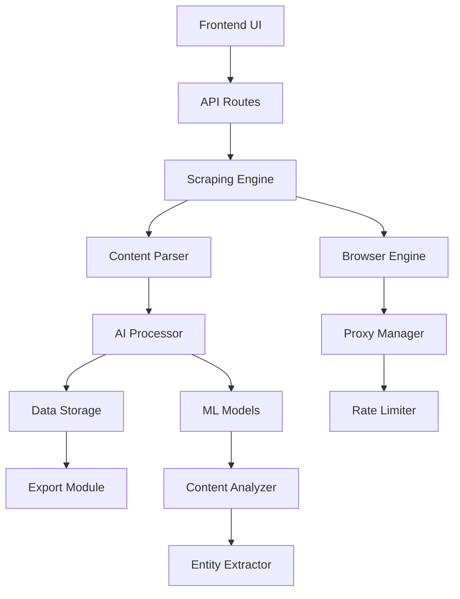

# Webscraper Tool - Hauptspezifikation

## Übersicht

Das Webscraper-Tool ist ein automatisiertes System zur intelligenten Extraktion, Verarbeitung und Strukturierung von Web-Inhalten. Es integriert sich nahtlos in die bestehende EvolutionHub-Tool-Palette und erweitert die Möglichkeiten durch externe Datenquellen.

## Ziele

- **Intelligente Datensammlung**: Automatische Erkennung und Extraktion strukturierter und unstrukturierter Daten
- **KI-gestützte Verarbeitung**: Verwendung von Machine Learning zur Content-Analyse und -aufbereitung
- **Nahtlose Integration**: Kompatibilität mit bestehenden Tools (Image Enhancer, Prompt Enhancer)
- **Compliance & Ethik**: Respektierung rechtlicher Rahmenbedingungen und Web-Standards

## Kernfunktionen

### 1. URL-basierte Extraktion

#### Eingabe-Interface

- Einzelne URL oder Batch-Verarbeitung
- Unterstützung verschiedener Content-Types (Artikel, Produktseiten, Foren, etc.)
- Konfigurierbare Tiefen für Multi-Page-Sites

#### Extraktions-Engine

- DOM-parsing mit struktureller Analyse
- JavaScript-Rendering für dynamische Inhalte
- Intelligente Content-Erkennung (Titel, Text, Metadaten)

### 2. KI-gestützte Verarbeitung

#### Content-Analyse

- Automatische Zusammenfassung langer Artikel
- Sentiment-Analyse und Stimmungsbestimmung
- Entitäten-Erkennung (Personen, Organisationen, Orte)
- Thematische Kategorisierung

#### Datenaufbereitung

- Automatische Bereinigung von HTML-Artefakten
- Duplikaterkennung und -entfernung
- Strukturierte Datenausgabe (JSON, CSV, Markdown)

### 3. Monitoring & Alerts

#### Änderungsüberwachung

- Regelmäßige Überprüfung von Webseiten
- Erkennung von Content-Updates
- Konfigurierbare Benachrichtigungen

#### Preis-Monitoring

- E-Commerce-Preisverfolgung
- Alert-System bei Preisänderungen
- Historische Preisanalyse

## Technische Architektur

### System-Komponenten



### Technologie-Stack

#### Frontend

- Astro Island für UI-Komponente
- React/TypeScript für interaktive Elemente
- Tailwind CSS für konsistentes Design

#### Backend

- Cloudflare Workers für verteilte Verarbeitung
- Hono.js für API-Routen
- Drizzle ORM für Datenpersistierung

#### Scraping-Engine

- Puppeteer für Headless-Browser-Funktionalität
- Cheerio für DOM-Parsing
- Custom Parser für strukturierte Daten

#### AI-Komponenten

- OpenAI GPT für Textverarbeitung
- Custom Models für Entitäten-Erkennung
- TensorFlow.js für client-seitige Analyse

## API-Design

### Endpunkte

```typescript
// Hauptextraktion
POST /api/webscraper/extract
{
  "url": "string",
  "options": {
    "depth": "number",
    "includeImages": "boolean",
    "summarize": "boolean"
  }
}

// Batch-Verarbeitung
POST /api/webscraper/batch
{
  "urls": ["string"],
  "config": "ScrapingConfig"
}

// Monitoring einrichten
POST /api/webscraper/monitor
{
  "url": "string",
  "frequency": "cron",
  "alerts": "AlertConfig"
}
```

#### Datenmodelle

```typescript
interface ScrapingJob {
  id: string;
  url: string;
  status: 'pending' | 'running' | 'completed' | 'failed';
  createdAt: Date;
  completedAt?: Date;
  result?: ScrapingResult;
}

interface ScrapingResult {
  url: string;
  title: string;
  content: string;
  metadata: {
    author?: string;
    publishDate?: Date;
    tags?: string[];
    sentiment?: 'positive' | 'negative' | 'neutral';
  };
  entities: {
    persons: string[];
    organizations: string[];
    locations: string[];
  };
  images?: ImageData[];
  links: string[];
}
```

## UI/UX-Design

### Hauptinterface

#### Dashboard-Layout

- URL-Eingabefeld mit Validierung
- Konfigurationspanel (akkordeon-artig)
- Live-Preview während der Extraktion
- Ergebnis-Darstellung mit Export-Optionen

#### Ergebnisseite

- Strukturierte Darstellung der extrahierten Daten
- Interaktive Entitäten-Hervorhebung
- Export-Interface für verschiedene Formate
- Visualisierung von Sentiment und Themen

### Responsive Design

- Mobile-first Ansatz
- Tablet-Optimierung für Recherche-Workflows
- Desktop-Erweiterungen für Power-User

## Sicherheitsaspekte

### Compliance

#### Robots.txt-Respektierung

- Automatische Erkennung und Einhaltung
- User-Override mit Warnhinweisen
- Logging von Compliance-Verstößen

#### Rate Limiting

- Adaptive Verzögerungen basierend auf robots.txt
- User-Agent-Rotation
- Automatische Backoff-Strategie

#### Content-Filter

- Erkennung von sensiblen Inhalten
- PII-Detektion und -maskierung
- Rechtliche Content-Prüfung

### Datenschutz

#### Minimale Datenpersistierung

- Temporäre Speicherung während Verarbeitung
- Automatische Bereinigung nach Export
- Opt-in für Langzeitspeicherung

## Integration mit bestehenden Tools

### Synergien

#### Image Enhancer Integration

- Automatische Bildextraktion von Webseiten
- Batch-Verarbeitung für Bildergalerien
- Metadaten-Transfer zwischen Tools

#### Prompt Enhancer Integration

- Web-Content als Prompt-Eingabe
- Extrahierte Entitäten für Prompt-Anreicherung
- Cross-Tool-Content-Pipeline

#### Content Generator Integration

- Research-Material aus dem Web
- Automatische Quellen-Zitation
- Content-Validierung gegen Originale

## Deployment & Infrastruktur

### Cloudflare-Integration

#### Workers-Funktionen

- Verteilte Scraping-Jobs
- Edge-nahe Verarbeitung
- Globale Proxy-Verteilung

#### Storage-Strategie

- D1 für Job-Metadaten
- R2 für temporäre Assets
- KV für Cache und Konfiguration

### Skalierungsaspekte

#### Horizontale Skalierung

- Worker-Instance-Management
- Load-Balancing für große Jobs
- Queue-System für Batch-Operationen

#### Performance-Optimierung

- Browser-Pooling
- Intelligente Caching-Strategie
- Kompression für große Datenmengen

## Erfolgsmetriken

### Technische KPIs

- **Extraktionsgenauigkeit**: >95% für strukturierte Daten
- **Verarbeitungsgeschwindigkeit**: <5s für durchschnittliche Seiten
- **Systemverfügbarkeit**: >99.5% Uptime
- **Fehlerrate**: <1% bei Standard-Webseiten

### User-Experience-KPIs

- **Task-Completion-Rate**: >90% erfolgreiche Scraping-Operationen
- **User-Satisfaction-Score**: >4.5/5
- **Feature-Adoption**: >70% der aktiven User nutzen das Tool

## Akzeptanzkriterien

### Funktionale Kriterien

- [ ] Einzelne URL-Extraktion funktioniert zuverlässig
- [ ] Batch-Verarbeitung für bis zu 10 URLs
- [ ] Export in mindestens 3 Formaten
- [ ] Grundlegende Sentiment-Analyse
- [ ] Integration mit einem bestehenden Tool

### Nicht-funktionale Kriterien

- [ ] Performance: <3s für durchschnittliche Seiten
- [ ] Sicherheit: Bestanden Security-Audit
- [ ] Accessibility: WCAG 2.1 AA-konform
- [ ] Mobile: Vollständig responsive
- [ ] Testing: >80% Test-Coverage

---

*Siehe auch: [roadmap.md](roadmap.md), [guidelines.md](guidelines.md), [testing.md](testing.md)*
